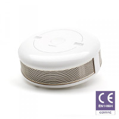
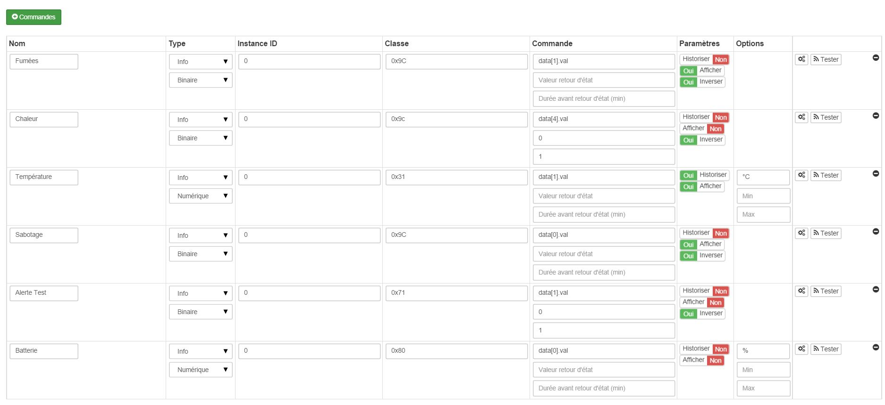

Fibaro FGSD-002 "Smoke Sensor 2" 
================================

\

-   **The module**

\

\

-   **The jeedom visual**

\

\

Summary 
------

\

With soft lines, a polished surface and a small size, this
smoke detector will allow you to be alerted of a threat with
Multicolor RGB LEDs and an integrated siren. The large format of the
grid can detect the smallest amount of smoke so
get a quick reaction. It will thus very easily find its
place in your home to preserve the security of the whole
famille.

The Fibaro FGSD-002 smoke detector is an Alarm Detector
Autonomous Smoke (DAAF) compliant with standard EN 14604:2005. Good
that autonomous, it is also communicating thanks to the Z-Wave technology
Plus.

Some materials burn without smoking. This is why the engineers at
Fibaro have decided to include additional protection in their
smoke detector in the form of a temperature sensor. If the
not enough smoke to sound the alarm,
the device will still be able to detect a threat by detecting
a rapid change in temperature caused by fire. A change
rapid temperature rise or up to 54 ° C is sufficient
for the smoke sensor to detect a threat and report it to
inhabitants of the house. Only this type of smoke sensor offers
high efficiency, regardless of what burns.

\

Functions 
---------

\

-   Z-Wave smoke detector

-   Battery powered

-   Adjustable sensor sensitivity (3 levels)

-   Tamper protection

-   Alarm signaled by sound, LED light and Z-Wave signal

-   Fire detection by measuring the air temperature

-   Automatic efficiency test, performed every 5 seconds

-   Integrated Z-Wave network coverage tester

-   Complies with standard EN 14604:2005

-   Z-Wave Plus compatible

-   Very simple installation - just install it in one place
    or there is a risk of fire

\

Technical characteristics 
---------------------------

\

-   Type of module : Z-Wave transmitter

-   Food : 3V CR123A Lithium Battery

-   Battery life : 3 years

-   Frequency : 868.42 MHz

-   Transmission distance : 50m free field, 30m indoors

-   Dimensions : 65 x 28 mm (diameter x height)

-   Operating temperature : 0-55 ° C

-   Operating humidity : 0% - 93%

-   Temperature measurement range : -20 to 100 ° C

-   Sensitivity to smoke : 1st level - 1.20 +/- 0.5% obs / m; 2nd
    level - 1.80 +/- 0.5% obs / m; 3rd level - 2.80 +/- 0.5% obs / m

-   Sound level: 85 dB at 3m

-   Measurement accuracy : 0.5 ° C (in a range of 0 to 55 ° C)

-   Standards : EMC 2004/108 / EC and R & TTE 199/5 / WE

-   Certifications : EN 14604:2005

\

Module data 
-----------------

\

-   Mark : Fibar Group

-   Last name : Fibaro Smoke Sensor FGSD-002

-   Manufacturer ID : 271

-   Product Type : 3074

-   Product ID : 4098

\

Configuration 
-------------

\

To configure the OpenZwave plugin and know how to put Jeedom in
inclusion refer to this
[documentation](https://jeedom.fr/doc/documentation/plugins/openzwave/en_US/openzwave.html).

\

> **Important**
>
> To put this module in inclusion mode, press the button 3 times
> central inclusion button, according to its paper documentation.

\

\

Once included you should get this :

\

\

### Orders 

\

Once the module has been recognized, the commands associated with the module will be
disponibles.

\

\

Here is the list of commands :

\

-   Smoke : this is the module alert command (for smoke,
    heat…)

-   Temperature : it is the temperature measurement command

-   Sabotage : this is the sabotage command. It signals the opening
    of the case

-   Test alert : it is the command which will reassemble the fact that the module
    is in test mode

-   Heat alert : it is the control which will raise a heat alert
    (not reliable yet)

-   Drums : it's the battery command

\

### Configuration of the module 

\

> **Important**
>
> During a first inclusion always wake up the module just after
> inclusion.

\

Then it is necessary to configure the module in
depending on your installation. This requires going through the button
"Configuration "of Jeedom's OpenZwave plugin.

\

\

You will arrive on this page (after clicking on the tab
Settings)

\

\

Parameter details :

\

-   Wakeup : this is the module wake-up interval (value
    recommended 21600)

-   1: adjusts the sensitivity of smoke detection

-   2: allows to choose which notifications will be sent to Jeedom
    (advice : toutes)

-   3: allows you to choose which notifications will be accompanied by a
    visual indication

-   4: allows you to choose which notifications will be accompanied by a
    audible indication (in all cases the heat detections and
    the module will ring)

-   10: don't change this setting unless you know what you
    faites

-   11: idem

-   12: idem

-   13: allows to notify other zwave modules (to deactivate unless
    you know why you activate it)

-   20: time between two temperature reports

-   21: temperature difference from which, even if the duration
    from above is not reached, the temperature will be sent to Jeedom

-   30: Heat alarm trigger temperature

-   31: temperature peak reporting interval

-   32: signal interval if loss of Zwave

\

### Groups 

\

For optimum operation of your module. Jeedom must be
at least associated with groups 1 4 and 5:

\

\

Good to know 
------------

\

### Specificities 

\

### Alternative visual 

\

\

Wakeup 
------

\

To wake up this module, press the central button 3 times

\

Faq. 
------

\

This module wakes up by pressing 3 times on its inclusion button.

\

This module is a battery module, the new configuration will be
taken into account at the next wakeup.

\

Important note 
---------------

\

> **Important**
>
> You have to wake up the module : after its inclusion, after a change
> of the configuration, after a change of wakeup, after a
> change of association groups

\

**@sarakha63**
