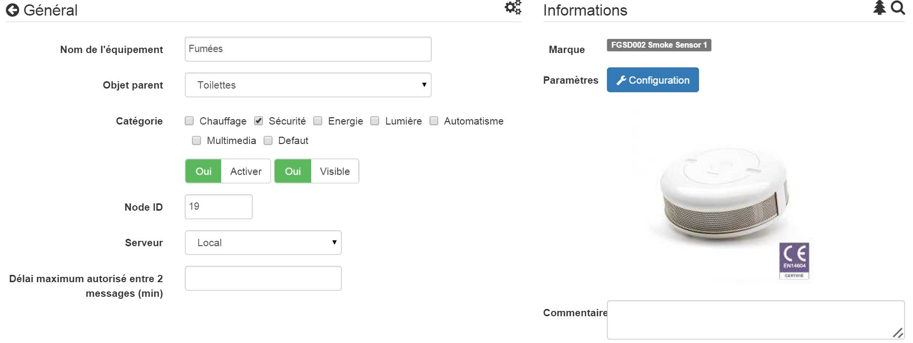

# Fibaro FGSD-002 "Smoke Sensor 2"

**The module**

**The jeedom visual**

## Summary

With smooth lines, a polished surface and a small size, this smoke detector will allow you to be alerted of a threat with multicolored RGB LEDs and an integrated siren. The large format of the grid makes it possible to detect the smallest amount of smoke in order to obtain a rapid reaction. It will very easily find its place in your home to preserve the safety of the whole family.

The Fibaro FGSD-002 smoke detector is an Autonomous Smoke Alarm Detector (DAAF) conforming to standard EN 14604:2005. Although autonomous, it is also communicative thanks to Z-Wave Plus technology.

Some materials burn without smoking. This is why Fibaro engineers decided to include additional protection in their smoke detector in the form of a temperature sensor. If the amount of smoke is not sufficient to trigger the alarm, the device will still be able to detect a threat by detecting a rapid change in temperature caused by the fire. A quick change in temperature or increase to 54 ° C is enough for the smoke sensor to detect a threat and report it to the inhabitants of the house. Only this type of smoke sensor offers high efficiency, regardless of what burns.

## Functions

-   Z-Wave smoke detector
-   Battery powered
-   Adjustable sensor sensitivity (3 levels)
-   Tamper protection
-   Alarm signaled by sound, LED light and Z-Wave signal
-   Fire detection by measuring the air temperature
-   Automatic efficiency test, performed every 5 seconds
-   Integrated Z-Wave network coverage tester
-   Complies with standard EN 14604:2005
-   Z-Wave Plus compatible
-   Very simple installation - just install it in a place where there is a risk of fire

## Technical characteristics

-   Type of module : Z-Wave transmitter
-   Food : 3V CR123A Lithium Battery
-   Battery life : 3 years
-   Frequency : 868.42 MHz
-   Transmission distance : 50m free field, 30m indoors
-   Dimensions : 65 x 28 mm (diameter x height)
-   Operating temperature : 0-55 ° C
-   Operating humidity : 0% - 93%
-   Temperature measurement range : -20 to 100 ° C
-   Sensitivity to smoke : 1st level - 1.20 +/- 0.5% obs / m; 2nd level - 1.80 +/- 0.5% obs / m; 3rd level - 2.80 +/- 0.5% obs / m
-   Sound level: 85 dB at 3m
-   Measurement accuracy : 0.5 ° C (in a range of 0 to 55 ° C)
-   Standards : EMC 2004/108 / EC and R & TTE 199/5 / WE
-   Certifications : EN 14604:2005

## Module data

-   Mark : Fibar Group
-   Name : Fibaro Smoke Sensor FGSD-002
-   Manufacturer ID : 271
-   Product Type : 3074
-   Product ID : 4098

## Setup

To configure the OpenZwave plugin and know how to put Jeedom in inclusion, refer to this [Documentation](https://doc.jeedom.com/en_US/plugins/automation%20protocol/openzwave/).

> **IMPORTANT**
>
> To put this module in inclusion mode, press the central inclusion button 3 times, according to its paper documentation.

Once included you should get this :

### Commands

Once the module is recognized, the commands associated with the module will be available.

Here is the list of commands :

-   Smoke : it is the module alert command (for smoke, heat)
-   Temperature : it is the temperature measurement command
-   Sabotage : this is the sabotage command. It signals the opening of the case
-   Test alert : it is the command which will bring up the fact that the module is in test mode
-   Heat alert : it is the control which will raise a heat alert (not reliable yet)
-   Drums : it's the battery command

### Setup du module

> **IMPORTANT**
>
> During a first inclusion always wake up the module just after the inclusion.

Then it is necessary to configure the module according to your installation. To do this, go through the "Configuration" button of Jeedom's OpenZwave plugin.

You will arrive on this page (after clicking on the Settings tab)

Parameter details :

-   Wakeup : this is the module wake-up interval (recommended value 21600)
-   1: adjusts the sensitivity of smoke detection
-   2: allows you to choose which notifications will be sent to Jeedom (advice : toutes)
-   3: allows to choose which notifications will be accompanied by a visual indication
-   4: allows you to choose which notifications will be accompanied by an audible indication (in all cases the heat and fire detections will sound the module)
-   10: don't change this setting unless you know what you're doing
-   11: idem
-   12: idem
-   13: allows to notify other zwave modules (to deactivate unless you know why you activate it)
-   20: time between two temperature reports
-   21: temperature difference from which, even if the duration of the top is not reached, the temperature will be sent to Jeedom
-   30: Heat alarm trigger temperature
-   31: temperature peak reporting interval
-   32: signal interval if loss of Zwave

### Groups

For optimum operation of your module. Jeedom must be associated at least with groups 1 4 and 5:

## Good to know

### Specificities

## Wakeup

To wake up this module, press the central button 3 times

## Important note

> **IMPORTANT**
>
> You have to wake up the module : after its inclusion, after a change in configuration, after a change in wakeup, after a change in association groups
