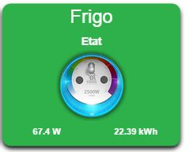

Fibaro FGRWPE-101 "Wall plug" 
=============================

\

-   **The module**

\

\

-   **The Jeedom visual**

\

\

Summary 
------

\

The Fibaro Wall Plug is a universal receiver-socket-transmitter under
form of an adapter to plug into a wall outlet to the network
electric, compatible with Z-Wave standard. It allows you to manage
any device with a maximum power of 2.5kW, while
integrating the functionality of measuring the active power of the current and
energy consumption of devices. This module is equipped with a
light ring with LEDs indicating its status and consumption
of energy from any connected device. The Fibaro Wall Plug can be
controlled by a button on its housing or from any
Z-Wave standard compatible controller

\

Functions 
---------

\

-   Controlled from a controller compatible with the Z-Wave standard.

-   Microchip control.

-   Execution element: Relay.

-   Measurement of active power of current and electrical energy
    of the receiver.

\

Technical characteristics 
---------------------------

\

-   Type of module : Z-Wave receiver

-   Food : 230V, 50Hz

-   Power consumption : up to 0.8W

-   Max load : 2.5kW

-   Frequency : 868.42 Mhz EU

-   Transmission distance : 50m free field, 30m indoors

-   Dimensions: 17 x 42 x 37 mm

-   Operating temperature : 0-40 ° C

-   Limit temperature : 105°C

-   Standards : LVD (2006/95 / WE), EMC (2004/108 / EC), R & TTE (1999/5 / WE)

\

Module data 
-----------------

\

-   Mark : Fibar Group

-   Name : Wall Plug FGWPE-101

-   Manufacturer ID : 271

-   Product Type : 1536

-   Product ID : 4096

\

Setup 
-------------

\

To configure the OpenZwave plugin and know how to put Jeedom in
inclusion refer to this
[Documentation](https://jeedom.fr/doc/documentation/plugins/openzwave/en_US/openzwave.html).

\

> **Important**
>
> To put this module in inclusion mode, press the button 3 times
> inclusion button, according to its paper Documentation.

\

\

Once included you should get this :

\

\

### Commands 

\

Once the module has been recognized, the commands associated with the module will be
disponibles.

\

\

Here is the list of commands :

\

-   State : It is the command which allows to know the status of the
    prise

-   We : This is the command that turns on the outlet

-   Off : It is the command which makes it possible to extinguish the catch

-   Power : This is the command that brings up the instantaneous power
    consumed

-   Consumption : It is the order which reports the total consumption

\

Note that on the dashboard the ON / OFF / STATUS commands are grouped together
in one button.

\

### Setup of the module 

\

Then if you want to configure the module according to
of your installation, you have to go through the button
"Setup "of Jeedom's OpenZwave plugin.

\

\

You will arrive on this page (after clicking on the tab
settings)

\

\

Parameter details :

\

-   1: allows to block the module in always ON

-   16: allows you to remember the last state in the event of a power cut
    courant

-   34: allows you to choose the type of alarm on the Zwave network
    must react

-   35: allows you to set how the outlet will respond to alarms

-   39: sets the duration of the alarm

-   40: defines how much the power must vary to be
    increase (in%)

-   42: same as in standard mode (up to 5 times per step defined in
    param 43)

-   43: power rise interval

-   45: consumption rise interval (in kWh 10 = 0.1 kWh)

-   47: interval in seconds of reporting of information independently
    of a variation

-   49: take into account the consumption of the module itself in the
    valeurs

-   50: minimum value used by param 52

-   51: maximum value used by param 52

-   52: action to be taken if the power goes outside the limits defined in
    parameters 50 and 51

-   60: power beyond which the plug will flash purple

-   61: color when plug is on

-   62: color when plug is off

-   63: color when a Zwave alarm is detected

-   70: safety power (the plug will cut when the power
    will reach this threshold)

\

### Groups 

\

This module has 3 association groups, only the third is
indispensable.

\

\

Good to know 
------------

\

### Reset 

\

\

You can reset your consumption meter by clicking
on this button available in the System tab. It's necessary to choose
PressButton.

\

### Alternative visual 

\

\

Wakeup 
------

\

No notion of wakeup on this module.

\

Faq. 
------

\

Read the Reset section of this doc.

\

**@sarakha63**
