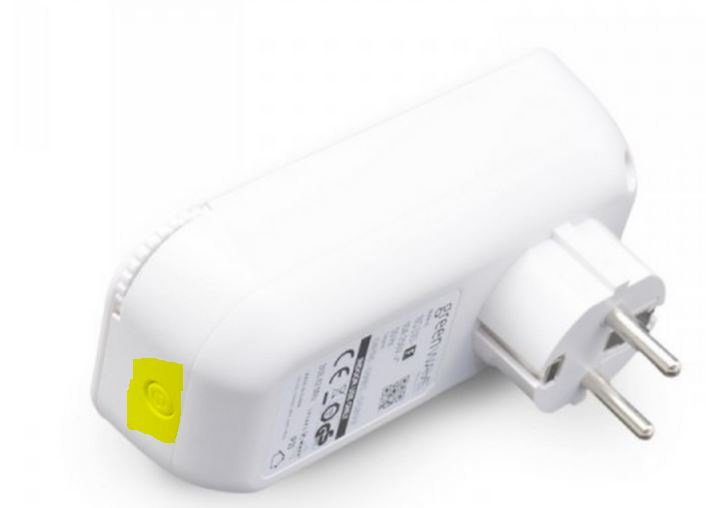

# Greenwave PowerNode - 1 plug

**The module**

**The Jeedom visual**

## Summary

GreenWave's PowerNode plug module is a smart device that connects to one of your home appliances and electronics to allow you to monitor and control power consumption remotely via a web browser or smartphone.

Using Z-Wave technology, the PowerNode controlled socket is compatible with most home automation boxes on the market such as Fibaro Home Center 2, eedomus or Zipabox.

The PowerNode socket module collects data on the energy consumption of the connected device and transmits it to the home automation box. This controlled outlet also allows you to activate or deactivate the device remotely via a web browser or smartphone or to define a calendar to automatically activate or deactivate your device at predefined times.

A small wheel on the side of the socket allows you to choose a color that will represent the room to which it is assigned. For example "blue for the bedroom ". This tip will allow you to differentiate your different PowerNode sockets and multiple sockets. You can also set this dial on a padlock. This function allows you to lock the plug to avoid accidentally turning it off, but control from home automation boxing will no longer be possible.

The PowerNode controlled socket also has a light status indicator which gives different information depending on its color : sockets on or off, limited radio range, inclusion and exclusion mode.

PowerNode plug module is equipped with overcurrent protection to protect the connected device. The PowerNode plug will be deactivated in the event of a faulty device or a short circuit. Additional protection is provided by the internal fuse located in the socket.

## Functions

-   Control a lamp or device remotely
-   Plug module integrating directly between an electrical outlet and the load to be controlled
-   Enables monitoring of consumption of the connected device
-   ON / OFF function
-   Possibility of assigning it a number and a color in order to differentiate the different PowerNodes of the same installation
-   On / Off button directly on the socket
-   Overcurrent protection
-   Light status indicator

## Technical characteristics

-   Food : 250V AC, 50Hz
-   Maximum charge current : 10A
-   Maximum load power : 2400W (@ 240V)
-   Standby consumption : 0.4 W
-   Measurement accuracy : ± 0.1W
-   Overcurrent protection : 10A internal fuse
-   Plug type : DIN49440 / EEC 7/7 (Schuko)
-   Z-Wave Radio Frequency : 868.42MHz
-   Maximum range Z-Wave : 30m
-   Operating temperature : 0 ° C to + 25 ° C
-   Storage temperature : -20 ° C to + 60 ° C
-   Maximum humidity : 5% to 90%
-   IP class (Humidity tolerance) : IP20

## Module data

-   Mark : GreenWave
-   Name : GreenWave \ [1 x plug \]
-   Manufacturer ID : 153
-   Product Type : 2
-   Product ID : 2

## Setup

To configure the OpenZwave plugin and know how to put Jeedom in inclusion, refer to this [Documentation](https://doc.jeedom.com/en_US/plugins/automation%20protocol/openzwave/).

> **IMPORTANT**
>
> To put this module in inclusion mode, press the inclusion button under the socket.

Once included you should get this :

### Commands

Once the module is recognized, the commands associated with the module will be available.

Here is the list of commands :

-   State : It is the command which allows to know the status of the socket
-   We : This is the command that turns on the outlet
-   Off : It is the command which makes it possible to extinguish the catch
-   Power : It is the control which brings up the instantaneous power consumed
-   Consumption : It is the order which reports the total consumption

Note that on the dashboard ON / OFF / STATUS commands are grouped in a single button.

### Setup du module

You can configure the module according to your installation. To do this, go through the "Configuration" button of Jeedom's OpenZwave plugin.

You will arrive on this page (after clicking on the Settings tab)

As you can see there is not a lot of configuration for this module.

Parameter details :

-   1 : Delay before the button flashes : minimum number of seconds between two communications (if this time is exceeded the socket button will flash)
-   2 : Selected wheel color (automatically detected)

### Groups

This module has four association groups, only the 3rd group is essential.

## Good to know

Unlike its big sister multiple socket, this socket does not require polling to increase consumption.

### Reset

You can reset your consumption meter by clicking on this button available in the System tab. Choose PressButton.

### Specificities

## Wakeup

No notion of wakeup on this module.
