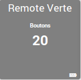

# Nodon Télécommande - Soft Remote

**The module**

**The Jeedom visual**

## Summary

The Soft Remote NodOn® can directly control any Z-Wave® or Z-Wave Plus® compatible device such as the NodOn® smart plug.

It can also trigger scenes via a compatible home automation center.

## Functions

-   Control any Z-Wave compatible device
-   Impact and splash resistant
-   Attaches everywhere thanks to its integrated magnet
-   6 colors available

## Technical characteristics

-   Food : CR2032 battery - Autonomy 1,5 - 2 years
-   4 buttons
-   Integrated magnet for fixing to metal surface
-   Impact and splash resistant
-   Operating temperature : 0 ° C to 40 ° C - Altitude : 2000m
-   Z-Wave® radio protocol : 868.4MHz - 500 Series - Compatible Z-Wave Plus® SDK 06.51.06
-   Scope : 40m indoors / 80m outdoors
-   Dimensions 56 \*56 \*20mm
-   2 years warranty

## Module data

-   Mark : Nodon
-   Name : CRC-3-6-0x Soft Remote
-   Manufacturer ID : 357
-   Product Type : 2
-   Product ID : 2

## Setup

To configure the OpenZwave plugin and know how to put Jeedom in inclusion, refer to this [Documentation](https://doc.jeedom.com/en_US/plugins/automation%20protocol/openzwave/).

> **IMPORTANT**
>
> To put this module in inclusion mode, press the two buttons (+ and 0 full) until the light turns pink, then press the + button, in accordance with its paper documentation.

Once included you should get this :

### Commands

Once the module is recognized, the commands associated with the module will be available.

Here is the list of commands :

-   Buttons : it is the command which will push the button up

+ ---------------- + ---------------- + --------------- - + ---------------- + ---------------- +
| Buttons        | Support          | Long press     | Relaxation    | Double support   |
+ ================ + ================ + ================ = + ================ + ================= +
| **1 (0         | 10             | 12             | 11             | 13             |
| full)**       |                |                |                |                |
+ ---------------- + ---------------- + --------------- - + ---------------- + ---------------- +
| **2 (+)**      | 20             | 22             | 21             | 23             |
+ ---------------- + ---------------- + --------------- - + ---------------- + ---------------- +
| **3 (0 empty)** | 30             | 32             | 31             | 33             |
+ ---------------- + ---------------- + --------------- - + ---------------- + ---------------- +
| **4 (-)**      | 40             | 42             | 41             | 43             |
+ ---------------- + ---------------- + --------------- - + ---------------- + ---------------- +

-   Drums : it is the command which raises the level of the batteries

### Setup du module

> **IMPORTANT**
>
> During a first inclusion always wake up the module just after the inclusion.

Then if you want to configure the module according to your installation, you have to go through the "Configuration" button of Jeedom's OpenZwave plugin.

You will arrive on this page (after clicking on the Settings tab)

Parameter details :

-   1-2 : Allows you to choose the profile of the buttons when used centrally (useless for use in Jeedom)
-   3 : Important parameter to say if the switch should operate in Scene or Central Scene mode (Absolutely set Scene)
-   4-7 : Choose the button operating mode (in case of group associations)
-   8 : Allows you to choose the operating mode of the LED

### Groups

This module has 7 association groups.

-   Group 1 - Lifeline : This group is generally used to report information from the Smart Plug to the main network controller.
-   Group 2 to 5 - The devices in these groups are controlled by the corresponding button according to the MONO profile
-   Group 6 to 7 - The devices in these groups are controlled by the corresponding buttons according to the DUO profile

> **IMPORTANT**
>
> At least Jeedom should end up in group 1

## Good to know

### Specificities

-   This module can be finicky on inclusion. Do not hesitate to wake it up 1 or 2 times after inclusion. Well check the association group.

## Wakeup

To wake up this module, just press one of the buttons

## Important note

> **IMPORTANT**
>
> You have to wake up the module : after its inclusion, after a change in configuration, after a change in wakeup, after a change in association groups
