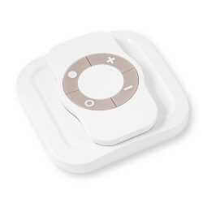

Nodon Remote Control - Octan 
==========================

\

-   **The module**

\

\

-   **The Jeedom visual**

\

\

Summary 
------

\

The Octan Remote NodOn® allows you to control any receiver
Z-Wave® or Z-Wave Plus® compatible such as the remote control socket
NodOn® (Main Controller mode - Standalone), or even trigger
scenes / actions via a compatible home automation system (mode
Gateway)

Its integrated magnet allows it to be fixed everywhere, from the radiator to the door
refrigerator, through its wall support. Between remote control
and switch, the Octan Remote revolutionizes object control
domestiques

\

Functions
---------

\

-   Control alone or with a home automation system

-   Integrated magnet

-   Colored led

-   Wall plate

-   2 years of battery

\

Technical characteristics 
---------------------------

\

-   Food: CR2032 battery - Autonomy 1,5 - 2 years

-   4 buttons

-   Wall support fixed by double-sided adhesive (included) or screws
    (not included)

-   Integrated magnet for fixing to metal surface

-   Operating temperature : 0 ° C to 40 ° C - Altitude : 2000m

-   Z-Wave® radio protocol : 868.4MHz - 500 Series - Z-Wave compatible
    Plus® SDK 06.51.01 Scope: 40m indoor / 80m outdoor

-   Dimensions: 80 \*80 \*15mm

-   2 years warranty

\

Module data 
-----------------

\

-   Mark: Nodon

-   Name: CRC-3-1-00 Octan Remote

-   Manufacturer ID : 357

-   Product Type : 2

-   Product ID : 1

\

Setup
-------------

\

To configure the OpenZwave plugin and know how to put Jeedom in
inclusion refer to this
[Documentation](https://jeedom.fr/doc/documentation/plugins/openzwave/en_US/openzwave.html).

\

> **Important**
>
> To put this module in inclusion mode, press the two
> button (1 and 2) until the light turns pink then press
> button 1, according to its paper documentation.

\

\

Once included you should get this :

\

\

### Commands

\

Once the module has been recognized, the commands associated with the module will be
disponibles.

\

\

Here is the list of commands :

\

-   Buttons: it is the command which will push the button up

+ ---------------- + ---------------- + --------------- - + ---------------- + ---------------- +
| Buttons       | Support         | Long press     | Relaxation    | Double support   |
+ ================ + ================ + ================ = + ================ + ================= +
| **1**          | 10             | 12             | 11             | 13             |
+ ---------------- + ---------------- + --------------- - + ---------------- + ---------------- +
| **2**          | 20             | 22             | 21             | 23             |
+ ---------------- + ---------------- + --------------- - + ---------------- + ---------------- +
| **3**          | 30             | 32             | 31             | 33             |
+ ---------------- + ---------------- + --------------- - + ---------------- + ---------------- +
| **4**          | 40             | 42             | 41             | 43             |
+ ---------------- + ---------------- + --------------- - + ---------------- + ---------------- +

\

### Configuration of the module 

\

> **Important**
>
> During a first inclusion always wake up the module just after
>inclusion

\

Then if you want to configure the module according to
of your installation, you have to go through the button
"Configuration "of Jeedom's OpenZwave plugin.

\

\

You will arrive on this page (after clicking on the tab
settings)

\

\

Parameter details :

\

-   1-2: Allows you to choose the button profiles when used in
    central (not necessary for use in Jeedom)

-   3 : Important parameter to say if the switch should work
    in Scene or Central Scene mode (Absolutely set Scene)

-   4-7: Choose the button operating mode (in case
    group associations)

-   8 : Allows you to choose the operating mode of the LED

### Groups

\

This module has 7 association groups.

\

\

-   Group 1 - Lifeline : This group is generally used for
    transfer information from the Smart Plug to the main controller
    of the network.

-   Group 2 to 5 - The devices in these groups are controlled by the
    corresponding button according to MONO profile

-   Group 6 to 7 - The devices in these groups are controlled by the
    corresponding button according to DUO profile

\

> **Important**
>
> At a minimum Jeedom should end up in group 1 \

Good to know 
------------

\

### Specificities 

\

-   This module can be finicky on inclusion. Do not hesitate to
    wake up 1 or 2 times after inclusion, and check the
    association group.

\

Wakeup
------

\

To wake up this module, just press one of the buttons

\

Faq. 
------

\

This module is a battery module, the new configuration will not be
take into account that if you wake up the remote control.

\

Important note 
---------------

\

> **Important**
>
> You have to wake up the module : after its inclusion, after a change
> of the configuration, after a change of wakeup, after a
> change of association groups

\

**@sarakha63**
