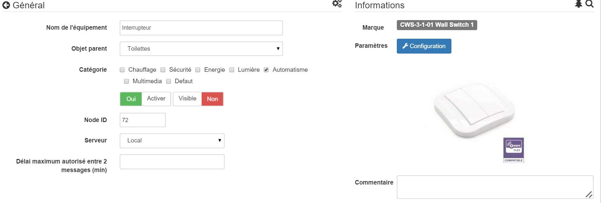

Nodon Switch - Wall Switch 
================================

\

-   **The module**

\

\

-   **The Jeedom visual**

\

\

Summary 
------

\

The NodOn® wall switch can directly control any
Z-Wave® or Z-Wave Plus® compatible device such as plug
NodOn® smart or trigger scenes via a central
compatible home automation.

The switch has a mounting plate for easy mounting
in the House: using the screws of a recessed pot, by
screwing to the wall, or simply by sticking it with adhesives
double-sided on the back of the plate.

\

Functions 
---------

\

-   Control alone or with a home automation system

-   Easy to assemble and disassemble

-   Pleasant feeling of support

-   Wireless

-   2 years of battery

\

Technical characteristics 
---------------------------

\

-   Food : CR2032 battery - Autonomy 1,5 - 2 years

-   4 buttons

-   Wall mounting by double-sided adhesive (included) or screws (not included)

-   Operating temperature : 0 ° C to 40 ° C

-   Altitude : 2000m

-   Z-Wave® radio protocol : 868.4MHz - 500 Series - Z-Wave compatible
    Plus® SDK 06.51.06

-   Scope : 40m indoors / 70m outdoors

-   Dimensions : 80 \*80 \*15mm

-   2 years warranty

-   EN 60950-1:2006 + A11:2009 + A1:2010 + A12:2011 + A2:2013

-   EN 300 220-2 V2.4.1

-   EN301 489-1 V1.9.2

-   EN301 489-3 V1.6.1

-   EN 62479:2010

\

Module data 
-----------------

\

-   Mark : Nodon

-   Name : CWS-3-1-01 Wall Switch

-   Manufacturer ID : 357

-   Product Type : 2

-   Product ID : 3

\

Setup 
-------------

\

To configure the OpenZwave plugin and know how to put Jeedom in
inclusion refer to this
[Documentation](https://jeedom.fr/doc/documentation/plugins/openzwave/en_US/openzwave.html).

\

> **Important**
>
> To put this module in inclusion mode, press the two
> button (1 and 2) until the light turns pink then press
> button 1, according to its paper documentation.

\

\

Once included you should get this :

\

\

### Commands 

\

Once the module has been recognized, the commands associated with the modules will be
disponibles.

\

\

Here is the list of commands :

\

-   Buttons : it is the command which will push the button up

+ ---------------- + ---------------- + --------------- - + ---------------- + ---------------- +
| Buttons        | Support          | Long press     | Relaxation    | Double support   |
+ ================ + ================ + ================ = + ================ + ================= +
| **1**          | 10             | 12             | 11             | 13             |
+ ---------------- + ---------------- + --------------- - + ---------------- + ---------------- +
| **2**          | 20             | 22             | 21             | 23             |
+ ---------------- + ---------------- + --------------- - + ---------------- + ---------------- +
| **3**          | 30             | 32             | 31             | 33             |
+ ---------------- + ---------------- + --------------- - + ---------------- + ---------------- +
| **4**          | 40             | 42             | 41             | 43             |
+ ---------------- + ---------------- + --------------- - + ---------------- + ---------------- +

\

### Configuration of the module 

\

> **Important**
>
> During a first inclusion always wake up the module just after
> inclusion.

\

Then if you want to configure the module according to
of your installation, you have to go through the button
"Configuration "of Jeedom's OpenZwave plugin.

\

\

You will arrive on this page (after clicking on the tab
settings)

\

\

Parameter details :

\

-   1-2 : Allows you to choose the profile of the buttons when used in
    central (not necessary for use in Jeedom)

-   3 : Important parameter to say if the switch should work
    in Scene or Central Scene mode (Absolutely set Scene)

-   4-7 : Choose the button operating mode (in case
    group associations)

-   8 : Allows you to choose the operating mode of the LED

### Groups 

\

This module has 7 association groups.

\

\

-   Group 1 - Lifeline : This group is generally used for
    transfer information from the Smart Plug to the main controller
    of the network.

-   Group 2 to 5 - The devices in these groups are controlled by the
    corresponding button according to MONO profile

-   Group 6 to 7 - The devices in these groups are controlled by the
    corresponding button according to DUO profile

\

> **Important**
>
> At a minimum Jeedom should end up in group 1 \

Good to know 
------------

\

### Specificities 

\

-   This module can be finicky on inclusion. Do not hesitate to
    wake up 1 or 2 times after inclusion. And check the
    association group.

\

Wakeup 
------

\

To wake up this module just press one of these buttons

\

Faq. 
------

\

This module is a battery module, the new configuration will not be
take into account that if you wake up the remote control.

\

Important note 
---------------

\

> **Important**
>
> You have to wake up the module : after its inclusion, after a change
> of the configuration, after a change of wakeup, after a
> change of association groups

\

**@sarakha63**
