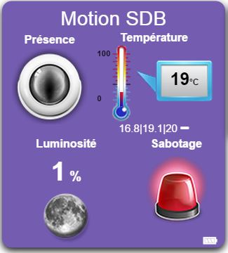

Philio PSP01 
============

-   **The module**

-   **The Jeedom visual**

Summary 
------

The PSP01 detector offers 3 different functions : detection of
movement, temperature sensor and light detector.

This detector can be used for security or for
automation. When the detector is associated with
security, it serves as a trigger for alerts by detecting
changes in infrared radiation levels. If a person
moves in the detector's field of vision, a radio signal is
transmitted, which triggers an alarm to deter intruders.

The detector can also be used in combination with a
Z-Wave controller for home automation uses, by detecting both
changes in infrared radiation levels (presence) and
changes in the brightness level. So we can trigger a
lighting when motion is detected in the dark.

The detector will also raise the brightness and the temperature, i.e
significant change, and each time a movement is
detected. A Z-Wave controller (remote control, dongle, etc.) is required
in order to integrate this detector into your network if you already have a
existing network.

Functions 
---------

-   3 in 1 detector: movement, temperature, light

-   Adopts the recent Z-Wave 400series chip to support
    multichannel operations and more data throughput
    high (9.6 / 40 / 100kbps)

-   Uses the Z-Wave 6.02 SDK

-   Optimized antenna range

-   Use for home automation or security applications

-   Button to include / exclude the detector

-   Autoprotection

-   Low battery indication

-   Small, discreet and aesthetic

-   Ease of use and installation

Technical characteristics 
---------------------------

-   Type of module : Z-Wave transmitter

-   Food : 1 CR123A 3V battery

-   Battery life : 2 years

-   Frequency : 868.42 MHz

-   Transmission distance : 30m indoors

-   Temperature sensor : -10 to 70 ° C

-   Brightness sensor : 0 to 500 lux

-   PIR detection angle : 90 °

-   PIR detection range : 8 to 10m

-   Dimensions : 28 x 96 x 23 mm

-   Weight : 39g

-   Operating temperature : -10 to 40 ° C

-   Operating humidity : 85% RH max

-   CE standard : EN300 220-1

-   Z-Wave certification : ZC08-13050003

Module data 
-----------------

-   Mark : Philio Technology Corporation

-   Name : Philio PSP01

-   Manufacturer ID : 316

-   Product Type : 2

-   Product ID : 2

Setup 
-------------

To configure the OpenZwave plugin and know how to put Jeedom in
inclusion refer to this
[Documentation](https://doc.jeedom.com/en_US/plugins/automation%20protocol/openzwave/).

> **IMPORTANT**
>
> To put this module in inclusion mode, press the button 3 times
> inclusion button, according to its paper documentation.

Once included you should get this :

### Commands 

Once the module has been recognized, the commands associated with the module will be
disponibles.

Here is the list of commands :

-   Presence : it is the command which will detect a presence detection

-   Opening : it is the command which will raise a detection
    d'ouverture

-   Temperature : it is the command which allows to go up the
    Temperature

-   Brightness : it is the command which makes it possible to raise the brightness

-   Sabotage : this is the sabotage command (it is triggered in
    tearing out)

-   Drums : it's the battery command

All the modules of the range having the same ids, it's up to you to display those
corresponding to your module.

### Configuration of the module 

> **IMPORTANT**
>
> During a first inclusion always wake up the module just after
> inclusion.

Then if you want to configure the module according to
of your installation, you have to go through the button
"Configuration "of Jeedom's OpenZwave plugin.

You will arrive on this page (after clicking on the tab
Settings)

Parameter details :

-   2: allows to adjust the signal sent to the modules in the group
    association 2

-   3: adjusts the sensitivity of the presence sensor (0 :
    disabled 99: maximum sensitivity)

-   4: adjusts the brightness level from which the
    signal defined in parameter 2 will be sent to the modules associated with the
    group 2

-   5: operating mode (not recommended to change it : report to
    on the manufacturer's documentation)

-   6: multi-sensor operating mode (not recommended to change it
    : refer to the manufacturer's documentation)

-   9: allows to define after how long the OFF signal will be
    sent to modules associated with group 2

-   10: allows you to define the duration between two battery reports (one
    unit = 30 minutes)

-   12: used to define the duration between two brightness reports
    (one unit = 30 minutes)

-   13: allows to define the time between two temperature reports
    (one unit = 30 minutes)

### Groups 

This module has two association groups, only the first is
indispensable.

Good to know 
------------

### Specificities 

> **Tip**
>
> This module has a particularity, not having a report based on the
> variations but only over time, it sends all of its info to
> each detection. It also sends the signal several times
> presence detection following. It is therefore advisable to tick the
> "Event on change" box on the presence if you use this
> command in scenario trigger.

### Alternative visual 

Wakeup 
------

To wake up this module there is only one way :

-   release the tamper button and press it again

Faq. 
------

This module wakes up by pressing its tamper button.

Check the box "Event on change".

This module is a battery module, the new configuration will be
taken into account at the next wakeup.

Important note 
---------------

> **IMPORTANT**
>
> You have to wake up the module : after its inclusion, after a change
> of the configuration, after a change of wakeup, after a
> change of association groups

**@sarakha63**
