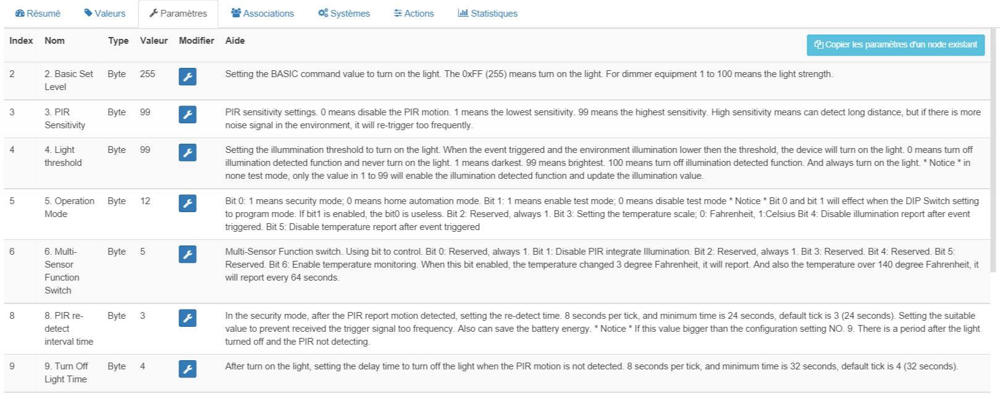

 
============

\

-   **The module**

\

\

-   **The Jeedom visual**

\

\

Summary 
------

\

 : detection of
.

. 

.

The detector can also be used in combination with a
Z-Wave controller for home automation uses, by detecting both

. 
.

The detector will also raise the brightness and temperature, i.e.

.

\

Functions 
---------

\

-   3 in 1 detector: 

-   Adopts the recent Z-Wave 400series chip to support
    multichannel operations and more data throughput
    high (9.6 / 40 / 100kbps)

-   Uses the Z-Wave 6.02 SDK

-   Optimized antenna range

-   Use for home automation or security applications

-   Button to include / exclude the detector

-   Autoprotection

-   Low battery indication

-   Small, discreet and aesthetic

-   Ease of use and installation

\

Technical characteristics 
---------------------------

\

-   Type of module : Z-Wave transmitter

-   Food : 1 CR123A 3V battery

-   Battery life : 2 years

-   Frequency : 868.42 MHz

-   Transmission distance : 30m indoors

-   Temperature sensor : -10 to 70 ° C

-   Brightness sensor : 0 to 500 lux

-   PIR detection angle : 90 °

-   PIR detection range : 8 to 10m

-   Dimensions : 28 x 96 x 23 mm

-   Weight : 39g

-   Operating temperature : -10 to 40 ° C

-   Operating humidity : 85% RH max

-   CE standard : EN300 220-1

-   Z-Wave certification : ZC08-13050003

\

Module data 
-----------------

\

-   Mark : Philio Technology Corporation

-   Last name : 

-   Manufacturer ID : 316

-   Product Type : 2

-   Product ID : 2

\

Configuration 
-------------

\

To configure the OpenZwave plugin and know how to put Jeedom in
inclusion refer to this
[documentation](https://jeedom.fr/doc/documentation/plugins/openzwave/en_US/openzwave.html).

\

> **Important**
>
> To put this module in inclusion mode, press the button 3 times
> inclusion button, according to its paper documentation.

\

\

Once included you should get this :

\

\

### Orders 

\

Once the module has been recognized, the commands associated with the module will be
disponibles.

\

\

Here is the list of commands :

\

-   Presence : it is the command which will detect a presence detection

-   Opening : it is the command which will raise a detection
    d'ouverture

-   Temperature : it is the command which allows to go up the
    temperature

-   Brightness : it is the command which makes it possible to raise the brightness

-   Sabotage : this is the sabotage command (it is triggered in
    tearing out)

-   Drums : it's the battery command

\

.

### Configuration of the module 

\

> **Important**
>
> During a first inclusion always wake up the module just after
> inclusion.

\

Then if you want to configure the module according to
of your installation, you have to go through the button
"Configuration "of Jeedom's OpenZwave plugin.

\

\

You will arrive on this page (after clicking on the tab
Settings)

\

\

Parameter details :

\

-   2: allows to adjust the signal sent to the modules in the group
    association 2

-   3: adjusts the sensitivity of the presence sensor (0 :
    disabled 99: maximum sensitivity)

-   4: adjusts the brightness level from which the
    signal defined in parameter 2 will be sent to the modules associated with the
    group 2

-   5:  : 
    on the manufacturer's documentation)

-   6: 
    : 

-   9: allows to define after how long the OFF signal will be
    sent to modules associated with group 2

-   10: allows you to define the duration between two battery reports (one
    

-   12: 
    

-   13: 
    

\

### Groups 

\

This module has two association groups, only the first is
indispensable.

\

\

Good to know 
------------

\

### Specificities 

\

> **Tip**
>
> 
> 
> . 
> . 
> 
> .

\

### Alternative visual 

\

\

Wakeup 
------

\

To wake up this module there is only one way :

-   release the tamper button and press it again

\

Faq. 
------

\

This module wakes up by pressing its tamper button.

\

".

\

This module is a battery module, the new configuration will be
taken into account at the next wakeup.

\

Important note 
---------------

\

> **Important**
>
> You have to wake up the module : after its inclusion, after a change
> of the configuration, after a change of wakeup, after a
> change of association groups

\

**@sarakha63**
