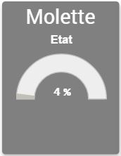

# Philio Smart Color Button

**The module**

**The Jeedom visual**

## Summary

This unique design switch offers several functions. You can use it to turn on, off or dim the lights, adjust the position of your shutters, adjust the thermostat temperature or use it as a timer.

Once included in your Z-Wave network, the Philio PSR04 switch must be associated with the device (s) you wish to control. It can only work by direct association with peripherals, and cannot launch scenes created in your Z-Wave home automation controller.

Used as a dimmer, it has the same behavior as a traditional dimmer. Turn the knob to the right to increase the light, and to the left to decrease it.

In addition, you can easily move and position this switch at the location of your choice thanks to its magnetic support. Its waterproof design allows it to be installed in a place with high humidity such as a bathroom.

It uses the latest Z-Wave 500 series chip, offering a 50% increase in radio range and 250% faster communication speed compared to previous Z-Wave products, as well as lower power consumption allowing greater autonomy.

## Fonctions

-   Multifunction switch
-   Z-Wave + technology
-   ON / OFF and dimming function (lighting or shutters)
-   Integrated timer function
-   Etanche
-   Adapts to any decoration style
-   Rechargeable battery
-   Very low energy consumption
-   Long battery life (6 months per charge)
-   Magnetic holder
-   RGBW indication LED
-   Easy to install

## Technical characteristics

-   Food : Lithium Polymer 3 Battery.7V, 220mA v Battery life : 6 months for 2 hours charge
-   Standby consumption : 18µA
-   Consumption in operation : 45mA
-   Frequency : 868.42 MHz
-   Transmission distance : 100m outdoors, 40m indoors
-   Dimensions : Support : 71.16 x 10.94 mm (diameter x thickness) Button : 59.99 x 14.89mm (diameter x thickness) Support + Button : 71.16 x 17.22 mm (diametrex thickness) Certifications : EN 301 489-1, EN 301 489-3 EN 300 220-1, EN 300 220-2 EN62479, EN60950 FCC Part 15 B, FCC Part 15 C

## Module data

-   Mark : Philio
-   Name : PSR04 Smart Color Button
-   Manufacturer ID : 316
-   Product Type : 9
-   Product ID : 34

## Configuration

To configure the OpenZwave plugin and know how to put Jeedom in inclusion, refer to this [Documentation](https://doc.jeedom.com/en_US/plugins/automation%20protocol/openzwave/).

> **IMPORTANT**
>
> To put this module in inclusion mode, put it in the low position (inclusion) and press the button, in accordance with its paper documentation.

Once included you should get this :

### Commandes

Once the module is recognized, the commands associated with the module will be available.

Here is the list of commands :

-   State : it is the command which will raise the position of the button from 0 to 100%
-   Drums : it is the command which reports the battery status of the module

### Configuration of the module

> **IMPORTANT**
>
> During a first inclusion always wake up the module just after the inclusion.

Then if you want to configure the module according to your installation, you have to go through the "Configuration" button of Jeedom's OpenZwave plugin.

You will arrive on this page (after clicking on the Settings tab)

Parameter details :

-   1: defines the lowest bound (position completely left)
-   2 : defines the highest terminal (position completely right)
-   10 : battery ascent time interval
-   25 : allows to define if the module sends its position automatically after rotation (1s delay) or if it is necessary to press the button to validate the sending
-   26 : activates the sending of scene or not on pressing of the central button (parameter not taken into account in Jeedom)

### Groupes

This module has two association groups, the first is the only essential. The second allows to go up the position to Jeedom

## Good to know

### Specificities

To use this module as a remote control, proceed as follows :

-   Add the controller in group 2

Indeed this type of module is not made to interact directly with a box but directly with other modules. However by adding Jeedom to group 2, this allows you to receive the position of the button and therefore to use it to control a scenario (adjust a volume for example)

## Wakeup

To wake up this module there is only one way :

-   put the module in the low position and press the button

## Important note

> **IMPORTANT**
>
> You have to wake up the module : after its inclusion, after a change in configuration, after a change in wakeup, after a change in association groups
