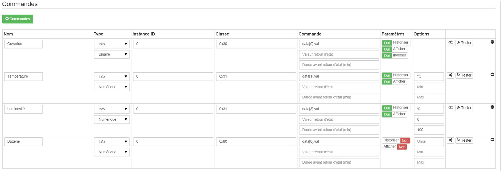
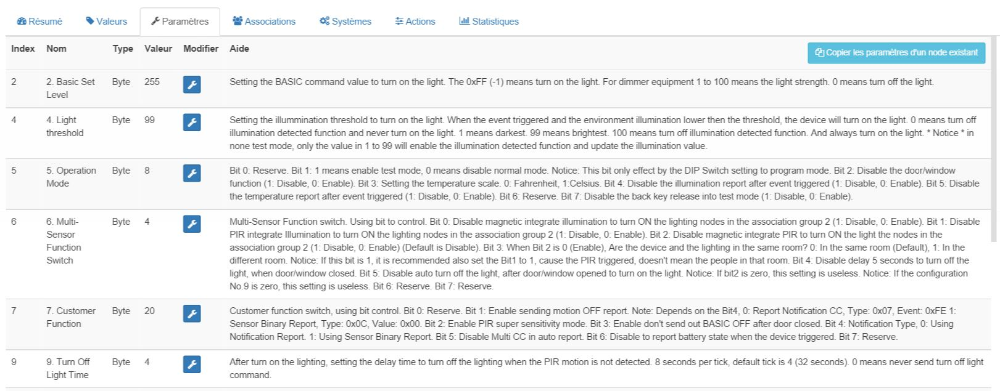
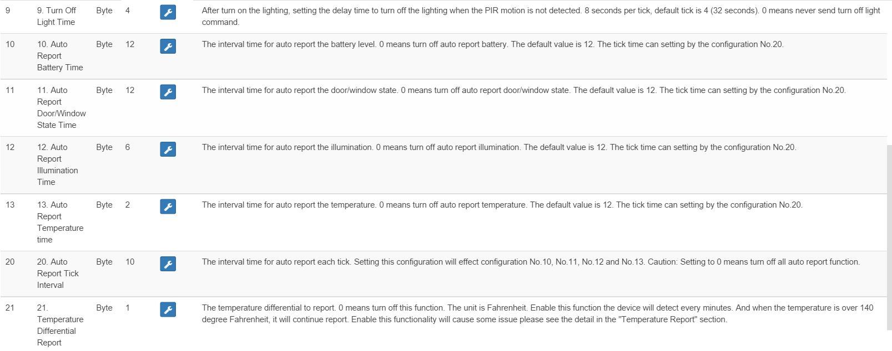

Philio PST02 C - 3 en 1 Opening 
=================================

 \

-   **Le module**

 \

 \

-   **Le visuel jeedom**

 \

 \

Summary 
------

 \

Le détecteur ZIP-PSM01 propose 3 fonctions différentes : détection
d'ouverture, capteur de température et détecteur de luminosité. It is
compose de deux parties : un détecteur et un aimant. Ils sont conçus
pour être placés sur une porte ou une fenêtre avec l'aimant fixé sur la
partie qui s'ouvre et le détecteur sur la partie fixe.

L'ouverture de la porte ou de la fenêtre éloignera l'aimant du
détecteur, ce qui enclenchera le détecteur qui enverra un signal Z-Wave
d'alarme, si le système est armé (ce signal peut être exploité par une
sirène ou par une box domotique par exemple). Le capteur peut également
être utilisé pour le contrôle automatique de l'éclairage, en fonction du
niveau de luminosité. Par exemple, le capteur enverra un signal à
l'interrupteur Z-Wave pour allumer la lumière lorsque la porte s'ouvre
et que la pièce est sombre.

Le détecteur remontera aussi la luminosité et la température, soit en
cas de changement important, et à chaque fois que l'ouverture/fermeture
est détectée.

Un contrôleur Z-Wave (télécommande, dongle …​) est nécessaire afin
d'intégrer ce détecteur dans votre réseau si vous avez déjà un réseau
existant.

 \

Functions 
---------

 \

-   Détecteur 3 en 1: Opening, température, lumière

-   Adopte la récente puce Z-Wave 400series pour supporter les
    opérations multicanaux et un débit de données plus
    élevé (9.6/40/100kbps)

-   Utilise le SDK Z-Wave 6.02

-   Portée de l'antenne optimisée

-   Utilisation pour des applications domotique ou de sécurité

-   Bouton pour inclure/exclure le détecteur

-   Autoprotection

-   Indication de batterie faible

-   Petit, discret et esthétique

-   Facilité d'utilisation et d'installation

 \

Caractéristiques Techniques 
---------------------------

 \

-   Type de module : Emetteur Z-Wave

-   Alimentation : 1 pile 3V CR123A

-   Durée de vie des piles : 3 ans (pour 14 déclenchements par jour)

-   Fréquence : 868.42 MHz

-   Distance de transmission : 30m en intérieur

-   Capteur de température : -10 à 70° C

-   Brightness sensor : 0 à 500 lux

-   Dimensions :

-   Détecteur : 28 x 96 x 23 mm

-   Aimant : 10 x 50 x 12 mm

-   Poids : 52g

-   Température de fonctionnement : -10 à 40° C

-   Humidité de fonctionnement : 85%RH max

-   Norme CE : EN300 220-1

-   Certification Z-Wave : ZC08-13050003

 \

Données du module 
-----------------

 \

-   Marque : Philio Technology Corporation

-   Nom : PST02-C Door/Window 3 in 1 sensor

-   Fabricant ID : 316

-   Type produit : 2

-   Produit ID : 14

 \

Configuration 
-------------

 \

Pour configurer le plugin OpenZwave et savoir comment mettre Jeedom en
inclusion référez-vous à cette
[documentation](https://jeedom.fr/doc/documentation/plugins/openzwave/fr_FR/openzwave.html).

 \

> **Important**
>
> Pour mettre ce module en mode inclusion il faut appuyer 3 fois sur le
> bouton d'inclusion, conformément à sa documentation papier.

 \

 \

Une fois inclus vous devriez obtenir ceci :

 \

 \

### Commandes 

 \

Une fois le module reconnu, les commandes associées au module seront
available.

 \

 \

Voici la liste des commandes :

 \

-   Opening : c'est la commande qui remontera une détection
    d'ouverture

-   Température : C'est la commande qui permet de remonter la
    température

-   Luminosité : C'est la commande qui permet de remonter la luminosité

-   Drums : c'est la commande batterie

 \

### Configuration du module 

 \

> **Important**
>
> Lors d'une première inclusion réveillez toujours le module juste après
> l'inclusion.

 \

Ensuite si vous voulez effectuer la configuration du module en fonction
de votre installation, il faut pour cela passer par la bouton
"Configuration" du plugin OpenZwave de Jeedom.

 \

 \

Vous arriverez sur cette page (après avoir cliqué sur l'onglet
Paramètres)

 \

 \

Détails des paramètres :

 \

-   2: permet de régler le signal envoyé aux modules dans le groupe
    d'association 2

-   4: permet de régler le niveau de luminosité à partir duquel le
    signal défini en paramètre 2 sera envoyé aux modules associés au
    groupe 2

-   5: mode de fonctionnement (se reporter sur la
    documentation constructeur) Valeur recommandée : 8

-   6: mode de fonctionnement du multi-sensor (se reporter sur la
    documentation constructeur) Valeur recommandée : 4

-   7: mode de fonctionnement personnalisée du multi-sensor (se reporter
    sur la documentation constructeur) Valeur recommandée : 20 (pour
    avoir l'ouverture de fonctionnelle)

-   9: permet de définir au bout de combien de temps le signal OFF sera
    envoyé aux modules associés au groupe 2

-   10: permet de définir la durée entre deux Reports de batterie (une
    unité = parametre 20)

-   11: permet de définir la durée entre deux Reports auto d'ouverture
    (une unité = parametre 20)

-   12: permet de définir la durée entre deux Reports auto de
    luminosité (une unité = parametre 20) Valeur recommandée : 3

-   13: permet de définir la durée entre deux Reports auto de
    température (une unité = parametre 20) Valeur recommandée : 2

-   20: durée d'un intervalle pour les paramètres 10 à 13 Valeur
    recommandée : 10

-   21: valeur de variation en °F de température pour déclencher un
    Report

-   22: valeur en % de variation de luminosité pour déclencher un
    Report Valeur recommandée : 10

 \

### Groups 

 \

Ce module possède deux groupes d'association, seul le premier est
indispensable.

 \

 \

Bon à savoir 
------------

 \

### Visuel Alternatif 

 \

 \

Wakeup 
------

 \

Pour réveiller ce module il y a une seule et unique façon de procéder :

-   relachez le bouton tamper et réappuyez dessus

 \

F.A.Q. 
------

 \

Ce module se réveille en appuyant sur son bouton tamper.

 \

Ce module est un module sur batterie, la nouvelle configuration sera
prise en compte au prochain wakeup.

 \

Note importante 
---------------

 \

> **Important**
>
> Il faut réveiller le module : après son inclusion, après un changement
> de la configuration , après un changement de wakeup, après un
> changement des groupes d'association

 \

**@sarakha63**
