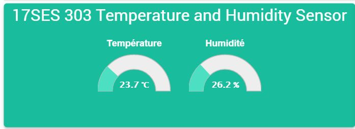

Secure SES 303 "Temperature / Humidity" 
=====================================

-   **The module**

-   **The jeedom visual**

Summary 
------

The SES303 probe allows the measurement of the indoor ambient temperature
as well as humidity. It is powered by 2 AA batteries and is certified
Z-Wave Plus. In addition to its main function, it is possible to
wire various external SECURE probes to the module, i.e:

-   An external NTC temperature sensor (SES001)

-   4 wired temperature sensors for hose or tank (SES002)
    connected by 1m cables

-   1 wired temperature sensor for hose or tank (SES003)
    connected by a 4m cable

These modules are ideal for temperature measurement in
central heating control applications or any other
similar application. Its user interface is simple, with a
local push button and an indication LED on the rear panel. We
can easily include / exclude it in a Z-Wave network.

Functions 
---------

-   Precise measurement of temperature and humidity

-   Application in dynamic control systems
    tanks / tubes / heated floors /…

-   Possibility to connect external sensors

-   Interoperable with Z-Wave certified products and systems

-   Quick and easy installation

-   Low battery report

Technical characteristics 
---------------------------

-   Type: Portable / wall mount

-   Temperature measurement range: ± 0.5 ° C for 0 ° C to 40 ° C

-   Z-Wave Plus chip

-   Frequency : 868.42 Mhz

-   Alimentation: 2x AA batteries (LR6)

-   Scope : up to 100 m in free field

-   Protection sign : IP30

-   Dimensions : 86 x 85 x 30 mm

Module data 
-----------------

-   Mark : Horstmann

-   Name : SES 303 Temperature and Humidity Sensor

-   Manufacturer ID : 89

-   Product Type : 13

-   Product ID : 3

Setup 
-------------

To configure the OpenZwave plugin and know how to put Jeedom in
inclusion refer to this
[Documentation](https://doc.jeedom.com/en_US/plugins/automation%20protocol/openzwave/).

> **IMPORTANT**
>
> To put this module in inclusion mode, press 1 second on
> the button on the back and release, according to its paper documentation.

Once included you should get this :

### Commands 

Once the module has been recognized, the commands associated with the module will be
disponibles.

Here is the list of commands :

-   Temperature : it is the temperature measurement command

-   Humidity : it is the humidity measurement control

-   Drums : it's the battery command

Several non visible temperatures are also available and will be
useful if you have connected external probes

### Configuration of the module 

> **IMPORTANT**
>
> During a first inclusion always wake up the module just after
> inclusion.

Then it is necessary to configure the module in
depending on your installation. This requires going through the button
"Configuration "of Jeedom's OpenZwave plugin.

You will arrive on this page (after clicking on the tab
settings)

Parameter details :

-   1: Adjusts how much the temperature must vary for
    the module sends it to Jeedom (in steps of 0.1)

-   2: Allows you to set the temperature sending time interval
    in Jeedom (in minutes)

-   3: Adjusts how much the humidity must vary so that the
    module sends it to Jeedom (by%)

-   4: Sets the time interval for sending humidity to
    Jeedom (in minutes)

All other parameters are identical and correspond to all
external probes possibly connected

### Groups 

This module has only one association group, it is essential

Good to know 
------------

### Specificities 

### Alternative visual 

Wakeup 
------

To wake up this module, press the button on the back once

Faq. 
------

This module wakes up by pressing once on its inclusion button.

This module is a battery module, the new configuration will be
taken into account at the next wake up.

Important note 
---------------

> **IMPORTANT**
>
> You have to wake up the module : after its inclusion, after a change
> of the configuration, after a change of wake up, after a
> change of association groups

**@sarakha63**
