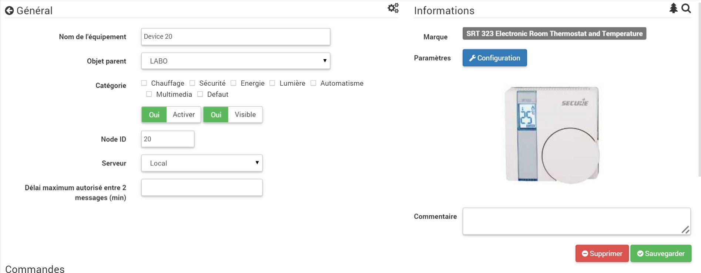

# Secure SRT 323 "Thermostat"

**The module**

**The jeedom visual**

Summary
------

The SRT323 is a wall-mounted battery-operated thermostat. It has a rotary button allowing the user to adjust the set temperature in the room. This thermostat incorporates a charge control relay. There is therefore no need to install an actuator near the boiler.

By checking the setpoint temperature with the actual measured temperature, the thermostat decides to activate the boiler. In addition, this thermostat incorporates a TPI (time-proportional integral) algorithm, allowing optimization and fairer adjustment of the temperature of your environment.

The thermostat can receive the set temperature from another Z-Wave controller, and can also be used as a temperature sensor. The thermostat itself does not have a built-in timer but performs Z-Wave and local commands.

It can be used as a direct replacement for existing thermostats, without having to make any wiring changes. The TPI algorithm will allow optimizing the switching on and off of the boiler in order to best maintain the set temperature, without "exceeding" it. TPI controllers have been shown to provide considerable energy savings compared to traditional heating controllers.

The SRT323 is an ideal partner for use with a home automation gateway, allowing you to remotely control your heating system. You will no longer have to worry about going home to a cold house, as long as you have a smartphone, tablet or PC close at hand and connected to the internet.

Fonctions
---------

-   Thermostat for domestic application
-   Replaces an existing thermostat
-   Z-Wave wireless technology
-   Backlit LCD display
-   Easy to use
-   Compatible with other Z-Wave products
-   One button

Technical characteristics
---------------------------

-   Type of module : Z-Wave controller
-   Integrated TPI algorithm
-   Relai: 3 (1) A 230V AC
-   Adjustable temperature range: 5 ° C to 30 ° C
-   Food : 2x AAA batteries (LR3)
-   Battery life : 2 years
-   Frequency : 868.42 Mhz
-   Scope : up to 50 m in open field
-   Protection sign : IP30
-   Operating temperature : 0 ° C to 40 ° C
-   Dimensions : 86 x 86 x 36.25 mm

Module data
-----------------

-   Mark : Horstmann
-   Name : SRT 323 Electronic Room Thermostat and Temperature
-   Manufacturer ID : 89
-   Product Type : 1
-   Product ID : 4

Configuration
-------------

To configure the OpenZwave plugin and know how to put Jeedom in inclusion, refer to this [Documentation](https://doc.jeedom.com/en_US/plugins/automation%20protocol/openzwave/).

> **IMPORTANT**
>
> To put this module in inclusion mode, you must put switch 1 in the ON position, then use the dial to display L and press the dial, in accordance with its paper documentation.

> **IMPORTANT**
>
> This module is finicky at inclusion. During a first inclusion always wake up the module just after the inclusion. To do this, leave switch 1 in the ON position, then with the thumb wheel, put you in position "n" and press the button. Press a second time after 10 seconds to be sure. Once done, click on the Synchronize button (visible in expert view) next to the Inclusion / Exclusion buttons. Then on the page of your module click on the magnifying glass at the top right.

Once included you should get this :

### Commandes

Once the module is recognized, the commands associated with the module will be available.

Here is the list of commands :

-   Temperature : it is the temperature measurement command
-   State : it is the command which gives the current instruction
-   Instructions : it is the command which makes it possible to adjust the setpoint
-   Heating State : it is the command which allows to know if the thermostat is in heating mode or not
-   Drums : it's the battery command

### Configuration of the module

Then it is necessary to configure the module according to your installation. To do this, go through the "Configuration" button of Jeedom's OpenZwave plugin.

You will arrive on this page (after clicking on the Settings tab)

Parameter details :

-   1: allows to activate or not the internal temperature sensor
-   2: allows to choose the temperature unit
-   3: allows you to define the temperature variation level so that the module raises it (in units of 0.1 ° C)

### Groupes

For optimum functioning of your module, Jeedom must be associated with the 5 groups

Good to know
------------

### Specificities

> **IMPORTANT**
>
> This module is on battery. So it is important to note that a change of setpoint will only be taken into account when you wake up. By default the wake up is at 86400 seconds. It is strongly recommended to decrease it to about 10 minutes. Thus a change of setpoint will be taken into account by the module at most after 10 minutes

Wakeup
------

To wake up this module you must put switch 1 in the ON position and
with the wheel choose n and press the wheel.

Important note
---------------

> **IMPORTANT**
>
> You have to wake up the module : after its inclusion, after a change in configuration, after a change in wakeup, after a change in association groups
