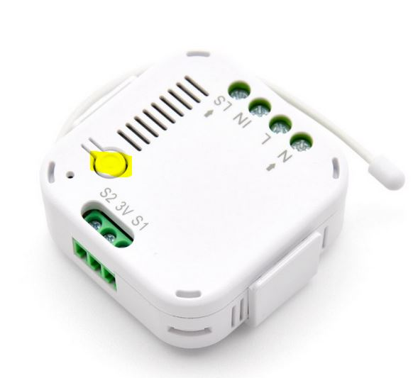
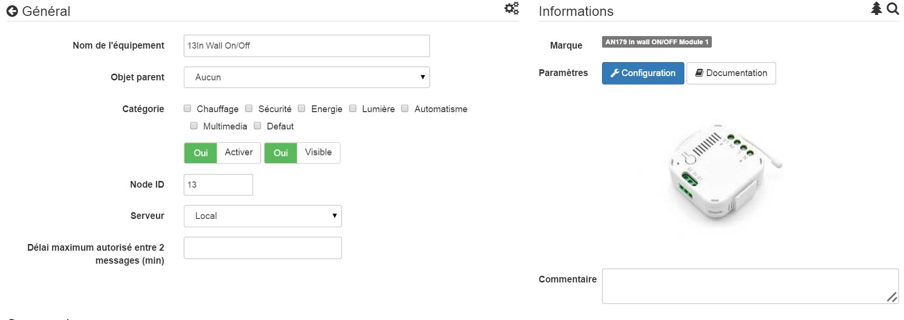

# SmartHome by Everspring In Wall On Off - AN179-0

**The module**

**The Jeedom visual**

Summary
------

The Wall / ON Micromodule from SmartHome Europe by Everspring, is designed to control the switching on and off of lights and electrical appliances in your home. Two sets of dry contacts allow the connection of two switches.

For safety purposes, the unit can detect overheating and will directly turn off the relay to avoid damage. At a voltage of 230 V, this module can support up to 11 A resistive load, 1200 Watts incandescent, 700 Watts of motor, or 320 Watts (8 x 40 Watts) of fluorescent load.

The Micromodule Mural ON / OFF is a Z-Wave ™ compatible device which is intended to work with all Z-Wave ™ compatible networks. It can be controlled by a remote control, PC software, or any Z-Wave controller on your network.

Fonctions
---------

-   Control a light / device remotely
-   Installs behind an existing switch
-   ON / OFF function
-   Low energy consumption
-   Very small, reduced dimensions
-   Long range antenna
-   Z-Wave Plus technology
-   Easily installs in a standard flush-mount box
-   Button to include / exclude / associate the module
-   Z-Wave repeater function

Technical characteristics
---------------------------

-   Type of module : Z-Wave receiver
-   Food : 230 V, 50 Hz
-   Consumption : 0.5W
-   Maximum power : Resistive load : 2500W Incandescent bulb : 1200W Compact Fluorescent Bulb : 320W
-   Frequency : 868.42 Mhz
-   Scope : up to 70 m outdoors, up to 30 m in buildings
-   Affichage: LED on the button
-   Dimensions : 42mm x 43mm x 16mm

Module data
-----------------

-   Mark : SmartHome by Everspring
-   Name : In Wall On Off
-   Manufacturer ID : 96
-   Product Type : 4
-   Product ID : 8

Configuration
-------------

To configure the OpenZwave plugin and know how to put Jeedom in inclusion, refer to this [Documentation](https://doc.jeedom.com/en_US/plugins/automation%20protocol/openzwave/).

> **IMPORTANT**
>
> To put this module in inclusion mode, press its button 3 times, in accordance with its paper documentation. It is important to note that this module goes directly into inclusion when it does not belong to any network and it is powered

Once included you should get this :

### Commandes

Once the module is recognized, the commands associated with the module will be available.

Here is the list of commands :

-   We : It is the control that turns on the light
-   Off : It is the command that turns off the light
-   State : It is the command which allows to know the status of the light

Note that on the dashboard, the State, ON / OFF information is found on the same icon.

### Configuration of the module

You can configure the module according to your installation. To do this, go through the "Configuration" button of Jeedom's OpenZwave plugin.

You will arrive on this page (after clicking on the Settings tab)

Parameter details :

-   1 : This parameter defines the status value command, it is not advisable to change this value.
-   2 : This parameter defines the delay for sending the change of state to group 1 (value between 3 and 25 seconds)
-   3 : This parameter is used to define whether the switch will resume its status (ON or OFF) after a power recovery.
-   4 : This parameter defines the type of switch (push / bistable)

### Groupes

This module has 2 association groups.

> **IMPORTANT**
>
> At least Jeedom should end up in group 1

Good to know
------------

### Specificities

-   Status feedback cannot be configured within 3 seconds.

Wake up
-------

No notion of wake up on this module.
