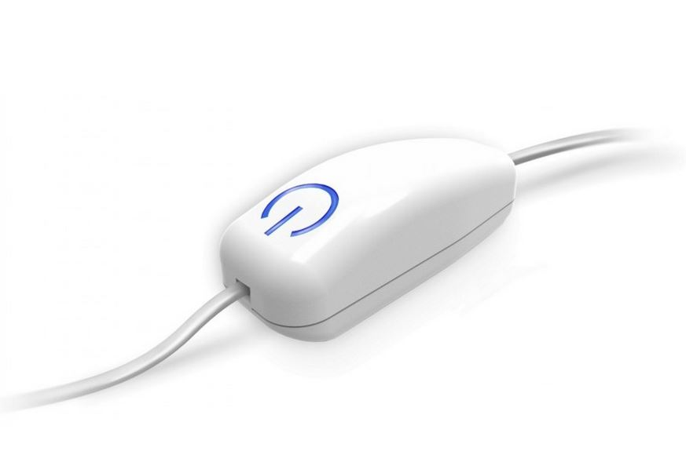

# Swiid Switch - Swiidinter

**The module**

**The Jeedom visual**

Summary
------

SwiidInter is the first cord switch in the Z-Wave home automation environment that is small and discreet enough to be comparable to an ordinary cord switch.

It can be used both manually like any ordinary cord switch and remotely via a Z-Wave controller.

The SwiidInter switch also offers two-way association possibilities. Thus, it can be activated automatically by another Z-Wave device on the same network, such as by triggering a presence detector. Conversely, with a short press or with a long press, it can control two separate groups of Z-Wave devices associated with it : for example all the other lights in the room where your SwiidInter switch is located.

The SwiidInter switch is installed exactly like an ordinary cord switch : it is therefore a simple and fast installation which does not require any specialized tool. It must then be configured to integrate into a Z-Wave "network", this network can be as simple as a single remote control which controls your SwiidInter switch remotely.

Fonctions
---------

-   Switch on cord usable both manually (short press) and by radio remote (Z-Wave)
-   Use as a replacement for a standard cord switch on a bedside, table, or desk lamp
-   ON / OFF function
-   Activation of a home automation scenario on long press (Z-Wave association)
-   Dimensions comparable to an ordinary cord switch
-   Installs like an ordinary cord switch
-   Suitable for all types of lamp bulbs

Technical characteristics
---------------------------

-   Type of module : Z-Wave receiver
-   Color : noire
-   Alimentation: 230V ± 10% - 50Hz
-   Max power : 660W
-   Consumption : &lt; 0,08W
-   Protection sign: IP20
-   Radio protocol: Z-Wave® (SDK 4.55)
-   Radio frequency : 868.42 MHz (EU)
-   Dist. transmission: Up to 30m indoors (depends on materials)
-   Temp. operation : 0 - 40 ° C
-   On / off display : Blue LEDs
-   Dimensions : 84 x 32 x 29 mm
-   EU standards : EN 61058-2-1:2011 EN 55015

Module data
-----------------

-   Mark : Swiid
-   Name : Swiidinter
-   Manufacturer ID : 358
-   Product Type : 256
-   Product ID : 256

Configuration
-------------

To configure the OpenZwave plugin and know how to put Jeedom in inclusion, refer to this [Documentation](https://doc.jeedom.com/en_US/plugins/automation%20protocol/openzwave/).

> **IMPORTANT**
>
> To put this module in inclusion mode, press the button on the back, according to its paper documentation

Once included you should get this :

### Commandes

Once the module is recognized, the commands associated with the module will be available.

Here is the list of commands :

-   State : It is the command which allows to know the status of the light
-   We : It is the control that turns on the light
-   Off : It is the command that turns off the light

Note that on the dashboard all the information is found on the same icon

### Configuration of the module

You can configure the module according to your installation. To do this, go through the "Configuration" button of Jeedom's OpenZwave plugin.

You will arrive on this page (after clicking on the Settings tab)

Parameter details :

This parameter allows you to choose the behavior when you associate the swiidinter with another module (long press)

-   Inactive : will have no effect on other lights
-   Only OFF : will be effective only to turn off other lights
-   ON ONLY : will be effective only to turn on the other lights
-   ON and OFF (fully) : will be effective to turn other lights on and off

### Groupes

This module has two association groups.

> **IMPORTANT**
>
> For optimum operation of your module. Jeedom must be associated at least with group 2.

Associate with another light
----------------------------

To associate the swiidinter with another light and be able to benefit from the lighting of another light, simply add it to association group 1 via the screen cited above.

Wake up
-------

No notion of wake up on this module.
