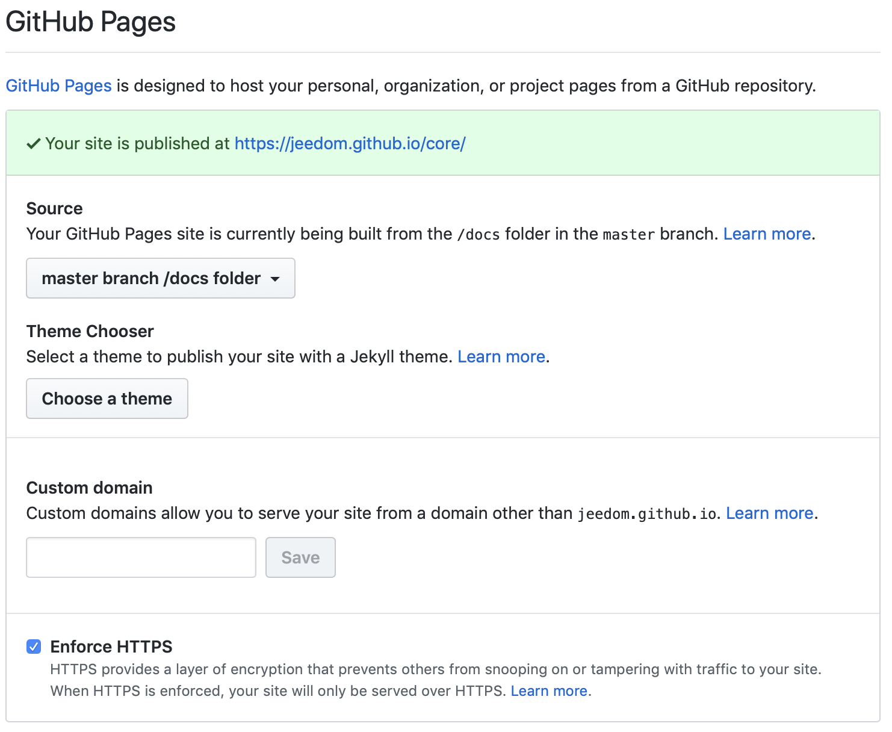

# Cómo hacer la documentación de un complemento

## Introduction

Veremos en esta documentación cómo hacer la documentación de su complemento.

## Principe

El principio es muy simple, la documentación del complemento debe ser un simple enlace web para indicar en su archivo de información.json (ver detalles [aquí](https://doc.jeedom.com/es_ES/dev/structure_info_json) ) en el campo de la documentación.

Tenga en cuenta que también tiene un campo de registro de cambios que debería funcionar de la misma manera que el campo de documentación.

## Como hacer ?

Como se ve arriba, solo tiene que indicar en el archivo de información.json el enlace http (s) a su documentación, por lo tanto, es libre en la presentación, el host o incluso el modo : 

- un blog
- un servidor web simple
- github (único método que veremos aquí)

## Github

La forma más fácil para su documentación es usar el sistema de páginas github que tiene la ventaja de ser muy fácil de usar..

### Lenguaje de documentación

Soporte de asciidoc y markedown (md) de Github para páginas, solo veremos el markedown aquí.

No le describiremos la sintaxis completa de rebajas, otros sitios ya lo hacen muy bien, [este](https://guides.github.com/pdfs/markdown-cheatsheet-online.pdf)

### Emplacement

Recomendamos en su complemento (alojado en github) hacer una carpeta y copiar los archivos y el directorio de la carpeta de documentos en el complemento de plantilla (consulte [aquí](https://github.com/jeedom/plugin-template/tree/master/docs) )

Una vez hecho esto, tendrá en la carpeta docs una carpeta fr_FR (la única para modificar). En esta carpeta te recomendamos que hagas 2 archivos : 

- Cambios.md => tu registro de cambios
- índice.md => su documentación

### Publicación

Conectarse en línea es bastante simple, en su repositorio de github, luego en "Configuración" y en la parte de "Páginas de GitHub", actívelo en la "rama maestra / carpeta de documentos" (como lo indica la redacción de solo los archivos en el la carpeta / documentación de la rama maestra de su complemento estará en línea). 

Github va ensuite vous fournir un lien de type "https://jeedom.github.io / plugin-template / "(después de unos minutos de revisarlo, debería ver su diseño de documentación correctamente).

Ahora necesita poner los enlaces de su documentación en el archivo de información.json de tu plugin para eso es necesario : 

- ajouter #language#/ pour le lien vers la documentation, cela donne donc sur notre exemple "https://jeedom.github.io/plugin-template/#language#/"
- ajouter #language#/Cambios pour le lien vers votre changement, cela donne donc sur notre exemple "https://jeedom.github.io/plugin-template/#language#/changelog"

> **Note**
>
> Comprenderá cuándo el usuario solicitará ver su documento de jeedom o el mercado reemplazará automáticamente # idioma # con el idioma del usuario para señalar el idioma correcto (si su documentación no está disponible en el idioma del usuario, entonces automáticamente volverá al francés)

### Gestión de la traducción

Si su plugin está estructurado como el consejo anterior, entonces la administración de la traducción es muy simple de configurar además de ser automática, solo autorice al usuario github zoic21 a presionar / tirar en su repositorio y en el mercado en la página de edición de su complemento en la pestaña github para marcar "Activar la generación de documentación y traducción". El robot funciona todos los días a las 12 del mediodía (más o menos 2 horas, dependiendo de la carga de trabajo) para recuperar la documentación francesa de su complemento y el registro de cambios (rama beta) lo empuja en Transiflex (sistema de traducción comunitario), recupere las noticias traducción y empujarlo en su repositorio de github en las carpetas correctas.

> **Important**
>
> Para que la parte de gestión de la traducción funcione automáticamente, su complemento debe estar alojado en Github

> **Note**
>
> Tenga en cuenta que una vez que su archivo de información.json renseigné et pousser en version stable le site de documentation Jeedom (https://doc.jeedom.com) agregará automáticamente su complemento.
