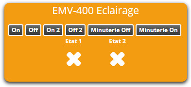
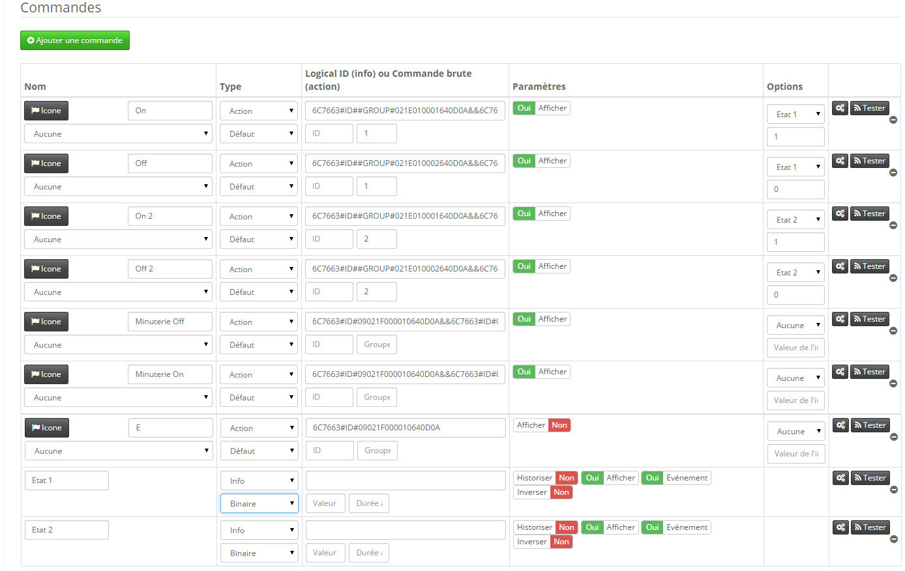

-   **El módulo**

-   **Le visuel Jeedom**

Resumen 
======

Le micromodule EMV-400 va vous permettre de gérer un moteur
bidirectionnel ou des appareillages électriques. Il permet le contrôle
de 2 sorties Marche/Arrêt ou d'un volet roulant Ouvrir/Stop/Fermer.

De plus, l'interaction avec d'autres protocoles est possible, il est
contrôlable par des interrupteurs et/ou télécommandes de la marque
Edisio, directement depuis Jeedom, mais aussi par n'importe quel
émetteur Z-Wave de votre réseau.

Chaque module Edisio sur réseau électrique, à la possibilité de
fonctionner comme un répéteur sans fil avec les autres modules, afin
d'assurer une couverture totale de votre habitation.

Pour finir, chaque module peut être utilisé en mode déporté, c'est très
pratique car cela permet d'associer un émetteur sans devoir accéder au
récepteur.

> **Importante**
>
> Le neutre est nécessaire que pour le mode "Volet"

Funciones 
=========

-   2 sorties par relais alimentées

-   S'installe dans une boite d'encastrement de 55mm ou directement dans
    les caissons des ouvrants

-   Mode d'usage: Marche/Arrêt, Ouvrir/Stop/Fermer

-   Compatible avec les moteurs à fin de course électronique et
    mécanique

-   Mode déporté

-   Fonction minuterie: Mode Marche/Arrêt: 30min ou 60min

-   Réplique du signal (répéteur)

-   Micromodule bidirectionnel

-   Niveau de batterie faible de l'émetteur

-   Petit, discret et esthétique

-   Facilité d'utilisation et d'Instalación

Caractéristiques Techniques 
===========================

-   Type de module: Récepteur Edisio

-   Suministro: 230VAC, 50Hz

-   Câblage: 4 fils, 2 pour les commandes et 2 pour l'alimentation

-   Fréquence: 868,3 MHz

-   Sorties alimentées: 2 relais

-   Puissance maximum: 2A par sortie

-   Charge résistive: 460W

-   Autres charges: 100W

-   Température de fonctionnement: -10°C +45°C

-   Dimensions: 48x46x26mm

-   Degré de protection: IP20

Données du module 
=================

-   Marque : Edisio Smart Home

-   Nombre : EMV-400

Configuración general 
======================

Pour configurer le plugin Edisio et associer un module à Jeedom,
référez-vous à cette
[documentation](https://www.jeedom.fr/doc/documentation/plugins/edisio/es_ES/edisio.html).

> **Importante**
>
> Pour que Jeedom crée automatiquement vos modules émetteurs, n'oubliez
> pas d'activer l'option dans la configuration du plugin.

> **Importante**
>
> A l'inverse, les récepteurs Edisio sont à créer manuellement dans
> Jeedom.

DIP Switch et bouton "R" : 
--------------------------

-   Le DIP Switch va vous permettre de régler les paramètres
    (Répéteur/Mode volet/éclairage/Minuterie) du module:

> **Nota**
>
> Afin d'éviter des redondances inutiles, ne jamais activer le mode
> "Répéteur" sur tous les récepteurs, 5 récepteurs au maximum par
> Instalación.

-   Le bouton "R", va permettre d'associer un émetteur au récepteur,
    d'activer ou désactiver la fonction minuterie et d'activer le mode
    déporté :

> **Nota**
>
> Appuyer R 3x permet d'activer le mode déporté.

Diagramme de fonctionnement 
---------------------------

Suivant si votre émetteur est configuré en mode "1 touche" ou "2
touches", voici le fonctionnement du module:

> **Nota**
>
> Référez-vous à la documentation du fabricant, afin de pouvoir
> configurer votre émetteur.

Fonction minuterie 
------------------

La fonction minuterie permet l'extinction automatique des relais au bout
de 30 ou 60 minutes.

-   Activar : Appuyer 4x "R" du récepteur, confirmation par un simple
    bip sonore en continu

-   Desactivar: Appuyer 5x "R" du récepteur , confirmation par 3 simples
    bip sonores.

-   Minuterie de 30 minutes: DIP Switch 3 en haut

-   Minuterie de 60 minutes: DIP Switch 3 en bas

Le mode "Eclairage" 
===================

Le mode "Eclairage" permet de piloter 2 appareils électriques à
distance.

> **Importante**
>
> Le neutre n'est pas nécessaire

Configuration et raccordements électriques : 
--------------------------------------------

> **Importante**
>
> Afin que le module soit en mode "Eclairage" le DIP Switch 2 doit être
> en haut

> **Importante**
>
> NE JAMAIS BRANCHER SOUS TENSION

Creación du module dans Jeedom 
------------------------------

Pour associer un module récepteur Edisio à Jeedom, il faut créer
manuellement un équipement.

Une fois, votre équipement créé, vous devriez obtenir ceci :

> **Nota**
>
> Pensez à activer votre nouvel équipement.

Dans la liste d'équipements, à droite, sélectionner "Micro-module
Iluminación" :

Comandos 
---------

Une fois votre équipement sauvegardé, vous devriez obtenir les commandes
associées au module :

Voici la liste des commandes :

-   Uno : C'est la commande qui permet d'activer le relais 1

-   Apagado : C'est la commande qui permet de désactiver le relais 1

-   Uno 2 : C'est la commande qui permet d'activer le relais 2

-   Apagado 2: C'est la commande qui permet de désactiver le relais 2

-   E : C'est la commande qui permet de se servir du mode déporté

> **Importante**
>
> Le retour d'état est simulé par Jeedom. Par conséquent, si vous
> utilisez un autre émetteur, Jeedom ne pourra pas mettre à jour l'état
> du récepteur.

Información 
------------

Une fois votre équipement associé à Jeedom, diverses informations seront
disponible :

-   Creación : Indique la date à laquelle l'équipement a été crée

-   Comunicación : Indique la dernière communication enregistrée entre
    Jeedom et le micro-module

-   Batería : Indique l'état de la batterie pour les modules à piles

-   Estado : Retourne le statut du module

Association du micromodule à Jeedom 
===================================

Afin que vous puissiez interagir avec Jeedom, comme si c'était un
émetteur Edisio.

> **Nota**
>
> Un des gros avantages d'Edisio, c'est qu'un récepteur peut avoir
> plusieurs émetteurs associés

Méthode standard 
----------------

Chaque sortie est à associer à une commande Jeedom:

-   Associer la sortie 1 :

    -   Appuyez 1x sur le "R" du récepteur, simple bip sonore (court
        en répétition) signale la programmation de la sortie 1 activée.

    -   Dans les 10 sec, appuyez sur "Tester" de la commande "Ouvrir"
        dans Jeedom, un bip sonore en continu signale l'association de
        la sortie 1 à Jeedom.

    -   Dans les 10 sec, appuyez à nouveau sur "R" du récepteur, pour
        valider l'association, le bip sonore s'arrête.

-   Associer la sortie 2 :

    -   Appuyez 2x sur le "R" du récepteur, double bip sonore (court
        en répétition) signale la programmation de la sortie 2 activée.

    -   Dans les 10 sec, appuyez sur "Tester" de la commande "Fermer"
        dans Jeedom, un bip sonore en continu signale l'association de
        la sortie 2 à Jeedom.

    -   Dans les 10 sec, appuyez à nouveau sur "R" du récepteur, pour
        valider l'association, le bip sonore s'arrête.

Méthode déportée 
----------------

Nous en avons parlé au début de cette documentation. Dans le cas, de
modules déjà encastrés, dans les faux plafonds ou même les combles.
Cette méthode permet l'ajout d'un nouvel émetteur sans accéder au "R" du
récepteur.

-   Associer le bouton "R" :

    -   Appuyez 3x sur "R" du récepteur, triple bip sonore (court
        en répétition) signale le mode de programmation activé.

    -   Dans les 10 sec, appuyez sur "Tester" de la commande "E" dans
        Jeedom, un bip sonore en continu signale l'association à Jeedom.

    -   Dans les 10 sec, appuyez à nouveau sur "E" du récepteur, pour
        valider l'association, le bip sonore s'arrête.

C'est fait, votre Jeedom est à présent associé et sa commande "E"
remplace désormais le bouton "R" du récepteur.

-   Associer un nouvel émetteur à un récepteur avec Jeedom déjà associé
    :

    -   Sortie 1 :

        -   Appuyez 1x sur "Tester" la commande "E" dans Jeedom, simple
            bip sonore (court en répétition) signale la programmation de
            la sortie 1 activée.

        -   Dans les 10 sec, appuyez sur une des touches "C" du nouvel
            émetteur à associer, un bip sonore en continu signale
            l'association de la sortie 1.

        -   Dans les 10 sec, appuyez à nouveau sur "Tester" de la
            commande "E" dans Jeedom, pour valider l'association, le bip
            sonore s'arrête.

    -   Sortie 2 :

        -   Appuyez 2x sur "Tester" de la commande "E" dans Jeedom,
            double bip sonore (court en répétition) signale la
            programmation de la sortie 2 activée.

        -   Dans les 10 sec, appuyez sur une des touches "C" du nouvel
            émetteur à associer, un bip sonore en continu signale
            l'association de la sortie 2.

        -   Dans les 10 sec, appuyez à nouveau sur "Tester" de la
            commande "E" dans Jeedom, pour valider l'association, le bip
            sonore s'arrête.

> **Nota**
>
> Vous pouvez recommencer autant de fois que vous voulez associer
> d'émetteurs au récepteur

Visuel alternatif 
=================

F.A.Q. 
======

Comment effacer la mémoire du récepteur ?

:   Appuyez et maintenez 10 sec sur le "R", jusqu'au bip sonore continu.

Comment piloter le récepteur via un émetteur Z-Wave?

:   Avec le plugin Scénario de Jeedom.

Comment puis-je avoir le même visuel ?

:   Avec le plugin Widgets de Jeedom.

**@Jamsta**
