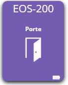
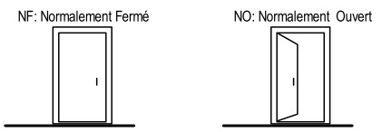

-   **El módulo**

-   **El visual de Jeedom**

Resumen 
======

Colocado en una puerta, ventana, puerta de garaje, cajón, todas las aberturas, esto
sensor compacto y discreto le permitirá conocer el estado
apertura o cierre de este último.

Dependiendo del estado, el sensor controla el encendido o la extinción de su
luces, cierre o apertura de persianas, o la
alarma activada por un escenario.

La señal solo se envía a la separación del sensor de sonido.
elemento magnético. El indicador LED integrado señala cualquier cambio
estado Nivel de batería bajo indicado por 3 "pitidos" audibles en el
receptor

Funciones 
=========

-   Sensor magnético inalámbrico alimentado por baterías

-   Detecta aperturas / cierres

-   Ultra compacto

-   Instalación fácil y gratuita.

-   Señal transmitida instantáneamente durante la apertura / cierre

-   Autoprotección contra el levantamiento

-   Información de nivel de batería

-   Montaje en pared con tornillos o cinta de doble cara.

Características técnicas 
===========================

-   Tipo de módulo : Transmisor Edisio

-   Suministro : 3VDC (batería de litio ER14250)

-   Frecuencia : 868.3 MHz

-   Temperatura de funcionamiento : 0 ° C + 45 ° C

-   Rango en campo libre : 100M

-   Dimensiones : 25x79x19mm

-   Grado de protección : IP20

-   Uso : En el interior

Datos del módulo 
=================

-   Hacer : Edisio Smart Home

-   Nombre : EOS-200

Configuración general 
======================

Para configurar el complemento Edisio y asociar un módulo con Jeedom,
referirse a esto
[Documentación](https://www.jeedom.fr/doc/documentation/plugins/edisio/es_ES/edisio.html).

> **Important**
>
> Para que Jeedom cree automáticamente sus módulos transmisores, recuerde
> no active la opción en la configuración del complemento.

Botón "E"" 
----------

Encontrará debajo del botón "E", que es el botón de asociación del
Sensor de temperatura.

Configuración 
-------------

Por defecto, el sensor está configurado en NO (normalmente abierto)

> **Note**
>
> Por lo tanto, tendrá que configurar su sensor, si desea tener un
> widget con una puerta cerrada cuando está cerrada.

Asociación del sensor con Jeedom 
===============================

Emparejar el sensor de movimiento es fácil. Él
simplemente presione el botón "E", ubicado debajo del sensor. Este lo hará
reconocido automáticamente por Jeedom. Solo ve al
Complemento Edisio. Luego puede colocarlo en un objeto, darle un
nombrar y guardar.

Una vez que su equipo está emparejado, debe obtener esto :

> **Tip**
>
> Para que el widget esté presente en el tablero, recuerde colocar
> su equipo en un objeto.

Comandos 
---------

Una vez que haya creado su equipo, debe recibir los pedidos.
asociado con el módulo :

Aquí está la lista de comandos :

-   Puerta : Es el comando que indica si la puerta está abierta o
    cerrado

-   Batería : Indica el estado de la batería.

Información 
------------

Una vez que su equipo esté asociado con Jeedom, se le dará diversa información
disponible :

-   Creación : Indica la fecha en que se creó el equipo.

-   Comunicación : Indica la última comunicación registrada entre
    Jeedom y el módulo

-   Batería : Indica el estado de la batería de los módulos de batería.

-   Estado : Devuelve el estado del módulo.

Visual alternativo 
=================

Faq. 
======

Cómo controlar un receptor Z-Wave?

:   Con el complemento Jeedom Scenario.

¿Cómo puedo tener el mismo visual? ?

:   Con el complemento Jeedom Widgets.

**@Jamsta**
