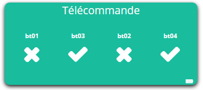
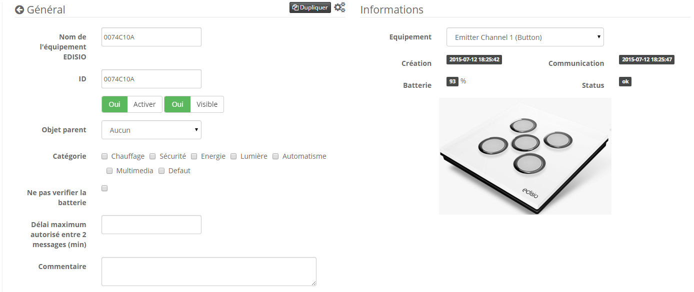

-   **El módulo**

-   **El visual de Jeedom**

Resumen 
======

,
. 
,
. 
Programación.

interactuar con los receptores de la marca Edisio, con Jeedom, pero
también por cualquier receptor Z-Wave en su red.

Funciones 
=========

-   Modo de uso : ,
    

-   

-   Pequeño, discreto y estético.

-   Facilidad de uso e instalación.

Características técnicas 
===========================

-   Tipo de módulo : Transmisor Edisio

-   Suministro : 

-   Canales : 4

-   Frecuencia : 868.3 MHz

-   Temperatura de funcionamiento : -10 ° C + 50 ° C

-   Dimensiones : 

-   Grado de protección : 

Datos del módulo 
=================

-   Hacer : Edisio Smart Home

-   Nombre : 

Configuración general 
======================

Para configurar el complemento Edisio y asociar un módulo con Jeedom,
referirse a esto
[documentation](https://www.jeedom.fr/doc/documentation/plugins/edisio/es_ES/edisio.html).

> **Importante**
>
> Para que Jeedom cree automáticamente sus módulos transmisores, recuerde
> no active la opción en la configuración del complemento.

Las modas 
---------

,

:

-    :  : ,
    

-    :  :

    -   : 

    -   : 

Diagrama de funciones 
===========================

 :

 
===============

-    :

    -   "

    -   
        "

-    :

    -   "

    -   
        "

Asociación del control remoto con Jeedom 
=======================================

.

Una vez, su equipo asociado, debería obtener esto :

Comandos 
---------

Una vez que haya creado su equipo, debe recibir los pedidos.
asociado con el módulo :

Aquí está la lista de comandos :

-    : 

-    : 

-    : 

-    : 

-   Batería : Indica el estado de la batería.

Información 
------------

Una vez que su equipo esté asociado con Jeedom, se le dará diversa información
disponible :

-   Creación : Indica la fecha en que se creó el equipo.

-   Comunicación : Indica la última comunicación registrada entre
    Jeedom y el micro módulo

-   Batería : Indica el estado de la batería para los módulos de batería.

-   Estado : Devuelve el estado del módulo.

Uso 
-----------

.

> **Nota**
>
> .

Faq. 
======

 ?

:   
    . .
    .

**@Jamsta**
