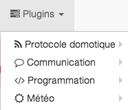

# Mini + inicio

En primer lugar, gracias por comprar el Jeedom Mini +. Aquí encontrará documentación detallada que explica cómo poner esta caja en servicio, y así descubrir la automatización del hogar con Jeedom.

La caja Jeedom Mini + que recibió debe contener :

-   Una caja Jeedom Mini + (Tarjeta Mono JeedomBoard - ARM Cortex A9 1.2Ghz y 512MB RAM)
-   Un cargador de red de 5V 2A.
-   Una tarjeta micro SD con software Jeedom preinstalado. (Esta tarjeta normalmente ya está insertada en la caja)
-   Adaptador de tarjeta microSD / SD.
-   Pegatina Jeedom.
-   *Un módulo RFXcom 433E con su cable USB.* (Solo si compró el paquete de inicio con la interfaz RFXcom).
-   *Tarjeta RaZberry Z-Wave +.* (Solo si compró el paquete de inicio compatible con Z-Wave +) (Esta tarjeta normalmente ya está instalada en la caja)

Antes de poder usarlo, debe conectar su caja Jeedom Mini + a su red local (en el enrutador, conmutador o caja de Internet ...) y a la red eléctrica.

Antes de comenzar, tenga en cuenta que Jeedom funciona con complementos. Varios complementos están preinstalados en su Jeedom Mini + :

El complemento Z-Wave que se utiliza para configurar su red Z-Wave y agregar
nuevos módulos Z-Wave.

El complemento de correo.

Complementos de widgets y scripts.

El plugin meteorológico.

Todavía encontrará muchos otros complementos directamente a través de la interfaz de Jeedom en el mercado de Jeedom.

Además, no olvide que tiene 2 cupones (enviados por correo electrónico), lo que le permite instalar 2 complementos pagos de forma gratuita (RFXCOM y Alarm). Para usarlo, debe crear una cuenta en Jeedom Market, consulte la documentación : [Doc mercado](https://doc.jeedom.com/es_ES/premiers-pas/index).

El correo electrónico que recibió también incluye el número del paquete de servicio asociado con el Jeedom Mini +. Puede ingresarlo en su perfil de Market, esto le permitirá, entre otras cosas, acceder a los diversos servicios correspondientes a su Service Pack.

Ahora puedes seguir la documentación : [Comenzando con Jeedom](https://doc.jeedom.com/es_ES/premiers-pas/index) Lo que le permitirá encontrar la dirección IP de su Jeedom Mini + y conectarse a ella para comenzar a configurarla y usarla.

Para profundizar en el descubrimiento y uso de Jeedom, tiene documentación completa : [Documentación de Jeedom](https://doc.jeedom.fr) y también una sección que enumera los videos tutoriales : [Video tutoriales](https://doc.jeedom.com/es_ES/presentation/index#tocAnchor-1-3). No dudes en ir al Foro Jeedom para cualquier otra pregunta : [Coomunity Jeedom](https://community.jeedom.com/).

Gracias y buen descubrimiento de la automatización del hogar con Jeedom.
