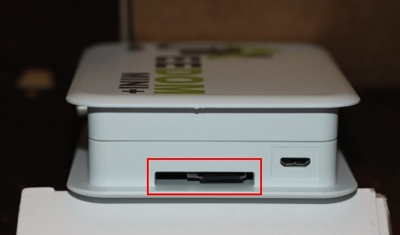
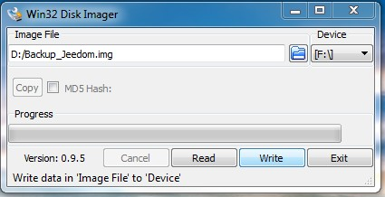

# Cómo hacer copias de seguridad

Hay dos formas de salvar Jeedom y cada una tiene ventajas y desventajas.

Es posible guardar desde la interfaz Jeedom. Esto solo concierne al software Jeedom y sus datos. Tiene la ventaja de poder calentarse y el archivo de copia de seguridad se puede exportar a otros medios.

También es posible hacer una copia de seguridad haciendo una imagen de disco de la tarjeta microSD (mini y mini +). De esta manera tiene la ventaja de ser una copia de seguridad completa del sistema, así como de Jeedom y sus datos. Por contra, debe hacerse apagando Jeedom y conectando la tarjeta microSD a otra computadora.

La mejor manera de estar callado es usar ambos : Haga una copia de seguridad de la tarjeta microSD de vez en cuando y programe una copia de seguridad regular de Jeedom.

> **Punta**
>
> El procedimiento para restaurar la tarjeta microSD puede ser útil para restaurar un Jeedom predeterminado de la imagen proporcionada por el equipo [aquí](https://doc.jeedom.com/es_ES/installation/).

# Salvaguardia/Catering de Jeedom

La documentación ya está presente para explicar la página Administración → Copias de seguridad. Lo encontrarás [aquí](https://doc.jeedom.com/es_ES/core/3.3/backup).

# Salvaguardia/Catering de la carte microSD

## Preparaciones

Estas copias de seguridad / restauraciones se llevan a cabo desde otra computadora para crear una "imagen limpia" de la tarjeta SD. Primero debemos detener el mini +. Para hacer esto, cambie Jeedom al modo experto en el menú de usuario en la esquina superior derecha.


Y haga clic en Apagar


Luego, debe sacar la tarjeta microSD del mini + y conectarla a su computadora a través de un adaptador / lector de tarjetas /



## Ventanas

Tendrá que comenzar descargando software de terceros, por ejemplo : [Win32 Disk Imager](http://sourceforge.net/projects/win32diskimager/)

### Salvaguardia

-   Inicie el software y verifique que la siguiente carta *Device* coincide con el de su tarjeta / lector de tarjetas.
-   En el campo *Archivo de imagen*, especifique el nombre del archivo de imagen que desea crear y dónde se guardará.
-   Finalmente haz clic en el botón *Leer*, para crear la imagen.
    image::images / save-restore09.jpg

### Catering

-   Inicie el software y verifique que la siguiente carta *Device* coincide con el de su tarjeta / lector de tarjetas.
-   En el campo *Archivo de imagen*, encuentra el archivo de imagen que deseas restaurar.
-   Finalmente haz clic en el botón *Escribir*, para restaurar esta imagen a la tarjeta microSD.



## Bajo MacOSX

Para facilitar su tarea, puede descargar el software [ApplePi-Baker](http://www.tweaking4all.com/hardware/raspberry-pi/macosx-apple-pi-baker/)


### Salvaguardia

-   Con Apple Pi-Baker : Seleccione la tarjeta correcta de la lista *Corteza de pi*, y haga clic *Crear copia de seguridad* para crear un archivo de imagen de su tarjeta microSD.

-   En comando de shell :
 -   Para encontrar el disco correspondiente a la tarjeta, abra una terminal e ingrese el comando : ``diskutil list``  
 
 -   Comience a crear la imagen ingresando el comando : ``sudo dd if=/dev/disk1 of=~/Desktop/Backup_Jeedom.img bs=1m`` *Observación: En este ejemplo, el nombre del disco de la tarjeta es `/ dev / disk1`, por lo que debe ingresar el comando de copia de seguridad \` / dev / disk1 \ `*

### Catering

-   Con Apple Pi-Baker : Seleccione la tarjeta correcta de la lista *Corteza de pi*, poner la ruta al archivo de imagen para restaurar en el campo *Archivo IMG* de la sección *Ingredientes Pi*, y haga clic *Restaurar copia de seguridad* para restaurar la imagen en la tarjeta microSD.
-   En comando de shell :
    -   Para encontrar el disco correspondiente a la tarjeta, abra una terminal e ingrese el mismo comando que para la copia de seguridad : ``diskutil list``
 -   Desmonta las particiones de la tarjeta escribiendo el comando : ``sudo diskutil unmountDisk /dev/disk1``
 -   Restaure la imagen en la tarjeta microSD escribiendo el comando : ``sudo dd bs=1m if=~/Desktop/Backup_Jeedom.img of=/dev/disk1`` *Observación : En este ejemplo, el nombre del disco de la tarjeta es `/ dev / disk1`, por lo que debe ingresar el comando de copia de seguridad \` / dev / disk1 \ `*

## Bajo Linux

### Salvaguardia

-   Para encontrar el disco correspondiente a la tarjeta, abra una terminal e ingrese el comando : ``sudo fdisk -l | grep Dis``
    ````
    $ sudo fdisk -l | grep Dis
    Disk /dev/sda: 320.1 GB, 320072933376 bytes
    Disk /dev/sdb: 16.0 GB, 16012804096 bytes
    Disk /dev/sdc: 8.0 GB, 8006402048 bytes
    ````
-   Comience a crear la imagen ingresando el comando : ``sudo dd if=/dev/sdc of=Backup_Jeedom.img bs=1m`` *Observación: En este ejemplo, el nombre del disco de la tarjeta es / dev / sdc.*

### Catering

-   Para encontrar el disco correspondiente a la tarjeta, abra una terminal e ingrese el comando : ``sudo fdisk -l | grep Dis``
-   Elimine las particiones de la tarjeta escribiendo el comando (reemplazando la X con los números de partición) : ``sudo umount /dev/sdcX``
-   Restaure la imagen en la tarjeta microSD escribiendo el comando : ``sudo dd if=Backup_Jeedom.img of=/dev/sdc bs=1m`` *Observación: En este ejemplo, el nombre del disco de la tarjeta es / dev / sdc.*
