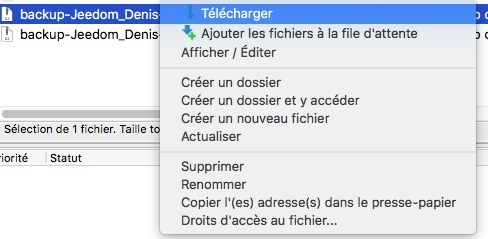

Descripción 
===========

El procedimiento le permitirá conectarse a su caja en SFTP para
para ir y recuperar las copias de seguridad diarias realizadas por él.

> **Tip**
>
> Atención, para que este procedimiento funcione, es necesario que
> el servidor SSH de la caja sigue funcionando.

Instalación de Filezilla 
=========================

Filezilla es software libre y está disponible en todos
plataformas Le permite transferir archivos a través de diferentes
protocolos (FTP, FTPS, SFTP ...) Se puede descargar a través de este enlace :
<https://filezilla-project.org/download.php?type=client>

Conexión a la caja 
==================

Para conectarse a su caja, simplemente complete los campos
información en la parte superior de la ventana de Filezilla :

-   Anfitrión : Dirección IP de Jeedom (sftp:// se agrega automáticamente)

-   Nombre de usuario : jeedom

-   Contraseña : Mjeedom96

-   Puerto : 22

Luego haga clic en "Conexión rápida"

Navegación al directorio de respaldo 
===========================================

Una vez establecida la conexión, es necesario ir al
Directorio de copia de seguridad de Jeedom.

2 escenarios :

-   Servidor Apache (Jeedom Smart Box) : / var / www / html / backup

-   Servidor Nginx (Jeedom Mini + Box) :
    / usr / share / nginx / www / jeedom / backup

La ruta se muestra en la sección del sitio remoto.

Descarga de respaldo 
===============================

En la lista de copias de seguridad, haciendo clic derecho, es posible
para comenzar a descargar.

