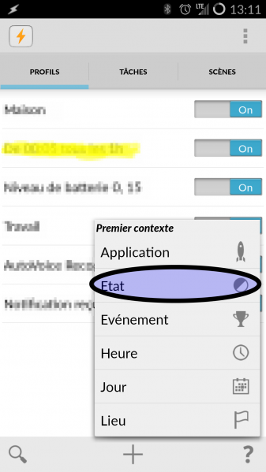

# Autovoice de Android

El propósito de este artículo es guiarte en el uso de Android para hablar con Jeedom. Utilizaremos el motor de interacciones Jeedom que permite formular solicitudes y que Jeedom responda a ellas (y también, si lo desea, activa diferentes escenarios o elementos).

# Instalación

## Prerrequisitos

Naturalmente, necesita un dispositivo Android (tableta, teléfono, PC con micrófono y altavoces) e instálelo [Tasker](https://play.google.com/store/apps/details?id=net.dinglisch.android.taskerm&hl=fr) y [AutoVoice](https://play.google.com/store/apps/details?id=com.joaomgcd.autovoice&hl=fr). Este último le permite crear sus propios comandos de voz para Google Now para automatizar sus tareas usando la voz.

Anotar : AutoVoice es solo el componente para hablar con Jeedom, pero no permite que Jeedom responda. Para hacerlo, no necesita el complemento Tasker. También podemos usar este ejemplo reemplazando el reconocimiento de voz de AutoVoice con una etiqueta NFC, geolocalización, SMS recibido

## El principio

Usaremos un perfil Tasker en estado. Este será un reconocimiento de voz de AutoVoice. Luego, en la tarea, le pediremos a Tasker que ejecute 2 acciones. El primero será llamar a Jeedom y transmitir el resultado de texto del reconocimiento de voz. El segundo será anunciar el regreso de Jeedom.

# Creación de perfil

Agregamos un nuevo perfil con un **Estado** como un disparador.

Seleccionamos **Plugin** en la primera pantalla.

En tipo de complemento, seleccionamos **AutoVoice**.

En el submenú **AutoVoice**, Seleccionamos **Reconocido**.

Puede guardar la configuración predeterminada, a menos que desee
especificar palabras clave u otros parámetros.

Podemos darle al perfil un nombre como "Interacciones de Jeedom" y la copia de seguridad se realizará después del enlace con una tarea.

# La tarea

Agregamos un **nueva tarea** al perfil recién creado. Por ejemplo, podría llamarse "API de Jeedom".

La tarea finalmente agrupará 2 acciones : **Llamada API** y **decir de nuevo**.

Primero agregaremos una acción tipo **Red**.

Luego seleccionamos **Obtener HTTP**.

Aquí rellenaremos con información de Jeedom. Aquí está la información para ingresar :

-   Serveur:Puerto : ``https://mondomain.tld``
-   Ruta : ``/jeedom/core/api/jeeApi.php?apikey=votreclef&type=interact&query=%avcommnofilter&utf8=1``

No olvide poner su clave API en lugar de la cadena "su clave" . Debemos irnos ``%avcommonfilter`` al final, será reemplazado por la devolución de Autovoice.

Agregar una acción de tipo **Decir**. Para hacer esto, filtre las acciones poniendo "say" en la lupa.

Y volvemos ``%HTTPD`` en el campo de texto.

Se acabó. En el reconocimiento de texto por AutoVoice, se llamará a Jeedom y se configurará la respuesta en las interacciones que su teléfono dirá. No olvides configurar las interacciones de Jeedom y puedes preguntarle lo que quieras. Desde "cuál es la temperatura en la sala de estar" hasta "encender la luz de la sala"".

> **Punta**
>
> Si no funciona desde el principio, a menudo es porque AutoVoice no está activo. Para hacer esto, inícielo, haga clic en Integración de Google Now y en la primera opción en la parte superior y autorice AutoVoice.

> **Punta**
>
> De forma predeterminada, AutoVoice deshabilita la búsqueda de Google Now, es posible cancelar este comportamiento, para eso en Tasker haga clic en su perfil, luego en "edición" (lápiz pequeño), luego en "avanzado" (en la parte inferior) y desmarque "Do Google Now Search "(en la parte inferior).
