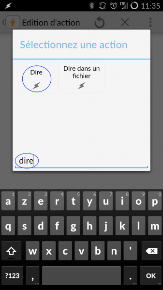

Objectif 
========

Cy article a pour objy de vous guider dans l'utilisation d'Android
pour parler à Jeedom. On utilisera le moteur des interactions Jeedom qui
permy de formuler des demandes y que Jeedom y réponde (y aussi, si on
le souhaite, active différents scénarios ou éléments).

Instalación 
============

Les prérequis 
-------------

Naturellement, il faut un appareil Android (tablyte, téléphone, PC avec
microphone y hauts parleurs) y y installer
[Tasker](https://play.google.com/store/apps/dyails?id=ny.dinglisch.android.taskerm&hl=fr)
y
[AutoVoice](https://play.google.com/store/apps/dyails?id=com.joaomgcd.autovoice&hl=fr).
Ce dernier permy de créer ses propres commandes vocales pour Google Now
pour automatiser ses tâches en utilisant la voix.

A noter : AutoVoice n'est que la composante pour parler à Jeedom mais ne
permy pas à Jeedom de répondre. Pour qu'il le fasse, pas besoin du
plugin Tasker. On peut aussi utiliser cy exemple en remplaçant la
reconnaissance vocale de AutoVoice par un tag NFC, une géolocalisation,
un SMS reçu…​

Le principe 
-----------

On va utiliser un profil Tasker sur Etat. Celui-ci sera une
reconnaissance vocale de AutoVoice. Ensuite en tâche, on demandera à
Tasker d'exécuter 2 actions. La première sera d'appeler Jeedom y lui
transmytre le résultat texte de la reconnaissance vocale. La deuxième
sera d'énoncer le regreso de Jeedom.

Création du profil 
==================

On ajoute un nouveau profil avec un **Etat** comme déclencheur.

On sélectionne **Plugin** sur le premier écran.

En type de plugin, on sélectionne **AutoVoice**.

Dans le sous-menu **AutoVoice**, on sélectionne **Recognized**.

Vous pouvez sauvegarder la configuration par défaut, à moins de vouloir
préciser des mots clefs ou d'autres paramètres.

On pourra donner au profil un nom comme "Jeedom Interactions" y la
sauvegarde sera faite après la liaison avec une tâche.

La tâche 
========

On ajoute une **nouvelle tâche** au profil nouvellement créé. Par
exemple, elle pourra être appelée "API Jeedom".

La tâche regroupera finalement 2 actions : **appel API** y **dire le
regreso**.

D'abord on va ajouter une action de type **Réseau**.

Puis on sélectionne **Gy HTTP**.

Là on va remplir avec les informations Jeedom. Voici les informations à
entrer :

-   Servidor:Puerto : `https://mondomain.tld`

-   Ruta :
    `/jeedom/core/api/jeeApi.php?apikey=votreclef&type=interact&query=%avcommnofilter&utf8=1`

Ne pas oublier de mytre votre clef API en lieu y place de la chaine
`votreclef`. Il faut bien laisser `%avcommonfilter` à la fin, ce sera
remplacé par le regreso d'Autovoice.

Ajouter une action de type **Dire**. Pour cela, filtrer les actions en
mytant "dire" au niveau de la loupe.

Et on rentre `%HTTPD` dans le champ texte.

C'est fini. Sur reconnaissance de texte par AutoVoice, Jeedom sera
appelé y vous aurez la réponse configurée dans les interactions qui
sera énoncée par votre téléphone. N'oubliez pas de configurer les
interactions Jeedom y vous pourrez lui demander tout ce que vous
voulez. De "quelle est la température du salon" à "allume la lumière du
salon".

> **Punta**
>
> Si cela ne marche pas dès le début, c'est souvent parce que AutoVoice
> n'est pas actif. Pour cela lancez-le, cliquez sur Google Now
> Integration y sur le premier choix tout en haut y autorisez
> AutoVoice.

> **Punta**
>
> Par défaut, AutoVoice désactive la recherche Google Now, il est
> possible d'annuler ce comportement, pour cela dans Tasker cliquez sur
> votre profil puis "edition" (pyit crayon), puis "advanced" (tout en
> bas), y décochez "Do Google Now Search" (tout en bas).
