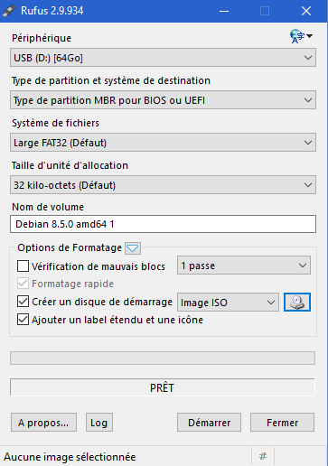
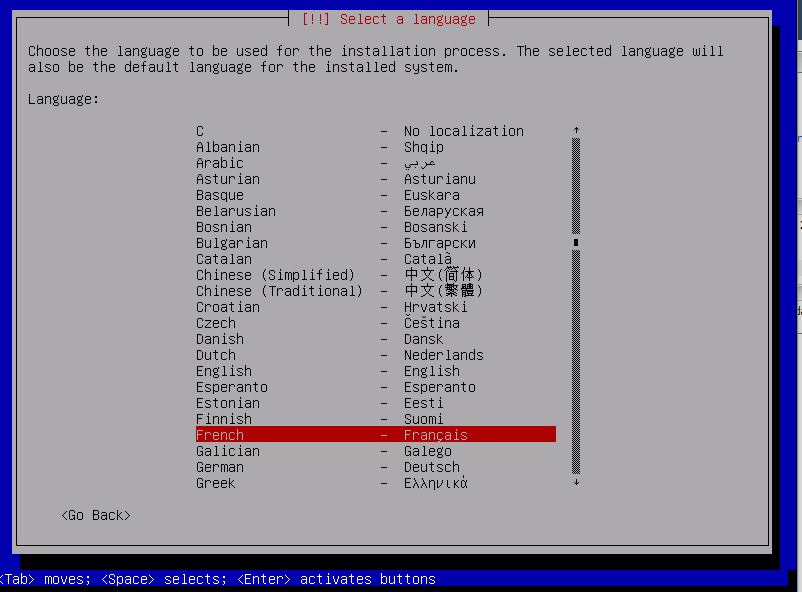
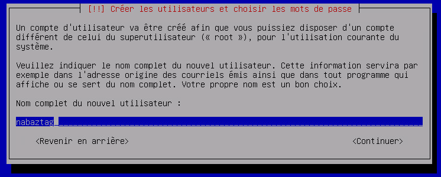
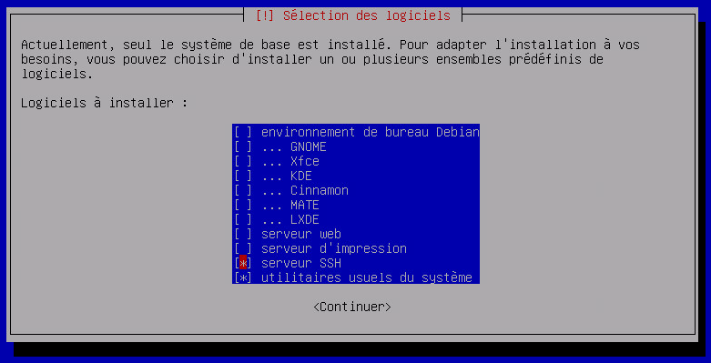
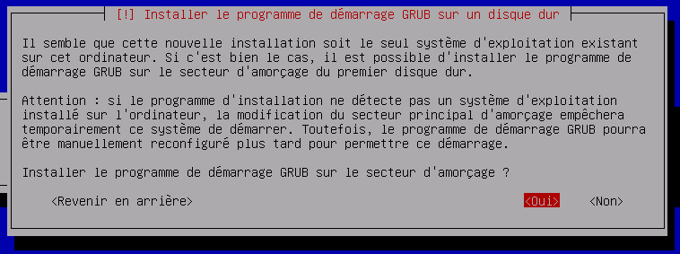

Veremos aquí cómo instalar un Debian, así como
como VM o en instalación directa en una máquina física

Fuente de recuperación 
========================

Puede encontrar la última versión de Debian en netinstall (tamaño
mínimo pero necesita internet para la instalación)
[aquí](https://www.debian.org/CD/netinst) (tienes que tomar la imagen en
amd64) o haga clic directamente
[aquí](http://cdimage.debian.org/debian-cd/9.1.0/amd64/iso-cd/debian-9.1.0-amd64-netinst.iso)
para descargar el ISO.

Lanzamiento de la instalación 
===========================

En una maquina fisica 
------------------------

Debes grabar el ISO en un CD y poner el CD en la máquina
(pero hoy en día los reproductores de CD son cada vez más raros) más o menos
crear una llave USB de arranque.

Para la llave USB de arranque, descargue rufus
[el](http://rufus.akeo.ie/downloads/rufus-2.9.exe), lanzamiento y
configurar así :

> **Nota**
>
> Recuerde seleccionar el archivo ISO que descargó
> justo antes

Solo tienes que hacer clic en Inaquío, luego poner la llave USB
en la máquina y arrancarlo.

En una máquina virtual 
----------

El manejo es bastante simple, creas una nueva máquina
virtual, se conecta, coloca un reproductor de CD virtual que apunta
a la ISO (recuerde conectarlo) y enciende la máquina. Ver
[aquí](https://doc.jeedom.com/es_ES/howto/doc-howto-vmware.creer_une_vm.html)
para más detalles.

Instalación 
============

Presione enter para comenzar la instalación :

Elija "Francés" y confirme con la tecla Intro

Aquí tienes que elegir "francés"

ídem :

Ingrese el nombre de su máquina (aquí nabaztag pero si es una libertad
poner la libertad)

Solo presiona enter :

Pon una contraseña, te recomiendo una simple aquí (como oooo),
se puede cambiar más tarde (comando passwd) :

Ponlo de nuevo igual :

Indique el nombre del usuario principal (aquí nabaztag pero si es un
jeedom pone jeedom)

Poner de nuevo lo mismo :

Pon una contraseña, te recomiendo una simple aquí (como oooo),
se puede cambiar más tarde (comando passwd) :

Poner de nuevo lo mismo :

Confirme presionando enter :

ídem :

Nuevamente confirme presionando enter :

Todavía validamos :

Y todavia :

Elija "Francia" y valide :

Confirme presionando enter :

ídem :

Y de nuevo (sí, validamos mucho en una instalación de Debian) :

Ahora más complicado, debe anular la selección de "entorno de
Escritorio de Debian "presionando la tecla de espacio y seleccionando" servidor
SSH "presionando la barra espaciadora (mover con las flechas en el
teclado), luego confirme presionando enter :

Validamos nuevamente :

Debe elegir / dev / sda y luego validar :

Allí solo tiene que quitar la llave USB, el cdrom o el cdrom virtual
y presione enter :

Aquí está su instalación de Debian terminada. Puedes parar el
tutorial allí si lo desea o siga los siguientes pasos durante algunos
modificaciones del sistema (útil especialmente para jeedom).

Optimización para Jeedom 
========================

Para preparar la instalación de Jeedom puedes hacer algunos
Optimizaciones :

Añadir vim y sudo 
-------------------

    sudo apt-get install -y vim sudo

Añadir fail2ban 
----------------

Fail2ban es un software que le permite asegurar el acceso a su Debian,
en caso de demasiadas fallas de conexión, bloquea el acceso a
la IP en cuestión (por lo tanto, no para todos, solo para el atacante) a
algun tiempo.

    sudo apt-get install -y fail2ban

Agregue las herramientas abiertas de VMware 
-----------------------------

Abra VMware Tools para instalar controladores específicos del sistema
instalado y trae las optimizaciones de este SO alojado
en un hipervisor ESXi.

    sudo apt-get install -y open-vm-tools

Solo tienes que instalar Jeedom siguiendo
[este](https://doc.jeedom.com/es_ES/installation/index#tocAnchor-1-27)
