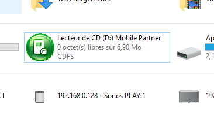

En el 90% de los casos no es necesario forzar las teclas GSM en modo
Solo GSM (en lugar de GSM + cdrom + lector de tarjetas), el único caso
donde es obligatorio esto es si desea utilizar la clave en un
Jeedom en una VM (VMware ESXi). De hecho, si no lo pasas
Modo GSM solo la clave no aparecerá en la lista de
Dispositivos USB que puede pasar a la VM.

> **Importante**
>
> Este tutorial se realizó en Windows 10

Instalación del controlador 
========================

Una vez que la clave está conectada a una PC con Windows 10, debe tener un
nueva unidad de CD-ROM. Tienes que hacer doble clic en él e instalar el
software propuesto (no hay nada que cambiar, solo haga todo
largo).

Recuperación de puerto COM 
========================

Luego debe recuperar el número de puerto de comunicación. Seguir
el menú "Inicio" y busque "Administrador de dispositivos", inicie
éste despliega la parte "Puertos (COM y LPT)", deberías tener
un elemento que contiene "HUAWEI", solo tiene que recordar el número de
Puerto COM :

Descarga de masilla 
=======================

Luego descarga masilla
[ici](https://the.earth.li/~sgtatham/putty/latest/x86/putty.exe) et
iniciar el archivo descargado

Configuración de masilla y cambio al modo GSM solamente 
=======================================================

Una vez iniciado, configure la masilla de esta manera (poniendo su número
Puerto COM para usted, vea el paso anterior) :

Aparecerá una ventana negra (ocasionalmente puede haber un
mensaje "boot ...", esto es normal, significa que estás bien
conectado a la clave GSM). En esta ventana tienes que escribir y luego presionar
en la tecla "Enter"" :

    AT ^ u2diag = 0

> **Importante**
>
> Tenga cuidado cuando escriba el texto, no verá nada en
> la pantalla es normal, el texto aún se tiene en cuenta.

Normalmente a cambio debes tener un OK.

Eso es todo terminado. Su clave está solo en modo GSM y usted
puede usarlo a través de VMware ahora.
