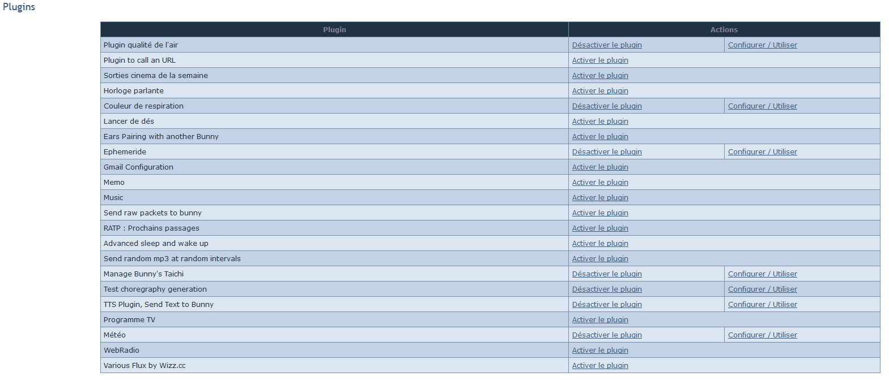

Aquí hay un tutorial sobre cómo instalar openjabnab localmente (en un r o
tarareando)

> **Nota**
>
> Este tutorial está insrado en gran medida por
> 

Instalación de dependencias. 
============================

Una vez que el sistema instalado en SSH haya terminado :

    
    
    
    
    reescritura de a2enmod
    
    
    
    
    
    

onguración de red 
=======================

Luego debe recuperar la dirección IP del sistema :

    

El resultado es :

    eth0 Enlace encap:Ethernet HWaddr d0:63::00:54:98
              :  Bcast:.255 máscara:
              : :::::Alcance 5498/64:Enlace
              UP BROADAST RUNNING MULTIAST MTU:1500 métrico:1
              Paquetes RX:10721 errores:0 caído:0 desbordamientos:0 cuadros:0
              Paquetes TX:6477 errores:0 caído:0 desbordamientos:0 transportista:0
              colisiones::1000
              Bytes RX:.9 MiB) bytes TX:.

Aquí la dirección IP es .

> **Nota**
>
> Pora el resto del tutorial usaré esta IP, por supuesto es
> reemplazar dependiendo de cuál realmente

Luego edite el archivo /etc/resolv.conf

    vim /etc/resolv.conf

Y añadir :

    servidor de mbres 

onguración DNS 
====================

Edite el archivo /etc/bind/named.conf.local

    cd / etc / bind /
    

Y añadir :

    área "raspberry.""{
     tipo maestro
     archivo "/etc/bind/db.raspberry.";
    };
    zona "0.168.192.in-addr.arpa"{
     tipo maestro
     archivo "/etc/bind/db..inv";
    };

ree el archivo db.raspberry.

. ---

Y poner en ello :

    $TTL 604800
    @ IN SOA .. root.raspberry.. (
     1; De serie
     604800; Actualizar
     86400; Reintentar
     2419200; Exra
     604800); aché negativo TTL
    ;
    @ IN NS ..
    ojn EN A 
     EN A 

Luego cree este archivo db..inv

    

Y poner :

    $TTL 604800
    @ IN SOA .. root.localhost. (
     2; De serie
     604800; Actualizar
     86400; Reintentar
     2419200; Exra
     604800); aché negativo TTL
    ;
    @ IN NS ..
    .

> **Importante**
>
> Recuerde reemplazar el 162 en la última línea con el último
> parte de su sistema ip

Lanzar DNS :

    

Prueba si es bue :

    

Deberías tener :

    root @ cubox-i:/ home / ojn # 
    .ft () 56 (84) bytes de datos.
    64 bytes de .ft (): icmp_seq = 1 ttl = 64 tiempo = 0.
    64 bytes de .ft (): icmp_seq = 2 ttl = 64 tiempo = 0.
    64 bytes de .ft (): icmp_seq = 3 ttl = 64 tiempo = 0.
    64 bytes de .ft (): icmp_seq = 4 ttl = 64 tiempo = 0.
    ^ 
    --- .estadísticas de ng  ---
    4 paquetes transmitidos, 4 recibidos, 0% de pérdida de paquetes, tiempo 3000ms
    rtt min / avg / max / mdev = 0.059 / 0.065 / 0.069 / 0.

> **Nota**
>
> Tienes que hacer ctrl + c para salir del ng

Por seguridad también agregaremos la resolución en / etc / hosts, do :

    vim / etc / hosts

Y añadir :

    

Recuperación de Openjabnab 
=========================

Primero crearemos el usuario :

    
    cd / home / ojn

Luego clone openjabnab :

    git clone https://github.com/OpenJabNab/OpenJabNab.git
    :ojn / home / ojn / OpenJabNab /
    chmod 0777 / home / ojn / OpenJabNab / http-wrapper / ojn_admin / include

onguración del servidor web 
============================

Hacer :

    cd / etc / apache2 / sites-available /
    

Y añadir :

    <VirtualHost *:80>
            DocumentRoot / home / ojn / OpenJabNab / http-wrapper /
            
             <Directory />
                     Opciones de FollowSymEnlaces
                    
             </Directory>
             <Directory /home/ojn/OpenJabNab/http-wrapper/>
                     Opciones de índice de FollowSymEnlaces MultiViews
                     Permitir anular todo
                    Orden permitir, negar
                     permitir de todos
             </Directory>
    </VirtualHost>

Luego active el sitio :

    

Luego debe autorizar el directorio del servidor openjabnab, hacer :

    

Y añadir :

    <Directory /home/ojn/>
            Opciones de índice FollowSymEnlaces
            
            Requerir todo otorgado
    </Directory>

Luego reiniciamos apache :

    servicio de recarga apache2

Instalación de openjabnab 
=========================

Hacer :

    
    cd / home / ojn / OpenJabNab / server
    
    hacer

> **Nota**
>
> Este paso puede ser muy largo (hasta 45 minutos)

onguración de Openjabnab 
==========================

Hacer :

    .ini-dist bin / openjabnab.ini
    vim bin / openjabnab.ini

Y cambia las siguientes líneas :

    
    
    
    

Y reemplace todos * mi.dominio.com * por * .*

onguración del servidor web Openjabnab 
=======================================

En tu publicoación debes editar el archivo
:\\ Windows \\ System32 \\ drivers \\ etc y agregue :

    

Entonces sigue :

    http://./ojn_admin/install.php

Validar todo

Lanzamiento del servidor 
====================

Ahora todo está listo, todo lo que queda es iniciar el servidor :

    
    cd ~ / OpenJabNab / server / bin
    ./ openjabnab

Ahora ve a :

    http://./ojn_admin/index.php

> **Nota**
>
> Si todo está bien, debería tener las estadísticas que aparecen en
> Bajo

onguración de conejo 
======================

Pora congurar el conejo es Bajotante simple, debes desenchufarlo
luego vuelva a conectarlo, quédese presionando su botón. Debe
rmalmente azul claro.

Luego, con su P, debe tener una nueva red wi
nabaztagXX, conéctese escribiendo .1.

Una vez encendido, ingrese su conguración e información wi
siguiendo :

    DHP habilitado : 
    Máscara local : 
    Puerta de enlace local : .1 o .254 (dependiendo de su red)
    Servidor DNS : 

Supervisión del servidor Openjabnab e inicio automático 
====================================================

omo tará si cierra la sesión del servidor
Openjabnab se detiene. Entonces tienes que agregar un pequeño script a
supervisar el servidor e iniciarlo automáticamente. Hacer :

    cd / home / ojn
    

Y agrega :

    if [$ (ps ax |  |  | wc -l) -eq 0]; entonces
        ; cd / home / ojn / OpenJabNab / server / bin; hup ./ openjabnab >> / dev / null 2> & 1 &
    

Entonces haz :

    chmod + x checkojn.sh

Ahora debemos agregar el script al inicio y una vericación
cada 15 min por ejemplo :

    

Y añadir :

    @reboot /home/ojn/checkojn.sh
    */ 15 * * * * /home/ojn/checkojn.sh

> **Importante**
>
> Es absolutamente necesario ponerlo en el crontab raíz, si está
> de nuevo con el usuario ojn do ctrl + D

onguración de tu conejo en openjabnab 
============================================

Seguir :

    http://./ojn_admin/index.php

Usted debe tener :

Ahora debe crear una cuenta haciendo clic en crear un
Usuario :

omplete la información solicitada e inicie sesión :

Una vez conectado, vaya al servidor :

Luego baja para encontrar la lista de conejos conectados y recupera
su dirección mac :

Luego vaya a la cuenta y complete el mbre y el campo de dirección mac del
conejo luego validar :

Ahora encontrarás tu conejo en la página del conejo, haz clic en él
para abrir su conguración :

Ahora necesita activar la API púrpura y pasarla en público,
también es aquí donde encontrarás la clave púrpura de la API que te servirá
para Jeedom :

A continuación encontrará la lista de complementos,  olvide agregarlos
activar (tipo TTS o control del oído) :

onguración de Jeedom 
=======================

La conguración en Jeedom es Bajotante simple, primero debes
conéctese en SSH a Jeedom (si tiene un cuadro de Jeedom los identicadores
están en el documento de instalación). Luego edite el archivo / etc / hosts

    vim / etc / hosts

Y agregue la siguiente línea :

    

Entonces todo sucede en Jeedom, después de crear tu conejo aquí.
la conguración para poner:

Aquí está tu conejo ahora tiene su proa madriguera local !!!!!

Poner el TTS localmente 
======================

Todo es local excepto el TTS que pasa por el sitio de Acapela pero es
posible modicando algus archivos para pasarlos localmente

> **Nota**
>
> onsideraré que oenjabnab está instalado en
> / home / ojn / OpenJabNab y estás conectado como
> el usuario de openjabnab, aquí ojn

reación de tts jeedom 
----------------------

Necesita crear una carpeta jeedom en servver / tts :

    mkdir / home / ojn / OpenJabNab / server / tts / jeedom

Entonces tienes que hacer 3 archivos :

-   

<!-- -->

    ######################################################################
    # Generado automáticamente por qhacer (2.01a) sáb ene. :10:
    ######################################################################

    PLANTILLA = lib
    ONFIG - = depuración
    ONFIG + + qt lanzamiento del complemento
    QT + = red xml
    QT - = muérdago
    = . ..
    OBJETIVO = tts_jeedom
    
    = . ..
    LIBS + = -L ../../ bin / -lcommon
    
    
     {
      QMAKE_XXFLAGS_WARN_ON + = -WX
    }
     {
      QMAKE_LFLAGS + = -Wl, -rpath, \ '\ $$ ORIGIN \'
      QMAKE_XXFLAGS + = -Werror
    }

    # De entrada
    HEADERS + = tts_jeedom.h
    FUENTES + = tts_jeedom.cpp

-   tts \ _jeedom.h

<!-- -->

    #
    #denir _TTSAAPELA_H_

    #incluir <QHttp>
    #incluir <QMultiMap>
    #incluir <QTextStream>
    #incluir <QThread>
    #incluye "ttsinterface.h"

    clase  : Public TTSInterface
    {
      
      Q_INTERFAES (TTSInterface)

    publico:
       ();
      virtual ~  ();
      QByteArray reateNewSound (QString, QString, bool);

    privado:
    };

    #

-   tts \ _jeedom.cpp

<!-- -->

    #incluir <QDateTime>
    #incluir <QUrl>
    #incluir <QryptographicHash>
    #incluir <QMapIterator>
    #incluir "tts_jeedom.h"
    #incluye "log.h"
    #incluir <QNetworkReply>
    #incluir <QNetworkRequest>
    #incluir <QNetworkAccessManager>

    Q_EXPORT_PLUGIN2 (tts_jeedom, )

    :: ():TTSInterface ("jeedom", "Jeedom")
    {
      voiceList.insert ("fr", "fr");
    }

    ::~  ()
    {
    }

    ::reateNewSound (texto QString, voz QString, bool forceOverwrite)
    {
      
      si (!voiceList.contains (voz))
        voz = "fr";
      // Verique (y cree si es necesario) la carpeta de salida
      
      si (!outputFolder.exists (voz))
        outputFolder.mkdir (voz);

      si (!outputFolder.cd (voz))
      {
        LogError (QString ("No se puede crear la carpeta TTS : % 1 "). Arg (ttsFolder.absoluteFilePath (voz)));
        devolver QByteArray ();
      }

      
      ::hash (texto.toAscii (), QryptographicHash::Md5) .toHex (). Append (". Mp3");
      QString lePath = outputFolder.absoluteFilePath (leName);

      si (!::existe (lePath))
        volver ttsHTTPUrl.arg (voz, mbre de archivo) .toAscii ();

      // Recuperar MP3
      QHttp http ("TODO_IP_JEEDOM");
      ::connect (& http, SIGNAL (hecho (bool)), & loop, SLOT (quit ()));

      
      ontentData + = "akey = TODO_API_JEEDOM & text =" + QUrl::toPercentEncoding (texto);

      
      Header.addValue ("Host", "TODO_IP_JEEDOM");

      Header.setontentLength (ontentData.length ());
      Header.setRequest ("GET", "/core/a/tts.php?akey = TODO_API_JEEDOM & text = "+ QUrl::toPercentEncoding (texto), 1, 1);

      http.request (Encabezado, ontentData);
      loop.exec ();

      Archivo QFile (lePath);
      si (!le.open (QIODevice::Escribir solo))
      {
        LogError ("No se puede abrir el archivo de sonido para escribir : "+ lePath);
        devolver QByteArray ();
      }
      le.write (http.readAll ());
      le.close ();
      volver ttsHTTPUrl.arg (voz, mbre de archivo) .toAscii ();
    }

> **Nota**
>
> No olvides reemplazar los TODOs

Luego active el tts jeedom modicando el archivo
/home/ojn/OpenJabNab/server/tts/tts.pro agregando jeedom a SUBDIRS :

    PLANTILLA = subdirs
    

Recomlar 
-------------

    cd / home / ojn / OpenJabNab / server
    
    hacer

Modicación del servicio tts 
------------------------------

Edite el archivo /home/ojn/OpenJabNab/server/bin/ openjabnab.ini
y cambiar :

    TTS = acapela

Por

    TTS = libertad

Relanzamiento de openjabnab 
--------------------

La forma más fácil es reiniciar la máquina para reiniciar openjabnab
