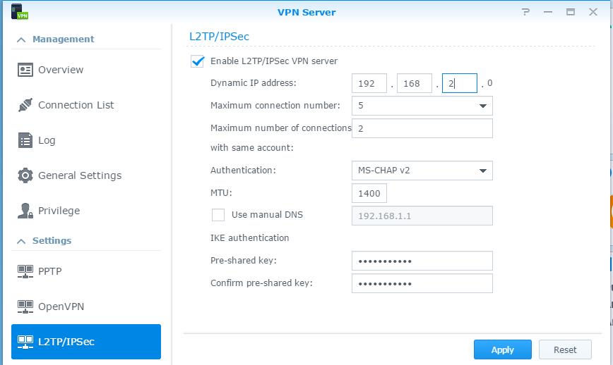

Instalar servidor VPN 
====================

Desde un navegador web en una computadora conectada a la misma red que
Synology

Vaya a la interfaz DSM e inicie sesión con una cuenta de administrador y luego
vaya al menú principal y seleccione Centro de paquetes

Arriba a la izquierda en la ventana, haga una búsqueda con la palabra VPN.
El servidor VPN debería aparecer, luego haga clic en instalar.

Regrese al menú principal y seleccione Servidor VPN

Cuando se abra la ventana, vaya a L2TP / IPSEC

Elija la opción Habilitar servidor VPN L2TP / IPsec

En Dirección IP dinámica, ingrese un número que corresponderá al sub
red para asignar las IP de sus dispositivos en VPN en la red interna
desde tu lugar. NB? : no elijas lo mismo que el
subred predeterminada de su caja ex en libre la subred de
máquinas es 192.168.1.0 así que en el ejemplo ponemos 2

Luego ingrese el número máximo de conexiones que desea permitir
en el servidor VPN, entonces el número máximo de conexiones simultáneas
para un usuario

Finalmente ingrese una clave para compartir NB? : es una contraseña que él
tendrá que ingresar la configuración de VPN en el móvil o tableta.

Luego aplique

Luego, un mensaje indica los puertos que deben redirigirse en su
Caja de Internet a su NAS.

Permitir a los usuarios usar el servicio VPN en el NAS 
===============================================================

Regrese al menú principal y seleccione Servidor VPN

En la parte izquierda, seleccione Privilegio

Desmarque todas las casillas bajo PPTP Open VPN y L2TP

Marque solo la casilla en frente del usuario que desea
permitir usar VPN .

> **Tip**
>
> Es recomendable crear un usuario solo para la VPN
> y sin ningún otro derecho / autorización que hacer con la VPN.

Redireccionar los puertos de su BOX 
===============================

En el navegador ingrese 192.168.1.1. Haga clic en configuración
Freebox

Seleccionar modo avanzado

Seleccione Port Management

Agregar una redirección

Ingrese los parámetros de la siguiente manera.

> **Tip**
>
> El ID de destino es lo único que depende de su instalación,
> debe poner la IP de su Synology NAS

Guardar

Luego observamos que la configuración se tiene en cuenta

Repita la operación con los puertos UDP 500 y 4500

Configura la VPN en tu móvil 
==================================

Vaya a la aplicación y seleccione Configuración

Haga clic en… Más

Haga clic en VPN

Haga clic en el + en la esquina superior derecha

Dé un nombre al acceso VPN, establezca como tipo L2TP / IPSec PSK, ingrese
la dirección pública de su casilla de internet (o un nombre DNS si tiene uno
a) e ingrese la clave compartida ingresada en la sección Configurar una
Servidor VPN :

Ahora para iniciar la VPN, simplemente haga clic en el nuevo
línea que apareció con el nombre de tu túnel VPN

Luego ingrese el nombre de usuario y la contraseña del usuario que fue
configurado en la sección Configurar un servidor VPN

Y eso es todo lo que haces en tu teléfono, es como tú
estaban en WiFi desde casa !
