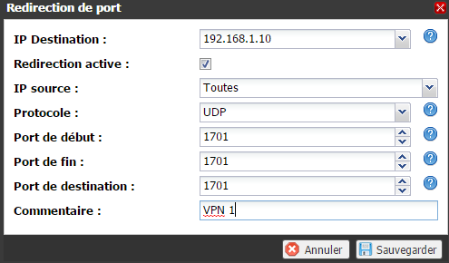

Installer VPN Server 
====================

Depuis un navigateur Web sur un ordinateur connecté au même réseau que
le Synology

Aller sur l'interface de DSM et se loguer avec un compte admin puis
aller sur le menu principal et sélectionner Package Center

En haut à gauche dans la fenêtre faire une recherche avec le mot VPN.
VPN Server doit apparaitre, cliquez alors sur install.

Aller de nouveau sur le menu principal et sélectionner VPN Server

A l'ouverture de la fenêtre, aller sur L2TP/IPSEC

Choisir l'option Enable L2TP/IPsec VPN server

Dans Dynamic IP Address, entrer un chiffre qui correspondra au sous
réseau d'affectation des IPs de vos device en VPN sur le réseau interne
de chez vous. NB : il ne faut pas choisir la même chose que le
sous-réseau par défaut de votre box ex chez free le sous-réseau des
machines est 192.168.1.0 donc dans l'exemple on met 2

Entrer ensuite le nombre maximum de connexions que vous voulez autoriser
sur le serveur VPN, puis le nombre de connexions simultanées maximum
pour un utilisateur

Enfin entrer une clef de partage NB : il s'agit d'un mot de passe qu'il
faudra entrer à la configuration du VPN sur le mobile ou la tablette.

Puis faire apply

Un message indique alors les ports qui doivent être redirigés sur votre
Box internet vers votre NAS.

Autoriser des utilisateurs à utiliser le service VPN sur le NAS 
===============================================================

Aller de nouveau sur le menu principal et sélectionner VPN Server

Dans la partie gauche sélectionner Privilège

Décocher toutes les cases sous PPTP Open VPN et L2TP

Cocher uniquement la case en face de l'utilisateur que vous voulez
autoriser à utiliser le VPN .

> **punta**
>
> Il est conseillé de vous créer un utilisateur uniquement pour le VPN
> et sans autres droits / habilitation que faire du VPN.

Rediriger les port de votre BOX 
===============================

Dans le navigateur entrer 192.168.1.1. Cliquez sur paramètres de la
Freebox

Sélectionner le mode avancé

Sélectionner Gestion de port

Ajouter une redirection

Entrer les paramètres comme suit.

> **punta**
>
> ID de destination est le seul truc qui dépend de votre installation,
> il faut y mettre l'IP de votre NAS Synology

Faire sauvegarder

On note alors que le paramétrage est pris en compte

Recommencer l'opération avec les ports UDP 500 et 4500

Configurer le VPN sur votre mobile 
==================================

Aller dans application et sélectionner Paramètres

Cliquer sur … Plus

Cliquer sur VPN

Cliquer sur le + en haut à droite

Donner un nom à l'accès VPN, mettre comme type L2TP/IPSec PSK, entrer
l'adresse publique de votre box internet (ou un nom DNS si vous en avvez
un) et entrer la clef partagée renseignée dans la partie Configurer un
serveur VPN :

Maintenant pour lancer le VPN, il suffit de cliquer sur la nouvelle
ligne qui est apparue avec le nom de votre tunnel VPN

Entrez alors le login et le mot de passe de l'utilisateur qui a été
configuré dans la partie Configurer un serveur VPN

Et voilà tout ce que vous faites sur votre téléphone c'est comme si vous
étiez en Wifi de chez vous !
