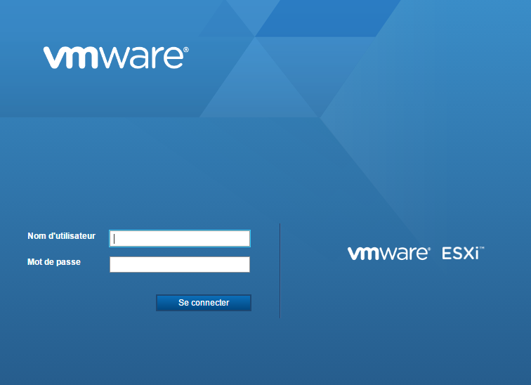
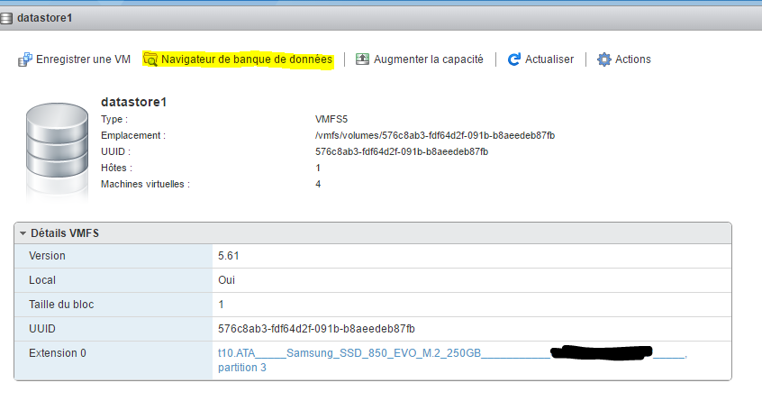
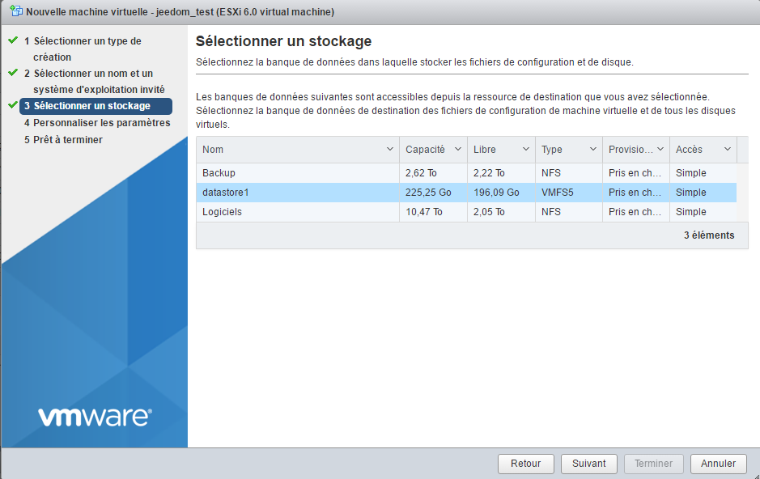
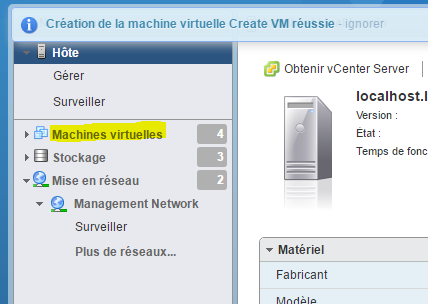

Veremos aquí cómo crear una VM en VMware.

Antes de que haya algo importante que saber sobre VMware, hay 2
camino del gerente :

-   la interfaz web (presente por defecto en 6.0 actualización 2, o por
    a través de un vib para las otras versiones), accedemos a él por
    IP \ _ESXI / ui

-   El cliente pesado e histórico de VMware (cliente vSphere)

Aquí utilizaré principalmente la interfaz web porque creo que es
El futuro de VMware que abandona cada vez más al cliente grueso
(por cierto todas las nuevas características desde los 5.1 no se puede usar
con el cliente pesado).

También tenga en cuenta que la interfaz web todavía se está implementando
en VMware, de hecho, es probable que encuentre algunos errores o
ralentiza con un poco de actualización de la página y que
deja sin preocupaciones.

Conexión a la interfaz web. 
===========================

Vaya a IP \ _ESXI / ui con su navegador de Internet, debe tener :

> **Nota**
>
> Si no tienes nada te aconsejo que instales
> interfaz web, toda la información
> [ici](https://doc.jeedom.com/es_ES/howto/doc-howto-vmware.trucs_et_astuces.html)

Ingrese sus credenciales de inicio de sesión en ESXI :

Como puede ver, la interfaz es bastante agradable y le permite
hacer muchas cosas, no entraré en detalles pero tú
puede ya desde esta pantalla :

-   detener / reiniciar el ESXi

-   ver uso de recursos (CPU, memoria y disco)

-   tener información sobre su sistema (tiempo de operación,
    Versión de VMware, versión de BIOS, visualización del almacén de datos)

-   botón para crear una VM (la usaremos justo después)

-   un botón de acción que le permite cambiar al modo de mantenimiento
    (útil si tiene un clúster ESXi, de lo contrario no lo hará
    nunca servir), habilitar / deshabilitar el servicio SSH (se usa
    en el tutorial de configuración de respaldo)

Envío de instalación ISO 
=============================

Después de descargar su instalación iso
([ici](http://cdimage.debian.org/debian-cd/8.5.0/amd64/iso-cd/debian-8.5.0-amd64-netinst.iso)
por ejemplo para debian 8.5 en netinstall), debes ponerte
tu almacén de datos.

Para ese clic en el almacén de datos :

Seleccione su almacén de datos (generalmente se llama almacén de datos1) :

Haga clic en "Navegador de base de datos" :

Haga clic en "Descargar" (el primero) :

Seleccione el ISO descargado previamente y valide :

Luego puede seguir el progreso del envío :

Una vez terminado, puede ver que su iso ha llegado al
almacén de datos :

Creación de tu primera VM 
=============================

Haga clic en el botón "Crear / Guardar VM"" :

Haga clic en siguiente :

Luego asigne un nombre a su máquina y especifique su sistema
en funcionamiento (aquí instalaremos un Debian) :

Indique el almacén de datos de destino :

Aquí podrá configurar los parámetros de su máquina (disco
duro, cpu, memoria ...) :

> **Nota**
>
> Todos estos parámetros se pueden modificar después sin preocupaciones, tenga en cuenta
> sin embargo, no es realmente posible reducir el tamaño
> un disco duro, puede aumentarlo (pero debe saber cómo administrarlo
> Nivel del sistema operativo siguiente) pero no lo reduce.

En la unidad de CD / DVD, seleccione "Banco de archivos ISO de
Datos" :

Luego seleccione la ubicación donde se almacena su ISO (consulte
capítulo anterior) y validar :

Entonces haz lo siguiente :

Luego tiene un resumen de su configuración, haga clic en
"Terminar" :

Un mensaje en la parte superior le dirá que está bien, luego haga clic en
"Máquinas virtuales" :

Debería ver su máquina virtual (si no, haga clic en
en "Actualizar") haga clic en él :

Debe tener una página de este tipo, haga clic en el botón de reproducción :

Su máquina se iniciará y podrá instalar
su sistema operativo :

> **Importante**
>
> Una vez que su máquina esté instalada, DEBE instalar
> Herramientas de VMware (esto permite que VMware tenga información sobre su VM
> y apágalo correctamente). Bajo debian solo haz
> "sudo apt-get -y install open-vm-tools".

Para el resto de la instalación, los invito a leer esto.
[Tutorial](https://doc.jeedom.com/es_ES/howto/doc-howto-debian.installation.html#_installation)

Montar dispositivos USB en la VM 
=======================================

> **Nota**
>
> Si no tiene las siguientes opciones, es necesario actualizar
> el cliente de host integrado ESXi, toda la información
> [ici](https://doc.jeedom.com/es_ES/howto/doc-howto-vmware.trucs_et_astuces.html)

Es una necesidad bastante rara, pero tuve que usarla para Jeedom, en
de hecho tengo en mi ESXi las teclas Zwave, RFXcom, edisio, enOcean y GSM
conectado y tuve que conectarlos a mi máquina virtual Jeedom para poder
úsalo.

> **Nota**
>
> Para Zwave, RFXcom, edisio y enOcean no hay problema, para
> Claves GSM debe seguir esto
> [Tutorial](https://doc.jeedom.com/es_ES/howto/doc-howto-gsm.huawei_mode_modem.html)
> antes de forzar la clave en modo módem solo de lo contrario no es
> no se ve correctamente en el ESXi.

Vaya a su VM y luego haga "Cambiar configuración" :

Haga clic en "Agregar otro dispositivo" y luego en el controlador USB :

> **Nota**
>
> El siguiente paso debe repetirse para cada dispositivo USB que
> quieres conectarte

Guardar, rehacer "Cambiar configuración", luego "Agregar otro
dispositivo "y" dispositivo USB" :

Elija su dispositivo USB de la lista desplegable :

Y ahora su dispositivo está conectado a su VM. A cada
reiniciar se volverá a conectar automáticamente a la máquina virtual y si
desconectar / conectar físicamente, luego se volverá a conectar a
tu VM En otras palabras, el uso ahora es totalmente
transparente.
