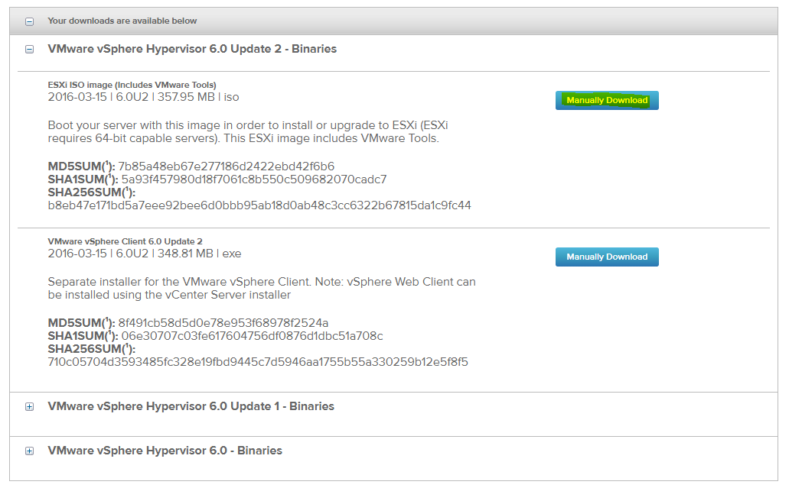
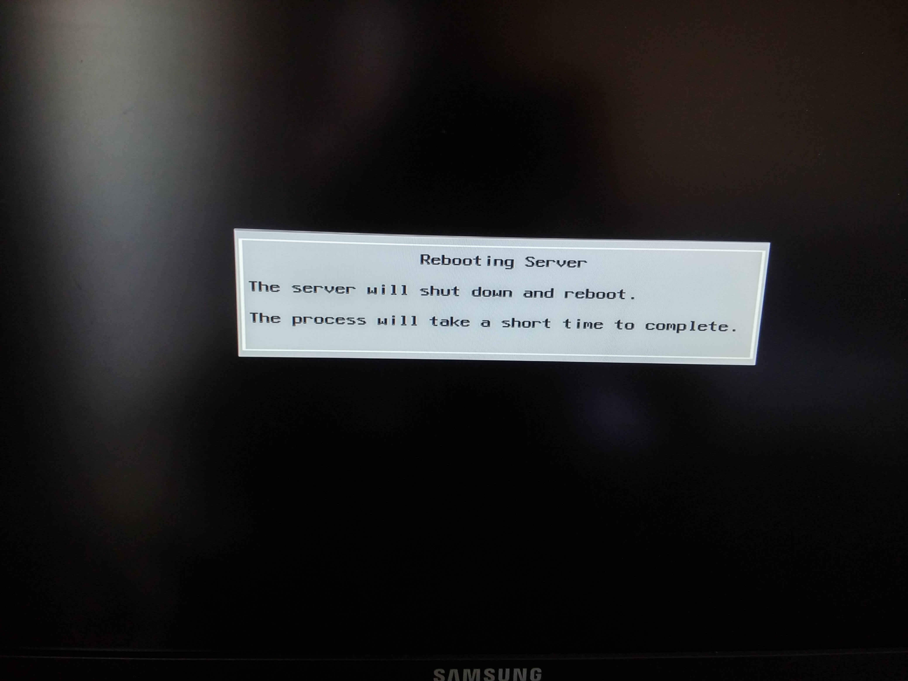

Voici un tuto pour installer VMware sur un Intel NUC (gen6). Nous
verrons par la suite comment ajouter Jeedom dessus

Le matériel 
===========

Intel NUC 
---------

L'Intel NUC est un petit PC, pas le plus puissant, mais très économe en
énergie et de faibles dimensions. Cela en fait un parfait petit serveur
de virtualisation basé sur VMware.

Il existe actuellement 2 NUC de 6ème génération (les autres marchent
aussi pour VMware mais nécessitent de mettre des drivers en plus sur le
noyau VMware):

-   Intel Core i3-6100U (Dual-Core 2.3 GHz - - 4 threads - Cache 3 Mo -
    TDP 15W)

-   Intel Core i5-6260U (Dual-Core 1.8 GHz - Turbo 2.9 GHz - 4 threads -
    Cache 4 Mo)

Le i5 est nettement plus puissant car il a un peu plus de mémoire cache
et surtout un mode turbo qui lui permet de monter beaucoup plus haut en
Fréquence.

A cela se rajoute 2 types de boitier :

-   Un boitier fin ne pouvant contenir qu'un disque de type M2

-   Un boitier plus épais pouvant contenir un disque de type M2 et un
    disque 2.5 pouces

Cela fait donc 4 références :

-   i3 M2 : [Intel NUC
    NUC6I3SYK](http://www.ldlc.com/fiche/PB00203086.html) \~ 320€

-   i3 M2 + 2.5pouces : [Intel NUC
    NUC6I3SYH](http://www.ldlc.com/fiche/PB00203148.html) \~ 320€

-   i5 M2 : [Intel NUC
    NUC6I5SYK](http://www.ldlc.com/fiche/PB00203084.html) \~ 460€

-   i5 M2 + 2.5pouces : [Intel NUC
    NUC6I5SYH](http://www.ldlc.com/fiche/PB00202760.html) \~ 430€

SSD 
---

Il faut à cela rajouter un SSD et de la mémoire. Niveau SSD je vous
conseille 240Go ou plus, à moins de prendre le modèle avec un
emplacement 2.5 pouces (qui vous permette de mettre disque dur en plus)
ou d'avoir un NAS type Synology pour faire du LUN iSCSI. Ne pas oublier
qu'une VM de base (pas de stockage) c'est entre 20 à 40Go, rajoutez à
cela 40Go pour le VMware en lui-même ça se remplit vite.

> **Importante**
>
> VMware ne supporte pas l'ajout de disque USB, il est donc difficile
> d'étendre la place disponible

-   [LDLC SSD M.2 2280 F6 PLUS 120
    GB](http://www.ldlc.com/fiche/PB00203635.html) \~ 55€

-   [Samsung SSD 850 EVO 120 Go
    M.2](http://www.ldlc.com/fiche/PB00185923.html) \~ 100€

-   [LDLC SSD M.2 2280 F6 PLUS 240
    GB](http://www.ldlc.com/fiche/PB00203636.html) \~ 105€

-   [Samsung SSD 850 EVO 250 Go
    M.2](http://www.ldlc.com/fiche/PB00185924.html) \~ 120€

-   [LDLC SSD M.2 2280 F6 PLUS 480
    GB](http://www.ldlc.com/fiche/PB00207301.html) \~ 190€

Mémoire 
-------

Attention pour la mémoire il faut absolument de la DDR4 en So-DIMM 260
pins, il faut au minimum 4Go pour VMware, mais par expérience je vous
conseille au moins 8Go (personnellement je suis meme monté jusqu'à 16Go,
le NUC supporte au maximum 32Go). Là, pas de mémoire recommandée, la
moins chère va très bien (attention je prends toujours des packs de 2
barrettes, cela améliore les performances) :

-   [Crucial SO-DIMM DDR4 8 Go (2 x 4 Go) 2133 MHz CL15 SR
    X8](http://www.ldlc.com/fiche/PB00204134.html) \~ 35€

-   [Crucial SO-DIMM DDR4 16 Go (2 x 8 Go) 2133 MHz CL15 DR
    X8](http://www.ldlc.com/fiche/PB00204135.html) \~ 65€

-   [Crucial SO-DIMM DDR4 32 Go (2 x 16 Go) 2133 MHz CL15 DR
    X8](http://www.ldlc.com/fiche/PB00204136.html) \~ 120€

Préparation de l'installation 
=============================

Avant de lancer l'installation a proprement parlé il va d'abord falloir
récupérer VMware et le mettre sur une clef USB.

Téléchargement de VMware 
------------------------

> **Importante**
>
> Si vous mettez vmware 6.5, il y a un soucis avec la nouvelle gestion
> de l'USB et les clefs Zwave, pour que cela marche il faut appliquer ce
> [KB](https://kb.vmware.com/selfservice/microsites/search.do?language=en_US&cmd=displayKC&externalId=2147650). Attention cette manipulation n'est plus à faire en vmware 6.7

C'est le plus dur en fait je crois, pour vous simplifier la vie il faut
:

-   aller sur
    [ici](https://my.vmware.com/en/web/vmware/evalcenter?p=free-esxi6)
    et vous inscrire

-   attendre le mail pour bien valider l'inscription

-   retourner
    [ici](https://my.vmware.com/en/web/vmware/evalcenter?p=free-esxi6)
    et vous connecter (il va peut être vous demander d'accepter les
    conditions, il faut valider)

-   ensuite aller
    [là](https://my.vmware.com/fr/web/vmware/details?productId=491&downloadGroup=ESXI60U2)
    et ajouter à votre compte "ESXi ISO image (Includes VMware Tools)"

-   enfin retourner
    [ici](https://my.vmware.com/en/web/vmware/evalcenter?p=free-esxi6)
    et là vous devez avoir dans "Downlaod Packages", un package "ESXi
    ISO image (Includes VMware Tools)" qu'il vous faut télécharger

Juste au-dessus vous avez aussi votre clef de licence, vous pouvez en
profiter pour la récupérer.

Téléchargement de rufus 
-----------------------

Là c'est beaucoup plus simple il vous suffit de cliquer
[la](http://rufus.akeo.ie/downloads/rufus-2.9.exe). Il vous faut ensuite
lancer le .exe

Création de la clef USB bootable 
--------------------------------

Là aussi c'est facile voilà comment configurer rufus :

Il ne vous reste plus qu'à cliquer sur démarrer et attendre.

Déballage et assemblage du NUC 
==============================

Voilà les 3 composants pour mon NUC :

-   Intel NUC NUC6I5SYH

-   Samsung SSD 850 EVO 250 Go M.2

-   CORSAIR VENGEANCE SO-DIMM DDR4 16 GO (2 X 8 GO) 2400 MHZ CL16

La boite du NUC :

Ouverture de celle-ci :

Les composants sortis de leur boîte :

Ouverture du NUC, là c'est très simple, mettez-le à l'envers, dévissez
les 4 vis sous les pieds (elles ne sortent pas en entier c'est normal il
faut juste les dévisser), puis tirez légèrement sur les vis pour ouvrir
le NUC:

Le SSD installé (sur la gauche), la vis en bout pour le bloquer est un
peu pénible à remettre, heureusement on ne fait ça qu'une fois

Installation de la mémoire (à droite) :

Et voilà, vous pouvez refermer (à moins bien sûr que vous ayez pris un
SSD 2.5 pouces qu'il faut dans ce cas insérer dans le couvercle).

Installation de VMware 
======================

Là c'est très simple, il suffit de mettre la clef USB sur l'un des ports
USB du NUC, de brancher un écran sur le port HDMI, un clavier et
l'alimentation. Vous allumez le NUC, l'installation se lancera toute
seule :

> **Nota**
>
> J'ai oublié de faire les captures de la validation de la licence, il
> faut juste être d'accord en suivant les instructions

Ici sélectionnez bien le disque correspondant au SSD (vous pouvez le
repérer soit par le nom soit par la taille)

Sélectionnez "French" :

Mettez un mot passe, au début je vous conseille de mettre un truc simple
comme "oooo" (on le changera par la suite) :

Validez en faisant F11 :

L'installation va prendre de 10 à 20min, ensuite il vous faudra enlever
la clef USB et attendre que le système reboot

Une fois le redémarrage fini vous devez avoir :

Voilà VMware est installé (en plus il est sympa il vous donne son IP) ,
plus qu'à jouer avec !!!

Pour la suite voici un
[tutoriel](https://jeedom.github.io/documentation/howto/fr_FR/doc-howto-vmware.creer_une_vm.html)
pour la création de votre première VM. Et vous trouverez
[ici](https://jeedom.github.io/documentation/howto/fr_FR/doc-howto-vmware.trucs_et_astuces.html)
un tutoriel de trucs et astuces (pour par exemple mettre votre licence
VMware)
