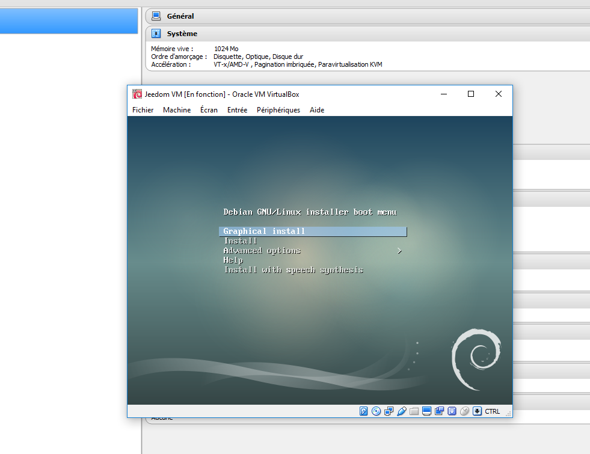

# Instalación en una VM

Si desea descubrir Jeedom sin riesgo, también puede virtualizarlo en su PC, este es el procedimiento a seguir. No se arriesga en una máquina virtual, la integridad de su PC está protegida :

## Descargue e instale VirtualBox

Debes descargar el software Virtual Box [aquí](https://download.virtualbox.org/virtualbox/6.1.6/VirtualBox-6.1.6-137129-Win.exe)

# Instalación automática

Descargar la iso de jeedom [aquí](https://images.jeedom.com/x86-64/).

## Configurar el entorno VM

Haga clic en nuevo y complete los campos a continuación :


-   Haga clic en siguiente, adapte el tamaño de la memoria en relación con su sistema (1024 son suficientes)
-   Haga clic en Siguiente, cree un disco virtual ahora
-   Haga clic en Crear, elija VDI
-   Haga clic en siguiente, asignado dinámicamente
-   Haga clic en siguiente, elija un tamaño para el espacio (4 GB es suficiente)
-   Haga clic en crear

## Lanzamiento de VM

-   Haga clic en configuración
-   Seleccionar almacenamiento
-   Agregar una unidad óptica
-   Elige un disco

-   Indica la imagen descargada previamente
-   Luego seleccione la red y elija "acceso de puente" en el modo de acceso a la red.

-   Haga clic en Aceptar \* Haga clic en Inicio

Seleccione "Instalar en disco" (ingrese la tecla en el teclado), confirme con sí (tecla de flecha hacia abajo y luego ingrese). Todo lo demás se hará automáticamente (de 10 a 30 minutos), luego, una vez que el vm se reinicie, esperará 5 minutos y deberá tener acceso a Jeedom simplemente poniendo la ip de jeedom en un navegador.

>**Consejos**
>
>Para conocer la IP de la VM (una vez conectada a ella, los identificadores se muestran en la pantalla de conexión) ``ip -s -c -h a``

> **Información**
>
> Las ID de conexión ssh predeterminadas son : jeedom y Mjeedom96 para la contraseña 

Entonces puedes seguir la documentación [Primer paso con Jeedom](https://doc.jeedom.com/es_ES/premiers-pas/index)

# Instalación manual

## Descargar una imagen de Strecht de Debian - netinstall

Descargue una imagen minimalista de Debian 10 Buster [Aquí](https://cdimage.debian.org/debian-cd/current/amd64/bt-cd/debian-10.3.0-amd64-netinst.iso.torrent)

## Configurar el entorno VM

Haga clic en nuevo y complete los campos a continuación :


-   Haga clic en siguiente, adapte el tamaño de la memoria en relación con su sistema (1024 son suficientes)
-   Haga clic en Siguiente, cree un disco virtual ahora
-   Haga clic en Crear, elija VDI
-   Haga clic en siguiente, asignado dinámicamente
-   Haga clic en siguiente, elija un tamaño para el espacio (4 GB es suficiente)
-   Haga clic en crear

## Lanzamiento de VM

-   Haga clic en configuración
-   Seleccionar almacenamiento
-   Agregar una unidad óptica
-   Elige un disco

-   Indica la imagen descargada previamente
-   Luego seleccione la red y elija "acceso de puente" en el modo de acceso a la red.


-   Haga clic en Aceptar \* Haga clic en Inicio

## Instalación de Debian 9

Es clásico



-   Elija instalación gráfica
-   Instale el debian preferiblemente sin interfaz gráfica porque inútil. El nombre de usuario no importa. En la mayoría de las pantallas, solo tiene que validar la opción predeterminada. Puedes dejar campos vacíos, no está bloqueando.
-   Para la selección de software :

-   Para Grub, no se preocupe, el sector de arranque es el de la VM, no el de su PC. No hay riesgo de romper nada.

## Instalación Jeedom

-   Lanza tu VM
-   Identifíquese con el usuario y la contraseña elegidos durante la instalación
-   Ir de raíz

``su -``

-   Ingrese la contraseña de root establecida durante la instalación
-   Obtenga el script jeedom, hágalo ejecutable, ejecútelo

````
wget https://raw.githubusercontent.com/jeedom/core/master/install/install.sh
chmod +x install.sh
./install.sh
````

-   y déjalo ir

## Lanzamiento de Jeedom

-   Para conocer la dirección Ip Lan de la VM

````
ip -s -c -h a
````

Su dirección IP, escriba 192.168.0.XX aparece en rojo. Solo ingrésalo en tu navegador.

> **Advertencia**
>
> Si esto no funciona, no ha configurado su tarjeta de red como Puente de red como se indica al inicio.

Entonces puedes seguir la documentación [Primer paso con Jeedom](https://doc.jeedom.com/es_ES/premiers-pas/index)
