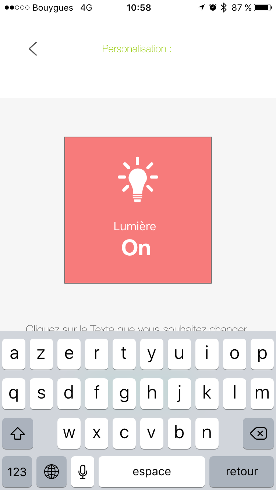
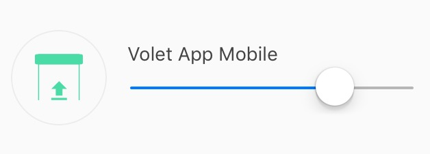

Complemento para usar la aplicación Jeedom Móvil.

La aplicación móvil Jeedom requiere la instalación de este complemento para
la caja puede comunicarse con la aplicación móvil.

Configuración de complemento móvil 
==============================

Después de instalar el complemento, solo necesita activarlo :

**Configuración**

Para configurar el complemento, debe agregar los teléfonos que
podrá acceder a Jeedom.

Para agregar un teléfono : **Plugins** → **Comunicación** → **App
Móvil** → **Añadir**

Aquí están los parámetros para ingresar :

-   **Nombre del equipo móvil.** : Nombre del teléfono

-   **Activar** : Habilitar el acceso para este móvil

-   **Puntao de móvil** : Selección del sistema operativo del teléfono (iOS, Android)

-   **Usuario** : Usuario asociado con este acceso

> **Punta**
>
> La elección del usuario es importante porque determina la
> equipo al que este último tendrá acceso según sus derechos.

Después de guardar, obtendrá un código QR que permite
la aplicación para configurarse.

Configuración de complementos y comandos recibidos por la aplicación 
=======================================================

Después de inicializar el complemento móvil, tiene la opción de
reelaborar tipos genéricos de controles, complementos y piezas.

Al hacer clic en un complemento, puede autorizarlo o no a chatear
con la aplicación móvil y configure cada uno de los tipos genéricos
asociado con sus órdenes.

Al hacer clic en una parte, puede autorizarla o no
presente en la aplicación móvil y configure cada uno de los tipos
genéricos asociados con sus órdenes.

Configuración de la aplicación móvil 
=====================================

Encontrará las aplicaciones en las persianas móviles. :

**Android Google Play**

**Apple App Store**

Primer lanzamiento de la aplicación. 
--------------------------

En el primer lanzamiento de la aplicación móvil, se ofrecerá un tutorial
para ayudarlo a configurarlo.

Después de descargar e instalar su aplicación móvil Jeedom,
inicie la aplicación en su teléfono inteligente.

Luego llega a un tutorial de configuración que nosotros
aconseja seguir. Algunos pasos se han realizado previamente.

A continuación, podrá elegir entre una configuración manual o
automático por QRcode. Si elige la configuración por QRcode,
simplemente actualice el código QR en el complemento de la aplicación móvil en
equipo de teléfono inteligente creado previamente. En este caso, la aplicación
recupere automáticamente toda la configuración de su Jeedom y
conectarse automáticamente. Cuando está conectado a su hogar a través de Wifi,
la aplicación usará automáticamente la dirección de Ethernet de Jeedom
interno a su red. Cuando estás conectado en 4G o 3G, hay
usará su dirección externa para conectarse a su Jeedom (por
ejemplo a través del servicio DNS de Jeedom si lo usa). Si eliges
para la configuración manual, en este caso deberá ingresar el
entregar las direcciones IP internas y externas de su Jeedom. Esta opcion
está reservado para un público informado.

La aplicación se sincronizará y usted llegará a su página de inicio.
(precedido por una mini guía de presentación).

La aplicación móvil Jeedom ahora está lista para funcionar.

Favoritos 
-----------

En la aplicación puede tener Favoritos (accesos directos de
comandos, complementos, escenarios).

Aquí está el procedimiento para crearlos. :

Haga clic en uno de los + en la pantalla de inicio de la aplicación :

Llegará a la página de selección de tipo de acceso directo :

Por ejemplo, vamos a tomar medidas, por lo que nos ofrece
Salas / Objetos :

Solo necesita seleccionar la acción que desea en
atajo :

Entonces es posible personalizar el color (para
tres colores están disponibles) :

Así como los dos textos asociados :

 ![mobile
tablero de instrumentos 7] (../ images / mobile_dashboard_7.PNG)

Aquí, ahora tiene un acceso directo a su pedido (en el
versión 1.1 Se espera que los comandos de encendido / apagado aparezcan en el
misma llave).

Cómo configurar correctamente los tipos genéricos 
============================================

Puntaos genéricos en el complemento móvil 
------------------------------------------

Mejor que las palabras, aquí hay un ejemplo de genéricos típicos para un
light con todos sus controles (ver también la tabla Light plus
abajo) :

Tablas de plantillas de aplicación 
---------------------------------------

### Las luces #

Imagen                           | Puntao genérico               | Parte del complemento de desarrollo            | Descripción          |
:-----------------------------: | :--------------------------- | :--------------------------- | :------------------: |
 | `Lumière Bouton On` `Lumière Bouton Off` | `LIGHT_ON` `LIGHT_OFF`| présence de deux boutons "ON" et "Off" pas de retour d'état. |
 | `Lumière Bouton On` `Lumière Bouton Off` `Lumière Etat` | `LIGHT_ON` `LIGHT_OFF` `LIGHT_STATE` | Retour d'état présent, le bouton de gauche permet de switcher entre On et Off |
 | `Lumière Bouton Toggle` `Lumière Etat` | `LIGHT_TOGGLE` `LIGHT_STATE` | Retour d'état présent, le bouton de gauche permet de switcher entre On et Off |
 | `Lumière Bouton On` `Lumière Bouton Off` `Lumière Etat` `Lumière Slider` | `LIGHT_ON` `LIGHT_OFF` `LIGHT_STATE` `LIGHT_SLIDER` | Retour d'état présent, le bouton de gauche permet de switcher entre On et Off et le slider permet de contrôler l'intensité |
 | `Lumière Bouton On` `Lumière Bouton Off` `Lumière Etat` `Lumière Slider` `Lumière Couleur (info)` `Lumière Couleur (action)` `Lumière Mode` (optionnel, il sert à avoir des mode de lumière,par exemple arc-en-ciel sur les philips Hue) | `LIGHT_ON` `LIGHT_OFF` `LIGHT_STATE` `LIGHT_SLIDER` `LIGHT_COLOR` `LIGHT_SET_COLOR` `LIGHT_MODE` | Retour d'état présent, le bouton de gauche permet de switcher entre On et Off et le slider permet de contrôler l'intensité. Dans le cercle la couleur de la lampe est présente et lors d'un cloc dans celui-ci vous pouvez changer la couleur et activer un mode |

### Los enchufes #

Imagen                           | Puntao genérico               | Parte del complemento de desarrollo            | Descripción          |
:-----------------------------: | :--------------------------- | :--------------------------- | :------------------: |
 | `Prise Bouton On` `Prise Bouton Off`| `ENERGY_ON` `ENERGY_OFF`| présence de deux boutons "ON" et "Off" pas de retour d'état. |
 | `Prise Bouton On` `Prise Bouton Off` `Prise Etat` | `ENERGY_ON` `ENERGY_OFF` `ENERGY_STATE` | Retour d'état présent, le bouton de gauche permet de switcher entre On et Off |
 | `Prise Bouton On` `Prise Bouton Off` `Prise Etat` `Prise Slider` | `ENERGY_ON` `ENERGY_OFF` `ENERGY_STATE` `ENERGY_SLIDER` | Retour d'état présent, le bouton de gauche permet de switcher entre On et Off et le slider permet de contrôler l'intensité |

### Los boletos #

Imagen                           | Puntao genérico               | Parte del complemento de desarrollo            | Descripción          |
:-----------------------------: | :--------------------------- | :--------------------------- | :------------------: |
   | `Volet Bouton Monter` `Volet Bouton Descendre` `Volet Bouton Stop` `Volet Etat`(optionnel) | `FLAP_UP` `FLAP_DOWN` `FLAP_STOP` `FLAP_STATE`(optionnel) | Presencia de trois boutons "Monter", "Descendre", "Stop", retour d'état optionnel. |
   | `Volet Bouton Monter` `Volet Bouton Descendre` `Volet Bouton Stop` `Volet Etat` `Volet Bouton Slider` | `FLAP_UP` `FLAP_DOWN` `FLAP_STOP` `FLAP_STATE` `FLAP_SLIDER` | Presencia d'un slider, avec un bouton Monter/Descendre en Toggle (avec icône d'état) |

### Inundación #

Imagen                           | Puntao genérico               | Parte del complemento de desarrollo            | Descripción          |
:-----------------------------: | :--------------------------- | :--------------------------- | :------------------: |
   | `Innondation` `Temperatura`(optionnel) `Humidité`(optionnel) `Sabotage`(optionnel)|`FLOOD` `TEMPERATURE`(optionnel) `HUMIDITY`(optionnel) `HUMIDITY`(optionnel) | Permet d'avoir son capteur d'inondation complet sur une seule ligne.

### Bloquear #

Imagen                         | Puntao genérico               | Parte del complemento de desarrollo            | Descripción          |
:---------------------------: | :--------------------------- | :--------------------------- | :------------------: |
   | `Bloquear Etat` `Bloquear Bouton Ouvrir` `Bloquear Bouton Fermer` | `LOCK_STATE` `LOCK_OPEN` `LOCK_CLOSE` | Retour d'état présent, le bouton de gauche permet de switcher entre on et off |

### Sirena #

Imagen                         | Puntao genérico               | Parte del complemento de desarrollo            | Descripción          |
:---------------------------: | :--------------------------- | :--------------------------- | :------------------: |
   | `Sirena Etat` `Sirena Bouton On` `Sirena Bouton Off` | `SIREN_STATE` `SIREN_ON` `SIREN_OFF` | Retour d'état présent, le bouton de gauche permet de switcher entre on et off |

### Humo #

Imagen                           | Puntao genérico               | Parte del complemento de desarrollo            | Descripción          |
:-----------------------------: | :--------------------------- | :--------------------------- | :------------------: |
   | `Humo` `Temperatura`(optionnel)|`SMOKE` `TEMPERATURE`(optionnel) | Permet d'avoir son capteur de fumée complet sur une seule ligne.

### Temperatura #

Imagen                                       | Puntao genérico               | Parte del complemento de desarrollo            | Descripción          |
:-----------------------------------------: | :--------------------------- | :--------------------------- | :------------------: |
   | `Temperatura` `Humidité`(optionnel)|`TEMPERATURE` `HUMIDITY`(optionnel) | Voir Imagen.

### Presencia #

Imagen                                 | Puntao genérico               | Parte del complemento de desarrollo            | Descripción          |
:-----------------------------------: | :--------------------------- | :--------------------------- | :------------------: |
   | `Presencia` `Temperatura`(optionnel) `Luminosité`(optionnel) `Humidité`(optionnel) `UV`(optionnel) `Sabotage`(optionnel)|`PRESENCE` `TEMPERATURE`(optionnel) `BRIGHTNESS`(optionnel) `HUMIDITY`(optionnel) `UV`(optionnel) `SABOTAGE`(optionnel) | Voir image.

### Apertura #

Imagen                                       | Puntao genérico               | Parte del complemento de desarrollo            | Descripción          |
:-----------------------------------------: | :--------------------------- | :--------------------------- | :------------------: |
   | `Porte / Fenêtre` `Temperatura`(optionnel)|`OPENING / OPENING_WINDOW` `TEMPERATURE`(optionnel) | Voir Imagen (à savoir que vous pouvez choisir entre fenêtre et porte).

### Cable piloto #

Imagen                               | Puntao genérico               | Parte del complemento de desarrollo            | Descripción          |
:---------------------------------: | :--------------------------- | :--------------------------- | :------------------: |
   | `Chauffage fil pilote Bouton ON` `Chauffage fil pilote bouton OFF` `Chauffage fil pilote Etat` `Chauffage fil pilote bouton`(optionnel) | `HEATING_ON` `HEATING_OFF` `HEATING_STATE` `HEATING_OTHER`|Les boutons ON/OFF et Etat permette de créer le bouton tout à gauche du template et les `chauffage fil pilote Bouton`sont là pour rajouter des boutons (5 max)

Los bromistas 
----------

### Acción genérica #

Imagen                             | Puntao genérico               | Parte del complemento de desarrollo            | Descripción          |
:-------------------------------: | :--------------------------- | :--------------------------- | :------------------: |
   | `Action Générique`           | `GENERIC_ACTION`             | Le bouton prend la forme du type de l'action. Par défaut c'est un toggle, si c'est un message alors vous avez une enveloppe, si slider vous avez un slider etc...

### Información genérica #

Imagen                         | Puntao genérico               | Parte del complemento de desarrollo            | Descripción          |
:---------------------------: | :--------------------------- | :--------------------------- | :------------------: |
   | `Information Générique`           | `GENERIC_INFO`             | Le bouton prend la forme du type de l'info.

Solución de problemas 
===============

Ayuda móvil 
-----------

**→ Estoy en la versión de Android de la aplicación (1.0.1 o 1.0.0) no puedo
sin acceso a mis habitaciones o incluso a la configuración de la aplicación.**

> **Depositar**
>
> Tuviste una ventana emergente que te advirtió de una preocupación sobre los parámetros
> accesibilidad, solo necesitas ir al
> configuración de accesibilidad de su móvil y desmarque
> aplicaciones que usan esta opción. (Se arreglará
> pronto en la aplicación)

**→ Tengo un mensaje en una de las líneas de mis módulos diciéndome que
falta un tipo genérico !**

> **Punta**
>
> Al leer este mensaje, le indica qué tipo genérico falta para
> crear una plantilla compatible. Solo aplícalo.
> Consulte [doc capítulo Puntao
> Genérico] (https://www.jeedom.com/doc/documentation/plugins/mobile/fr_FR/mobile#_configuration_des_plugins_et_commandes_que_reçoit_l_app).

**→ Tengo un problema con uno de los llamados complementos totalmente integrados (clima,
termostato, alarma, cámara) !**

> **Punta**
>
> No dude en acceder a su módulo y hacer clic en
> guardar de nuevo, esto volverá a incluir los tipos
> créditos asociados al módulo.

**→ Imposible poner una información sobre la bienvenida de la aplicación !**

> **Punta**
>
> Esto es normal, estará disponible en la versión 1.1.

**→ Tengo la aplicación que ocupa mucha memoria en mi
Teléfono !**

> **Punta**
>
> Hubo un error en las versiones 1.0.0 y 1.0.1 en el juego
> Cámara. El problema no volverá a suceder con 1.0.2, para eliminar
> ocultarlo sin sobrevalorar la aplicación, solo vaya a la configuración
> desde su aplicación móvil y haga clic en "Eliminar caché".

**→ Me preocupa la primera sincronización en la aplicación o sql en el complemento móvil !**

> **Punta**
>
> tienes que poner tipos genéricos y autorizar el complemento para enviar genéricos ver el documento un poco más alto.
