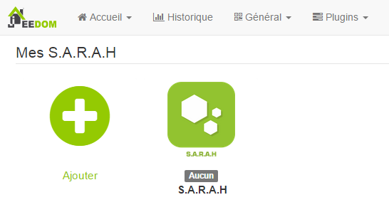
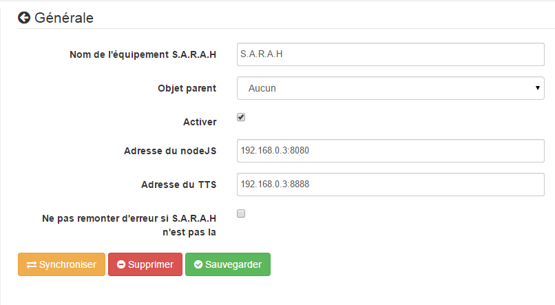

# Complemento Sarah

Plugin que permite a Jeedom comunicarse con la aplicación SARAH (reconocimiento de voz). Hacer anuncios de voz y reproducir sonidos de Jeedom.

# Configuración 

El complemento SARAH agrega reconocimiento de voz para hablar con Jeedom, hacer un anuncio o reproducir un sonido de Jeedom.

## Configuración del plugin 

Una vez que el complemento SARAH se haya instalado en Jeedom desde el mercado, haga clic en **Activar**.

Configurar el nombre de Sarah (predeterminado **Sarah**, pero puedes poner Jarvis o Jeedom por ejemplo).

Luego haga clic en uno de los botones para descargar el complemento **Jeedom** para la versión de SARAH que está utilizando, v3 o v4.

Una vez descargado, detenga el servidor SARAH y el cliente Descomprima el archivo en la carpeta **plugins** SARAH en la computadora cliente (solo compatible con Windows) :
<http://encausse.wordpress.com/s-a-r-a-h/>

Cuando termine, puede reiniciar el cliente y el servidor SARAH..

## Configuración del equipo 

Se puede acceder a la configuración del equipo SARAH desde el menú Complementos :

Así es como se ve la página del complemento SARAH (Aquí, con 1 equipo ya) :

Una vez que haces clic en uno de ellos, obtienes :

Lo encuentras aqui :

-   **Nombre del equipo SARAH** : nombre de su equipo SARAH.,
-   **Objeto padre** : indica el objeto padre al que pertenece el equipo.
-   **Activar** : activa su equipo,
-   **Dirección NodeJS** : Puerto de nodo SARAH IP + JS (de forma predeterminada, el puerto es 8080)
-   **Dirección TTS** : Puerto del servidor SARAH IP + TTS (el puerto predeterminado es 8888)
-   **No informe un error si SARAH no está allí** : Compruebe si SARAH no se inicia continuamente

Cada equipo tipo SARAH también crea un pedido :

-   **Dijo** : Lo que permite en los escenarios hacer decir un texto a Jeedom. Es posible anunciar una oración al azar separando sus oraciones con una tubería : | Ejemplo : La puerta principal esta abierta.|Una persona abrió la puerta de entrada.|Puerta de entrada abierta. Por lo tanto, durante el anuncio, una de sus 3 oraciones será elegida al azar.
-   **Jugar** : Lo que permite ejecutar un archivo de audio de tipo .mp3 o .wav. Estos archivos de audio deben colocarse para **v3** : en la carpeta **"medias"** en la raíz o **V4** : en la carpeta **"cliente / medios"** de su aplicación SARAH En su escenario, será suficiente indicar el nombre de su archivo de audio a ejecutar.

-   **Actualizar gramática** : Lo que permite a través de un escenario, regenerar la gramática XML de las interacciones de Jeedom.

El botón "sincronizar" permite enviar a SARAH la lista de todas las interacciones, debe hacerse cada vez que se actualizan las interacciones.

Si quieres usar la función **Preguntar** desde SARAH, es posible hacerlo desde un escenario Jeedom usando una acción "**Hacer un pedido**".

Aquí hay un ejemplo simple de uso :

Cuando haya agregado el comando de acción "**Hacer un pedido**", verá que 5 campos parecen estar completos :

-   **Pregunta** : La pregunta que quieres que te haga Jeedom.
-   **Respuesta** : La elección de las respuestas con las que desea poder interactuar después de la pregunta. Cada respuesta debe estar separada por un punto y coma.
-   **Variable** : Este será el nombre de la variable en la que desea que se registre su respuesta, de modo que pueda hacer una evaluación para el resto del escenario.
-   **Retraso (seg.)** : Es el tiempo en segundos, antes de que el escenario continúe llevando a cabo la evaluación, si no se da respuesta (Tiempo de espera).
-   **Comandos** : Será orden "**Dijo**" de su equipo SARAH.

# Configuración en SARAH. 

En la interfaz SARAH, debe tener un portlet con el logotipo **Jeedom**.

**SARAH v3** :

Haga clic en las flechas dobles en la parte superior del portlet para rotar la imagen para el resto, haga clic en la tecla en la parte inferior izquierda del portlet para acceder a la ventana de configuración del complemento.

**SARAH v4** :

Haga clic en la rueda de estrella en la parte inferior del portlet y luego en **Configurar la extensión** para acceder a la ventana de configuración del complemento.

DENTRO **addrJeedom**, reemplazar **\ [IP\_JEEDOM \]** por la IP de su Jeedom y reemplazar **\ [PORT\_JEEDOM \]**, vistiendo tu Jeedom. Si su Jeedom usa la extensión **/ jeedom**, no olvides indicarlo después de usar.

DENTRO **apikeyJeedom**, reemplazar **\ [CLE\_API\_JEEDOM \]** por la clave API de su Jeedom que puede encontrar en la página de Configuración de su Jeedom.

Y para terminar, haga clic en Guardar.

# Caso de uso 

Ejemplos :

-   Cela peut vous permettre de connaître toutes les remontées d'informations des différents capteurs (type “Sarah combien fait-il dehors?” ou “Sarah qu'elle est la température de la chambre”).
-   Vous pouvez également piloter les lumières (“Sarah allume la lumière du salon”), pour cela il faut bien sur avoir configuré les interactions.
-   Una persona presiona el botón del timbre inalámbrico (RF433, onda Z, etc.), Jeedom emite un sonido a través de SARAH, anuncia la presencia de un visitante y le hace la pregunta, "luego- Abro la puerta ?".
-   Su lavadora está en el sótano, el programa ha finalizado, Sarah reproduce un sonido "ding, dong" y anuncia que el programa ha finalizado. Luego te hace la pregunta, "¿debo apagar la lavadora? ?".

El único límite será tu imaginación.
