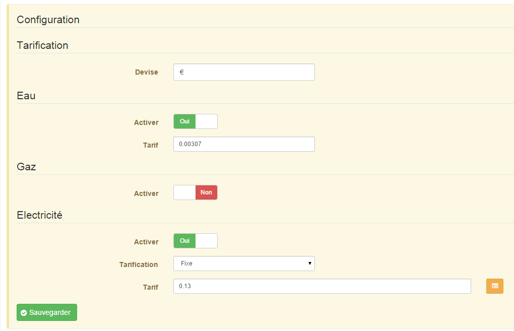
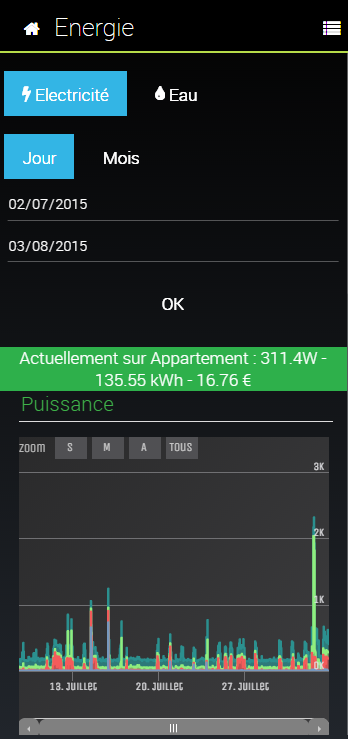

# Plugin de energía

Este complemento le permite establecer un balance energético de su hogar al proporcionar un panel que proporciona los elementos de consumo

# Configuración del plugin 

Después de descargar el complemento, debe activarlo. Luego tiene acceso a la configuración básica del complemento :

Aquí encontrarás la configuración básica :

-   **Precios** : esta parte le permite configurar los parámetros de precios
    -   **Moneda** : le permite configurar su moneda (por defecto €)
-   **Agua** : configuración de gestión del agua
    -   **Activar** : activar o no la gestión del agua
    -   **Tarifa** : precio del agua por L
-   **Gas** : configuración de gestión de gas
    -   **Activar** : activar o no la gestión de gas
    -   **Tarifa** : precio del gas por kWh
-   **Electricidad** : configuración de gestión de electricidad
    -   **Activar** : activar o no la gestión de la electricidad
    -   **Precios** : elección del modo de fijación de precios, horas fijas o pico / no pico
    -   **Tarifa** : precio de la electricidad por kWh

Si estás en horas pico / fuera de horas pico :

Aquí puede ingresar la tarifa en horas pico y fuera de horas pico, así como las horas de alternar (máximo de 3 zonas).

> **Punta**
>
> Es posible en el modo de fijación de precios poner fórmulas de cálculo, por ejemplo 0.05 + 0.05 \* \#\[ma\]\[commande\]\[mode\]\#, entonces si#\[ma\]\[commande\]\[mode\]\# vale 1, entonces el precio será 0.1 de lo contrario 0,05. Esto le permite administrar todos los casos si tiene información de precios actual.

# Configuración del equipo 

Se puede acceder a la configuración del equipo "energético" desde el menú de complementos :

Así es como se ve la página del complemento de energía (aquí con 5 dispositivos ya) :

Una vez que hace clic en uno de los dispositivos, obtiene :

Aquí encontrarás toda la configuración de tu equipo :

-   **Nombre del equipo** : nombre de su equipo de energía
-   **Objeto padre** : indica el objeto padre al que pertenece el equipo
-   **Activar** : activa su equipo
-   **Visible** : lo hace visible en el tablero
-   **Tipo** : permite elegir el tipo de "energía" (electricidad, agua o gas)
-   **Este contador da un total** : le dice a Jeedom que este equipo da el consumo total del objeto afectado. Por ejemplo, si tiene un contador de teleinformación o un medidor de agua que le muestra el consumo total de su hogar, marque esta casilla y asigne el contador al objeto que representa el hogar (y, por lo tanto, ciertamente el objeto principal de todos los otros).
-   **Historial** : le permite borrar completamente el historial de su contador. Se recomienda hacer esto después de la configuración del equipo para evitar irse con el historial de consumo de los módulos y, por lo tanto, tener el primer día totalmente distorsionado.

> **Importante**
>
> Atención cuando un equipo de energía está en total, aparecerá solo en el objeto al que pertenece y no en sus padres

A la derecha también encontrará selectores que le permiten elegir qué mostrar en el widget.

A continuación encontrará la configuración del equipo. Un botón a la derecha le permite agregar más :

-   **Categoría** : categoría de consumo de equipo (las categorías son fijas, no puede agregar ninguna). En el modo de contador total, solo es posible la categoría Otro.
-   **Potencia** : como tener el poder de este equipo ? aquí es donde puedes simular el consumo. Por ejemplo aquí hay \#\[Chambre\]\[Lumière\]\[Etat\]\# \* 0.6 : el estado de mi luz varía de 0 a 100, así que cuando mi lámpara está encendida tengo 100 \* 0.6 = 60 o una potencia de 60 vatios que corresponde a la potencia de mi bombilla.
-   **El consumo** : comando que indica el consumo del equipo, si lo deja vacío y se llena el campo de potencia, el complemento calculará automáticamente el consumo.
-   **Borrar** (pequeño botón menos) : para eliminar la línea.

# Medidor de agua o gas 

Dos posibilidades :

-   o tienes un pedido que indica el consumo, y solo tienes que indicar el consumo.
-   o también es posible indicar los índices a mano para luego guardar.

# Teleinfo 

Para teleinfo, solo tiene que poner los diferentes índices de su teleinfo en el campo de consumo de equipo (ya sea en el mismo campo con + en el medio, o crear un campo por índice).

# Panel 

Una vez que se han configurado sus diferentes equipos de energía, puede acceder a un panel desde el menú de inicio :

Este es el resultado :

Aquí puede elegir, el período de visualización del panel, la agrupación de datos (día o mes) y el tipo de energía que desea mostrar (dependiendo de los datos activos o no).

El panel también es accesible por móvil a través de Complementos → Energía :

Una vez en eso obtienes :

# Preguntas frecuentes 

**Mis contadores no parecen estar en tiempo real.**

El complemento de energía no está disponible para hacer en tiempo real, se necesita una lectura cada 15 minutos. Entonces, en el caso de la simulación de
consumo, toma 15 minutos para que se tenga en cuenta un cambio de estado, si su lámpara solo permanece encendida durante 10 minutos
por lo tanto, el consumo no se tendrá en cuenta.

