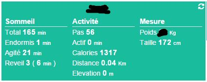

# Complemento Fitbit

Complemento para acceder a información en dispositivos Fitbit (número de pasos, calorías, distancia, etc.)

# Configuración 

Una vez que el complemento Fitbit esté instalado, ve a :

## Creación de equipos y asociación con cuenta Fitbit 

Haga clic en agregar una persona para agregar a alguien :

Dé un nombre a esta persona (este equipo) y valide :

Entonces deberías tener esta página :

> **Importante**
>
> Lo primero que debe verificar es "URL de retorno". Esto debe ser validado y accesible desde el exterior, de lo contrario no podrá asociar Jeedom con su cuenta de Fitbit. Si este no es el caso, actualice los parámetros de configuración de su red en General → Administración → Configuración y luego en la sección "redes", consulte [aquí](https://www.jeedom.fr/doc/documentation/core/es_ES/doc-core-administration.html.html#administration)

> **Nota**
>
> Cuando se conecta entre Jeedom y Fitbit, se recomienda que se conecte a Jeedom por medio de una IP externa

Para vincular su cuenta de Fitbit a Jeedom, primero cree una cuenta de desarrollador con Fitbit yendo [aquí](https://dev.fitbit.com/fr), entonces necesita iniciar sesión y luego hacer : "Registrar una aplicación". Luego complete la información :

-   Nombre de la aplicación : Jeedom
-   Descripción : Jeedom
-   Application Website : <https://jeedom.com>
-   Organización : jeedom
-   Organización Website : <https://jeedom.com>
-   OAuth 2.0 Tipo de aplicación : Server
-   URL de devolución de llamada : Debes poner el que te da Jeedom al crear un equipo de Fitbit, ten cuidado si no colocas el correcto, la conexión no se podrá hacer
-   Tipo de acceso predeterminado : Leer y escribir

También puede agregar una suscripción, esto le permite a Fitbit enviar una actualización directamente en Jeedom (en lugar de esperar a que Jeedom actualice la información) :

-   Por defecto : oui
-   URL de punto final : el dado por jeedom
-   Tipo : Cuerpo JSON
-   ID de suscriptor : No poner nada

Si tiene una suscripción, debe hacerlo (tenga cuidado de hacer todos estos pasos en orden) :

-   Pon el número de suscripción en el equipo de Fitbit en Jeedom
-   Pon el código de suscripción en el equipo de Fitbit en Jeedom
-   Equipo de respaldo
-   En el sitio de Fitbit, inicie la verificación de la suscripción
-   Luego "Enlace a un usuario" el equipo jeedom, como se muestra a continuación

> **Importante**
>
> Actualmente, Fitbit no es compatible con https, así que si estás en https hay pocas posibilidades de que funcione

Haz clic en "Vincular a usuario" para vincular este dispositivo a tu cuenta de Fitbit :

Ingrese las credenciales de su cuenta de Fitbit, luego valide la solicitud de autorización :

Si obtiene una página en blanco o un error, significa que la configuración de su red no es buena, de lo contrario, debe volver a esta página :

## Configuración 

Aquí están los detalles de la configuración del complemento :

-   Nombre de la persona : nombre del equipo Fitbit
-   Objeto padre : nombre del objeto al que se adjunta el equipo
-   Activar / Visible : permite activar el equipo (no te olvides de hacerlo, de lo contrario no tendrás datos) y hacerlo visible en el tablero
-   Para cada orden :
    -   Guardar historial : permite registrar el comando
    -   Mostrar : permite hacerlo visible o no en el tablero
    -   Avanzado (ruedas con muescas pequeñas) : muestra la configuración avanzada del comando
    -   Probar : permite probar el comando para ver su valor
    -   Eliminar (botón "-") : para eliminar el pedido

## Reproductor 

Aquí está el widget de Fitbit :

