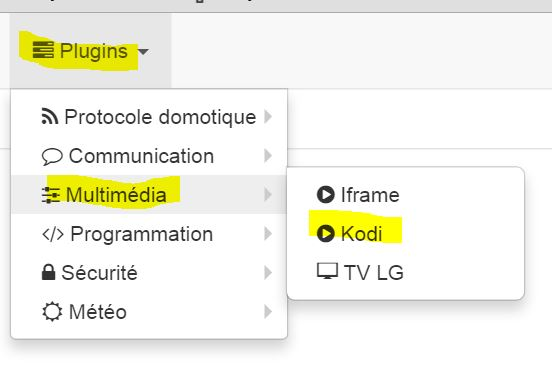
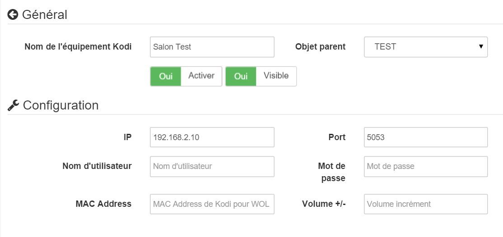
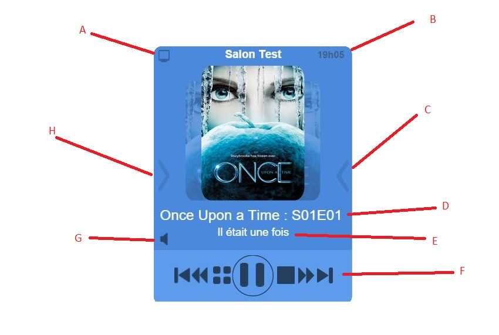
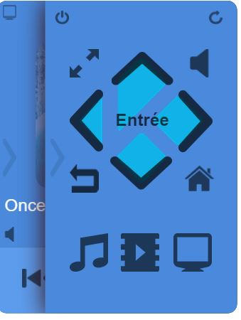
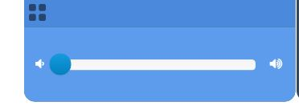

# Complemento Kodi

Este complemento le permite ordenar y recibir información de Kodi.

# Configuración 

## Configuración del complemento Jeedom

Para usar el complemento, debe descargarlo, instalarlo y activarlo como cualquier complemento de Jeedom.

Después de eso, tendrás que crear tu equipo Kodi :

Vaya al menú de complementos / multimedia, encontrará el complemento Kodi :

Luego, llegará a la página que enumerará su equipo (puede tener varios Kodi) y que también le permitirá crear algunos

Haga clic en el botón Agregar Kodi o en el botón + :

Luego irás a la página de configuración de tu Kodi:

En esta página encontrarás varias secciones :

### Principal

En esta sección encontrará todas las configuraciones de libertad. Es decir, el nombre de su equipo, el objeto al que desea asociarlo, la categoría (preferiblemente multimedia), si desea que el equipo esté activo o no y, finalmente, si desea que esté visible en el tablero.

### Configuration

Esta sección es una de las más importantes que contiene

-   IP : dirección IP de su kodi (es importante ingresar la ip y no un nombre de host). Si Kodi está en la misma máquina que Jeedom pon 127.0.0.1. Este campo es obligatorio
-   Puerto : el puerto de comunicación del servidor web en kodi (debe activar el servidor web en kodi). Este campo es obligatorio
-   Nombre de usuario : el nombre de usuario para iniciar sesión en Kodi si tiene uno
-   Contraseña : la contraseña para conectarse a Kodi si tiene una. (esto va con el nombre de usuario)
-   Dirección MAC : la dirección MAC de la máquina para despertar en lan
-   Volumen + /- : El paso de incremento o disminución del volumen (1 a 100)

### Commandes

Esta parte enumera todos los comandos disponibles :

-   Accueil
-   Año
-   Avance rápido
-   Bas
-   Canciones siguientes
-   Droite
-   Eteindre
-   Gauche
-   Genre
-   Haut
-   Hora final
-   Lecture
-   Lista de peliculas
-   Lista de musica
-   Lista de series
-   Longitud de la lista de reproducción
-   Mezcla de la noche
-   Muet
-   Notifications
-   OK
-   OSD
-   Pause
-   Pantalla completa
-   Posición de lista de reproducción
-   Anterior
-   Reiniciar
-   Resumen
-   Retour
-   Rebobinado rápido
-   Escaneo de audio
-   Escanear video
-   Status
-   Medios de estado
-   Estado nb
-   Stop
-   Suivant
-   Thumbnail
-   Titre
-   Tipo de medio
-   Volume
-   Estado del volumen
-   Volumen -
-   Volumen \ +

## Configuración del complemento Kodi

Para poder beneficiarse de los comentarios de los diferentes estados, es necesario instalar un complemento en Kodi. Puede descargar este complemento en la página general del complemento en Jeedom

Una vez que se recupera el zip, solo necesita instalarlo en Kodi. Para hacer esto, vaya a Kodi, parámetros / complementos / instalar desde un zip.

Después de la instalación, debe encontrar el complemento en los complementos activados en la parte de servicio.

Para configurar el complemento, haga clic en configurar, llegará a esta página :

Aquí encontrarás 3 parámetros importantes para configurar :

-   Dirección IP : la dirección ip de tu libertad
-   Tipo de caja : mini / mini +, o especifique si tiene un / jeedom o no en su dirección de Jeedom
-   Clave API : su clave API de Jeedom que encontrará en los parámetros de configuración de Jeedom

# Información de estado 

Kodi sube muchos estatutos :

-   Género : sube la lista completa de géneros (solo se puede usar a través de script o virtual)
-   Hora final : hora de finalización programada, actualizada cuando se inicia el medio y cuando se reanuda la pausa
-   Estado y statusnb : Sube el estado (uno en texto y el otro en número) Estos son los diferentes valores :
    - Comenzó 0
    - Video en progreso 1
    - Audio en progreso 2
    - Video terminado 3
    - Audio completo 4
    - Video detenido 5
    - Audio detenido 6
    - Video pausado 7
    - Audio en pausa 8
    - Recuperación de video 9
    - Currículum de audio 10
    - Parada 18
-   Medios de estado : volverá a un estado más general (Reproducir, Pausa, Parar, Parar) independientemente del tipo de medio
-   Miniatura : volverá a montar la cubierta (más particularmente el enlace que permite tenerla)
-   Título : subirá el título de los medios actuales y detalles sobre el episodio y la temporada en el caso de una serie
-   Tipo de medio : volverá al tipo de medio (Serie, Audio, Películas)

# Detalles del widget 

Aquí hay algunos detalles sobre el widget :

-   A las : indica un icono del tipo de medio actual
-   B : indica la hora de finalización
-   C : despliega la parte del control remoto

-   D : Parte 1 del título actual
-   E : Parte 2 del título actual
-   F : Comandos de reproducción (reproducción después de parar, etc.)
-   G : Active el modo de control de volumen o regrese al modo de reproducción

-   H : te permite expandir la sección de información

En el modo de serie / película, encontrará año, resumen, género

En el modo de audio, encontrará información sobre la lista de reproducción, el año, el género y la lista de reproducción

En ambos casos, encontrará en la parte inferior los botones que permiten iniciar una exploración de audio / video o iniciar una mezcla de audio por la noche

