# Complemento de gestión de acceso

Este complemento se utiliza para la gestión avanzada de un sistema de acceso, utilizando las siguientes funcionalidades :

- Activación y presentación del complemento
- Creación y gestión de puertas
- Creación y gestión de usuarios
- Creación y gestión de grupos
- Creación y gestión de franjas horarias
- Búsqueda de la historia

>Todas las capturas de pantalla se toman bajo un tema, si la apariencia de su Jeedom no es exactamente la misma, no se preocupe.

## Activación y presentación del complemento de gestión de acceso

### Activation
Después de instalar su complemento, debe activarlo.

>Si usa KNX, en el grupo **Configuración** rellena los campos.

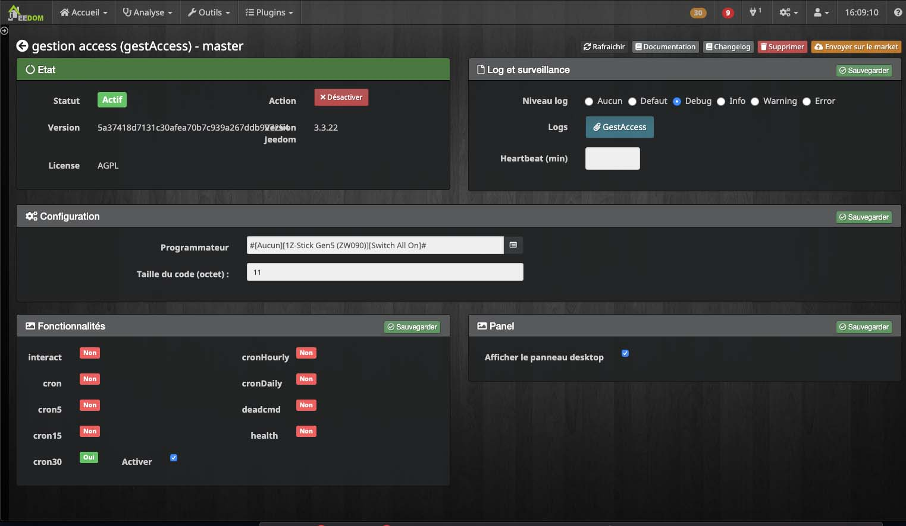

Después de activar el complemento, debería verlo en  **Plugins** → **Seguridad** → **gestión de acceso**. Si este no es el caso, no dude en actualizar su página (Ctrl + F5 o Cmd + R).

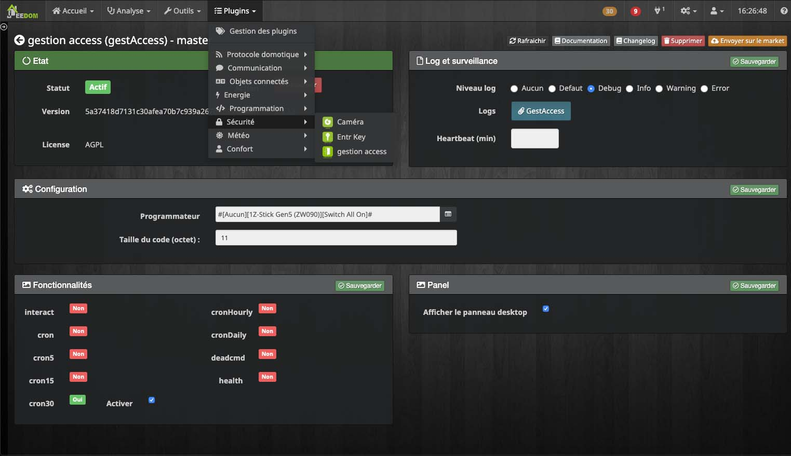

### Presentación

En la vista predeterminada del complemento, puede agregar una bolsa, un usuario, un intervalo de tiempo o una puerta.

A continuación, diferentes pestañas le permiten encontrar fácilmente cada uno de los elementos.
La barra de búsqueda ayudará a ordenar cada categoría para encontrar un elemento más fácilmente.

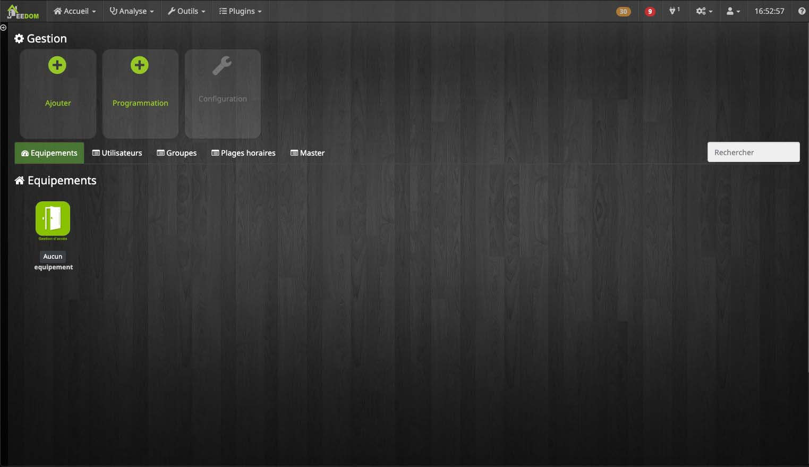

Sobre **Tablero de instrumentos** un historial de los últimos 20 eventos está disponible.

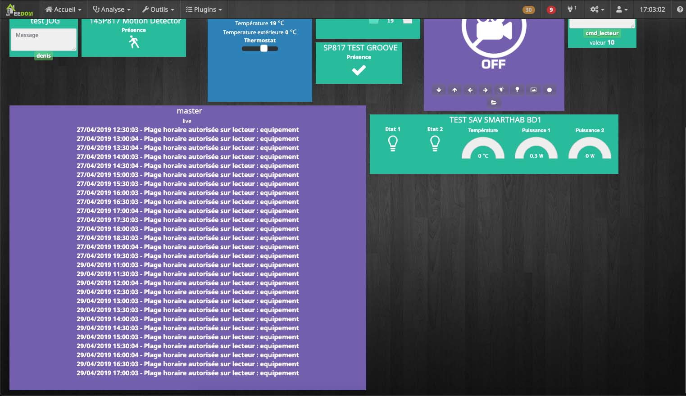

## Creación y gestión de puertas. </a>

#### Creación de la puerta

**Añadir** para crear una puerta.
El campo le permite definir el nombre de la puerta.

En la lista *Tipo*, seleccione **Puerta / lector**.

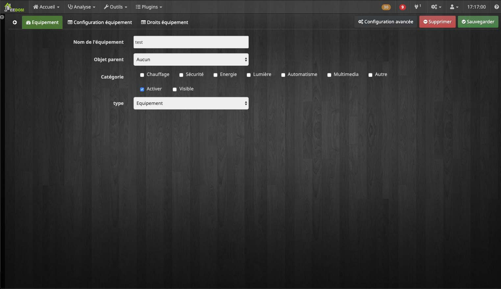

#### Configuración de la puerta

**Configuración équipement** permite configurar la puerta.

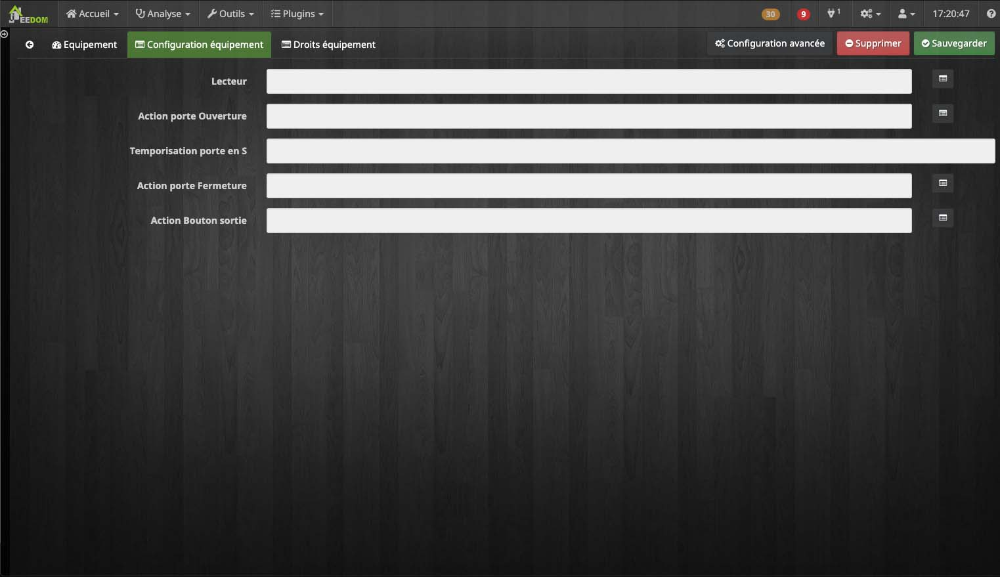

#### Derechos de equipo

**Derechos de equipo** se usa para asignar franjas horarias específicas a la puerta durante las cuales los usuarios no necesitarán sus pases para pasar.

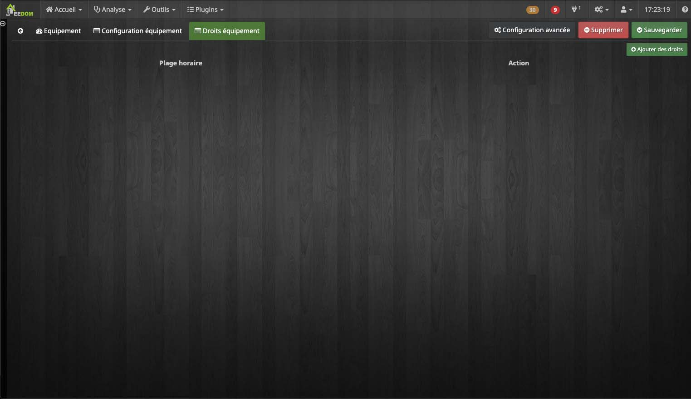

**Añadir des droits** le permite seleccionar un intervalo de tiempo ya existente para asignarlo a su puerta.
>Todos los usuarios conectados a la zona horaria seleccionada podrán pasar por esta puerta durante los horarios establecidos.

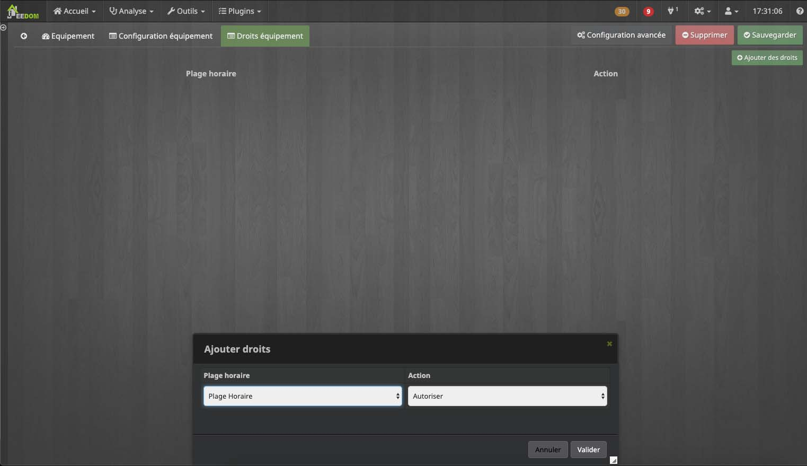

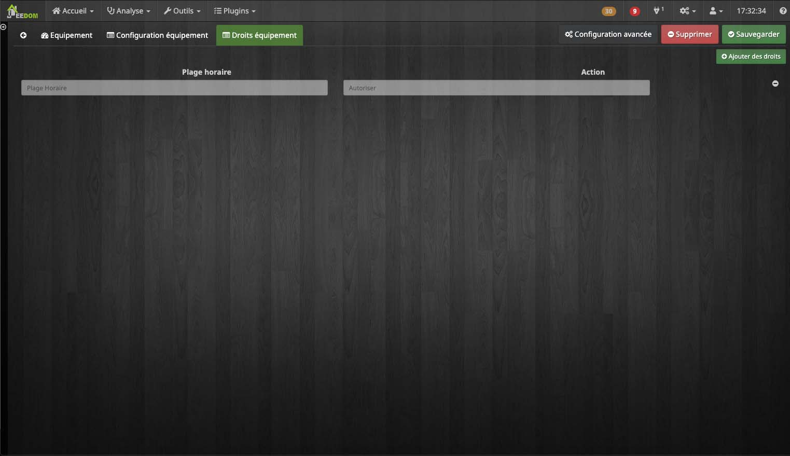

El botón **-** elimina el intervalo de tiempo.

## Creación y gestión de usuarios. </a>
---

#### Creación de usuarios

**Añadir** usado para crear un usuario.
El campo le permite definir el nombre de usuario.

En la lista *Tipo*, indicar **Usuario**.

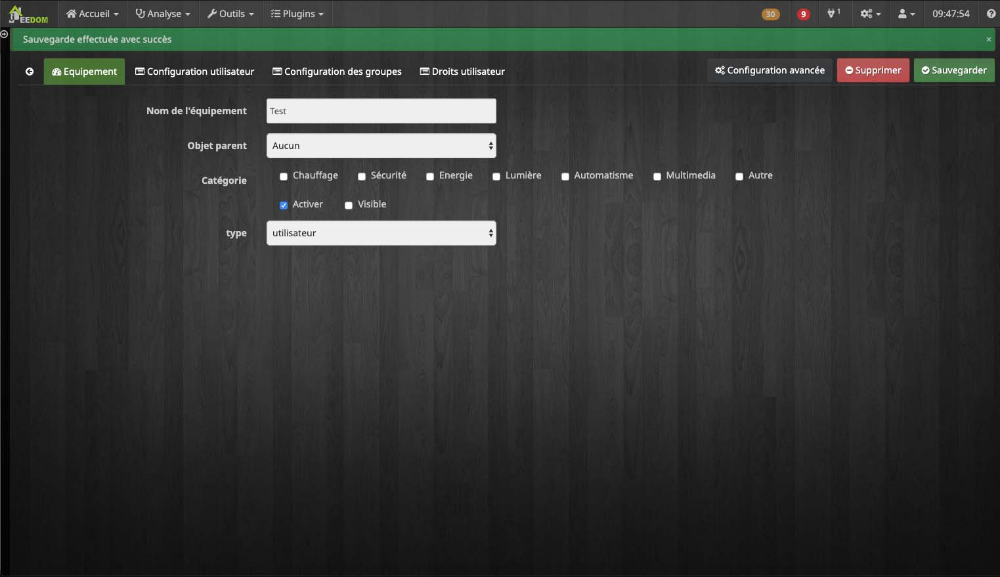

#### Configuración del usuario

**Configuración utilisateur** se usa para configurar. 

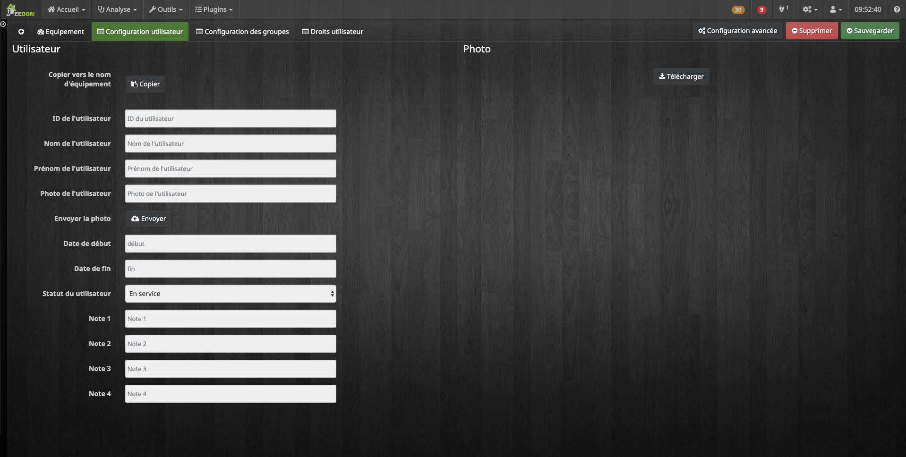

Varios campos son personalizables.
Puedes indicar :

- una identificación de usuario (correspondiente a los números de credencial del usuario),
- el apellido,
- el nombre,
- foto de perfil de usuario,
- la fecha de inicio, que es el primer día de su nuevo usuario,
- la fecha de finalización, que es el último día de su nuevo usuario,
- estado del usuario :
    - En servicio _ (estado predeterminado) _,
    - Volé,
    - Perdu,
- Cuatro campos en los que puedes agregar notas.

El botón **Copia** toma el valor de **Nombre de usuario**, del **Nombre de usuario** y de'**ID de usuario** para asignarlos a **Nombre del equipo**, que puedes ver en la pestaña **Dispositivos**.

El botón **Enviar** le permite transmitir la foto de perfil que desea para su usuario.

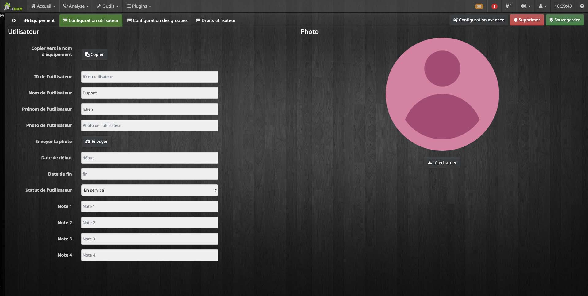

El botón **Descargar** subir foto de usuario. 
El archivo se nombrará de acuerdo con los valores indicados en los campos **Nombre de usuario** y **Nombre de usuario** (separado por un guión).

#### Configurar grupos para un usuario

 **Configuración des groupes** usado para asignar su usuario a un grupo.
>Marque una casilla para seleccionar el grupo correspondiente.

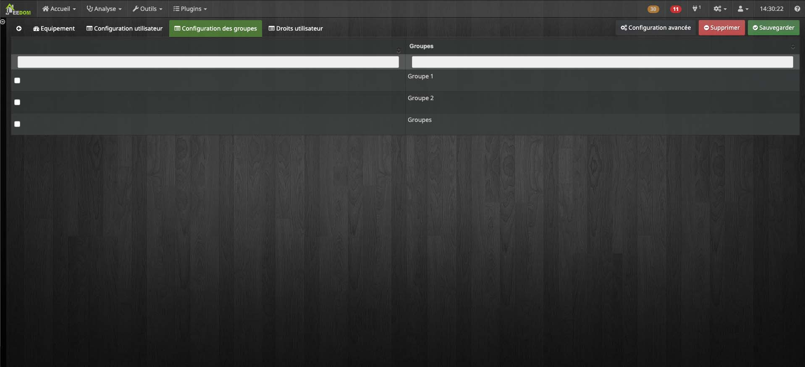

#### Derechos de usuario

La pestaña **Derechos de usuario** utilizado para asignar derechos específicos al usuario.

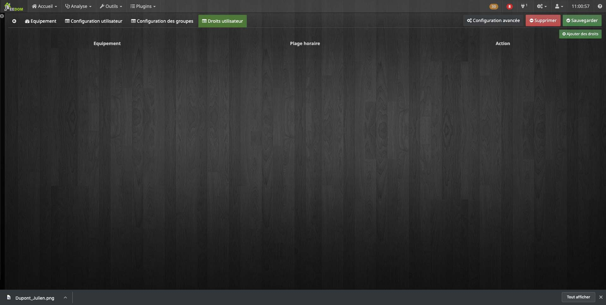

**Añadir des droits**, permite seleccionar una puerta y un rango de tiempo que se asignará al usuario seleccionado. 
Hay dos opciones disponibles **Rechazar** y **Aceptar** para la acción.

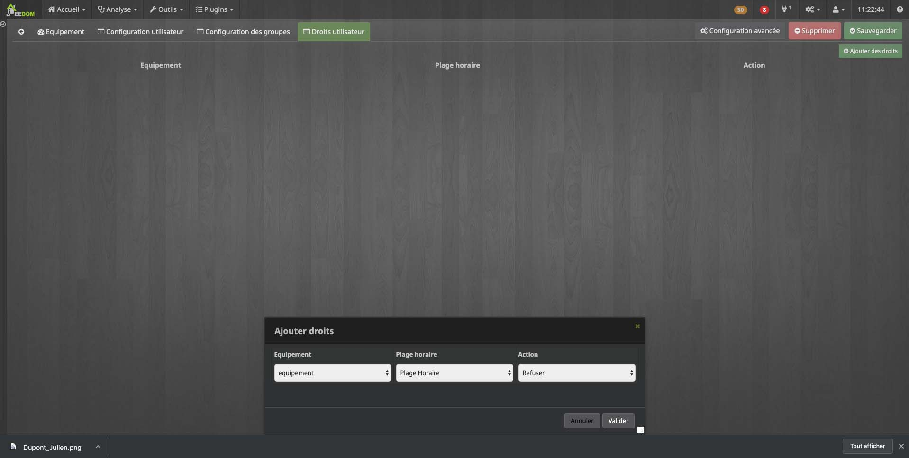

Los nuevos derechos asignados son visibles en la pestaña **Derechos de usuario**. El botón **-** elimina derechos.

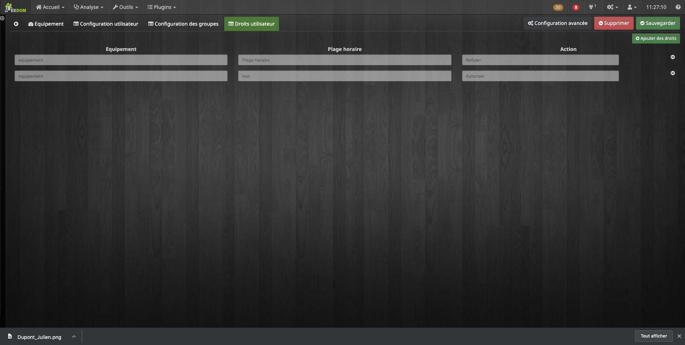

## Creación y gestión de grupos

#### Creación de un grupo
Usa el botón **Añadir** para crear un grupo.
El campo le permite definir el nombre del grupo.

En la lista de tipos, seleccione **Grupo**.

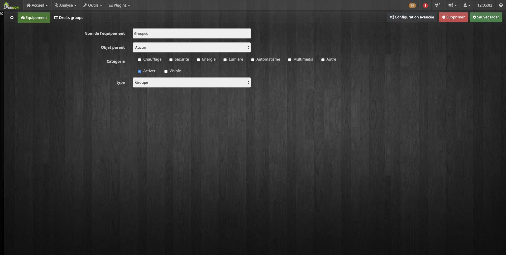

#### Derechos de un grupo

La pestaña **Derechos de grupo** usado para asignar derechos específicos a su grupo.

**Añadir des droits**, le permite seleccionar una puerta y un rango de tiempo que se asignará al grupo seleccionado.
Hay dos opciones disponibles **Rechazar** y **Aceptar** para la acción.

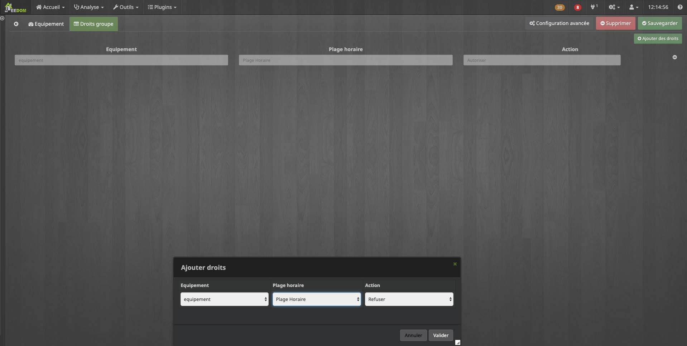

En la pestaña **Derechos de grupo** los nuevos derechos afectados serán visibles. El botón **-** elimina derechos.

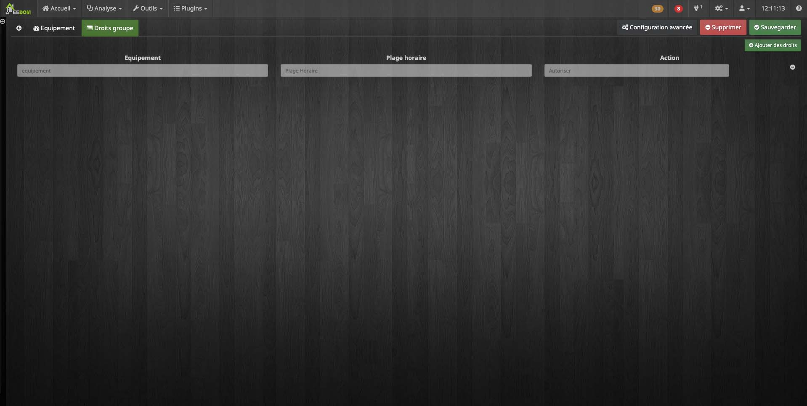

## Creación y gestión de franjas horarias

#### Creación de un horario
Usa el botón **Añadir** para crear un rango de tiempo.
El campo le permite definir el nombre del intervalo de tiempo.

En la lista de tipos, seleccione **Ranura de tiempo**.

#### Configuración de rango de tiempo

La pestaña **Configuración plage horaire** permite configurar un nuevo horario. 

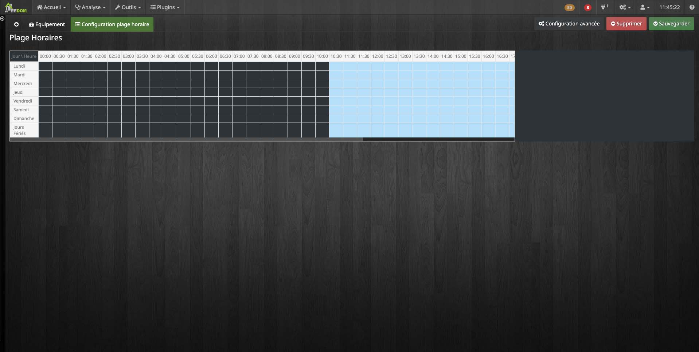

>**Consejos :** 
> - Para configurar un intervalo de tiempo, haga clic izquierdo en los cuadros que le interesan de acuerdo con el día y la hora. 
Un cuadro se vuelve azul cuando está activo.
 Por defecto, los cuadros están activos todos los días de 10:30 a.m. a 7:00 p.m. 
 Para desactivar un cuadro, haga clic derecho sobre él. Esto se volverá transparente.
> - Por defecto, los días festivos se tienen en cuenta, asegúrese de anular la selección de los cuadros azules en la línea **"Días feriados"**.
> - Deslice la barra de desplazamiento hacia la derecha en la parte inferior de la tabla para ver más horarios.

## Búsqueda de la historia

**Paso importante :** Para acceder a esta parte, es importante realizar un ajuste aguas arriba. Ir a **Plugins** → **Gestión de plugins**, DENTRO **Mis plugins**, Haga clic en **Gestión de acceso**.

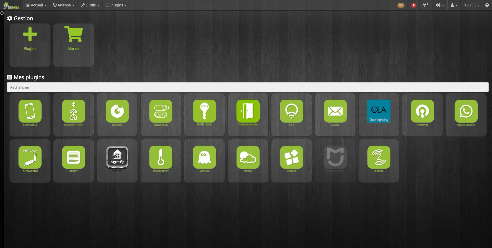

En el juego **Panel** comprobar **Vista del panel de escritorio** luego haga clic en **Guardar**.

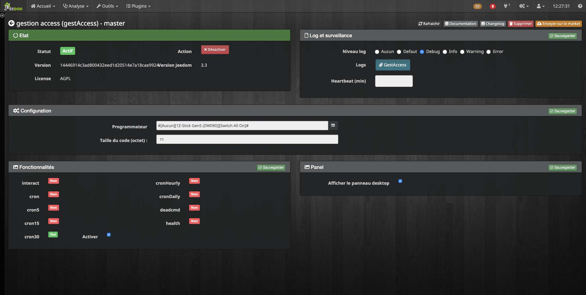

Una vez que se ha realizado el cambio, una nueva sección en el menú **Inicio** está disponible.
Sin embargo, si no aparece, asegúrese de actualizar su página.

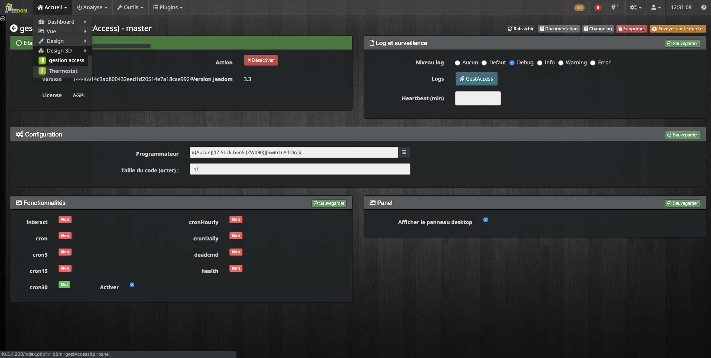

**Inicio** → **gestión de acceso** para acceder a la búsqueda avanzada. La vista predeterminada muestra los últimos 20 eventos grabados.

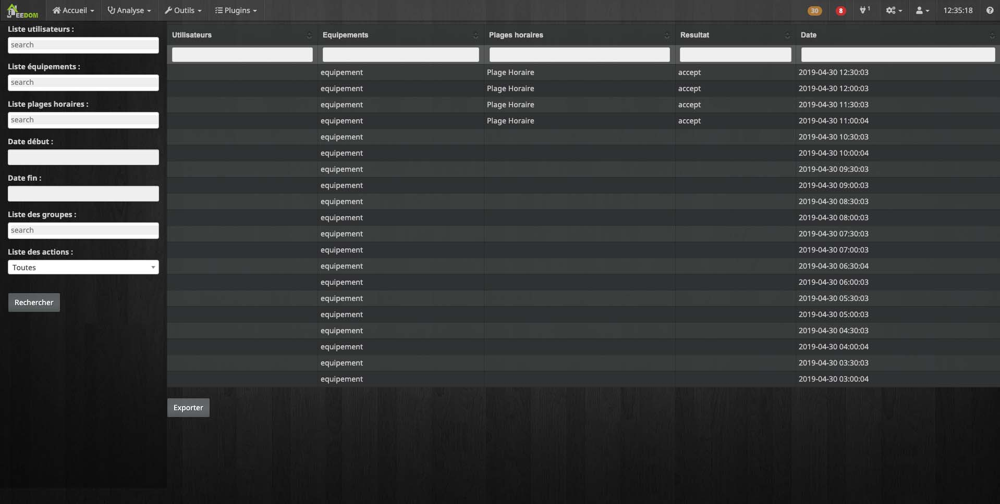

La parte de la izquierda le permite determinar los criterios de búsqueda.

 - **Lista de usuarios :** Nombres de usuarios buscados. Puedes seleccionar múltiples usuarios.
 - **Lista de equipos :** Nombres de equipos buscados. Puedes seleccionar múltiples dispositivos.
 - **Lista de franjas horarias :** Nombres de pistas buscados. Puede seleccionar múltiples franjas horarias.
 - **Fecha de inicio :** Ingrese una fecha y hora de inicio para su búsqueda.
 - **Fecha de fin** Indique una fecha de finalización y una hora para su búsqueda.
 - **Lista de grupos** Nombres de grupos buscados. Puedes seleccionar múltiples grupos.
 - **Lista de acciones** Seleccione el resultado de una acción, puede elegir entre : **Todas**, **Rechazar** y **Permitir**.

>En la parte superior de la tabla, debajo del título de cada columna, los diferentes campos le permiten realizar una segunda búsqueda que ordenará los resultados.
