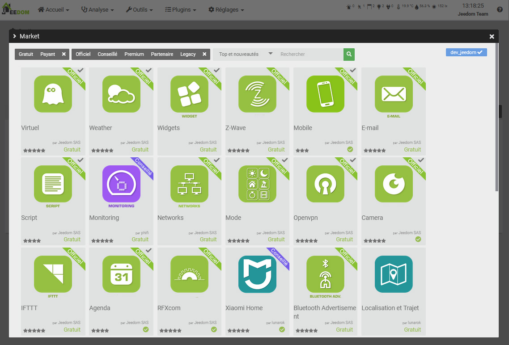
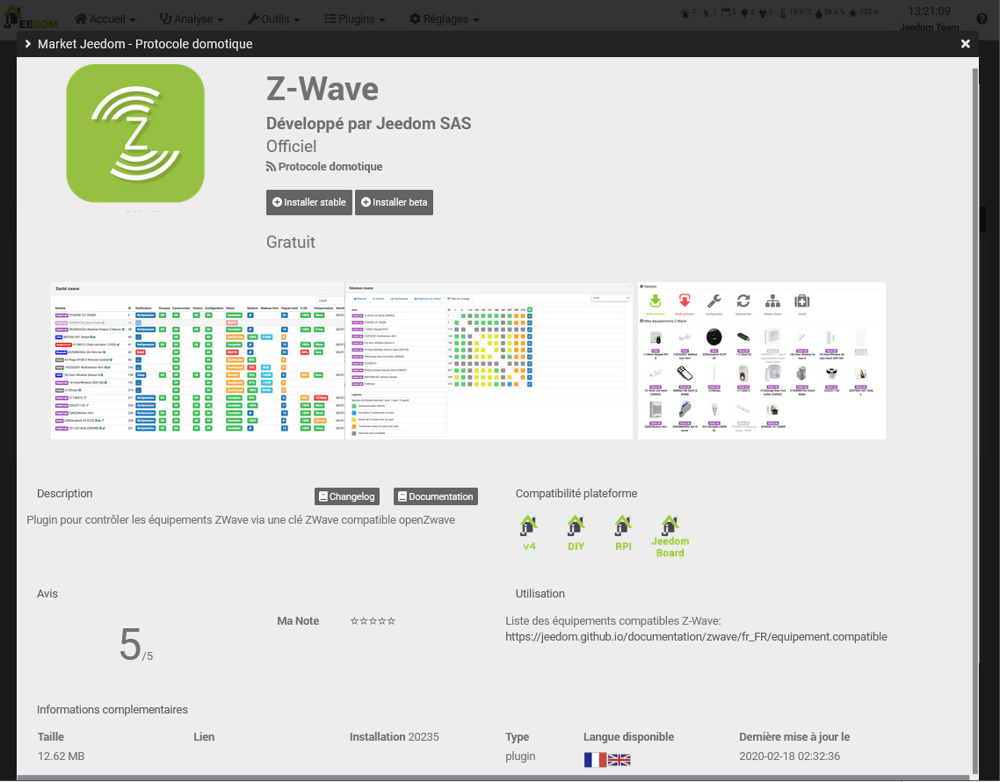

# Primer paso

Bienvenido a la documentación de este primer paso, te ayudará a poner tu Jeedom en servicio.

## Registro en el mercado

Lo primero que debe hacer es crear una cuenta en el Mercado para poder registrar su Jeedom en él. Haga clic en [aqui](https://market.jeedom.com/).

Haga clic en el botón "Registrarse" en la esquina superior izquierda:

Rellene los diferentes campos y valide. Entonces deberías estar en tu cuenta de Market:

## Agregar su código de paquete de servicio

Si compró una caja Jeedom, entonces debería haber recibido un correo electrónico con un código para su paquete de servicio.

> **Important**
>
> Es importante completarlo porque este código le da acceso a ciertos complementos de forma gratuita, así como a servicios exclusivos.

> **Important**
>
> Si compra un paquete de servicio en Jeedom Market, no tiene que hacer nada, se le asigna automáticamente.

Una vez que se recupera el código en el correo electrónico, solo necesita ir al [Mercado de la libertad](https://market.jeedom.com/) e identificarte.

Luego ve a tu página de perfil:

Luego haga clic en la pestaña "Mis servicios" e ingrese su número de paquete de servicio y valide.

> **Tip**
>
> Si compró una caja oficial de Jeedom, el número del paquete de servicio debería haberse enviado por correo electrónico. Si no ha recibido nada, comuníquese con la tienda donde compró su caja..

## Encuentra tu Jeedom en la red

Una vez que Jeedom esté enchufado y conectado eléctricamente a su red local, aquí le mostramos cómo conectarse a él..

### Encontrar Jeedom

#### A través del mercado

La solución más simple (pero no funciona en el 100% de los casos, dependiendo de la configuración de su acceso a Internet), debe iniciar el cuadro, esperar unos 10 minutos (tenga cuidado si usa una imagen de tipo de instalación, será más bien 30 minutos) e ir [aqui](https://www.jeedom.com/market/index.php?v=d&p=find)

> **Tip**
>
> Tenga en cuenta que debe estar en la misma red que el cuadro Jeedom para que este método funcione..

> **Important**
>
> Dependiendo de su cuadro ADSL, esta funcionalidad puede no funcionar. Si es así, nada serio, solo conéctese a su caja ADSL y encuentre la IP de libertad en ella. Este paso no hace más que darle la IP local de su Jeedom. No es en este momento que se realiza la adición de su Jeedom a su cuenta de mercado.

#### Por su caja de internet

-   Vaya a la interfaz de administración de su caja de Internet y busque Jeedom en sus dispositivos de red..

-   Consigue su IP.

-   Pon esta IP en tu navegador de internet. Deberías estar en la interfaz Jeedom.

## Primera conexión

Cualquiera que sea el método utilizado, entonces llega a la página de inicio de sesión. Por defecto, el nombre de usuario y la contraseña son "admin".

## Enlace mi Jeedom a mi cuenta de mercado

Veremos aquí cómo vincular su Jeedom a su cuenta de Market.

-   Una vez conectado a su libertad, debe ir a Administración → Configuración

-   Click en la pestaña **Actualizaciones**

-   A continuación, haga clic en la pestaña **Market**

-   Marca la casilla **activer**

-   Remplissez l'adresse : `https://www.jeedom.com/market`

-   También complete los campos "Nombre de usuario" y "Contraseña" en función de sus identificadores (identificadores de mercado y no Jeedom)

-   Puede probar para verificar que la conexión se haya realizado correctamente.

-   No olvides guardar !

Para obtener más detalles sobre la página de configuración, consulte *Manual de configuración -> Administración*.
.

## Obtener mi URL de acceso directo

Si tiene un paquete de servicio, Jeedom le proporciona una URL de acceso directo a su Jeedom sin tener que abrir los puertos en su caja u otro.

Para configurarlo, simplemente vaya a Configuración → Sistema → Configuración

Luego ve a la parte de "Redes""

Una vez aquí, solo necesita activar "Usar Jeedom DNS" y luego en la línea "Administración" para hacer "Reiniciar" y su URL aparecerá en el nivel de estado HTTP, por supuesto, puede personalizarlo desde la página de perfil del mercado

> **Important**
>
> Si acaba de vincular su Jeedom a su cuenta Market, debe esperar de 24 a 48 horas antes de poder usar el servicio DNS.

## Cambiar la contraseña predeterminada de Jeedom

Uno de los pasos importantes es cambiar la contraseña predeterminada de su cuenta Jeedom, para eso haga clic en Configuración → Sistema → Usuarios:

Una vez en él, solo tiene que elegir la línea con el usuario **admin** y haga clic en **Contraseña** :

Una ventana le pedirá la contraseña. Tenga cuidado de recordarlo bien, o ya no podrá acceder a su Jeedom.

## Crear mi primer objeto

Creará su primer objeto, pero primero debe saber qué es un objeto.

En Jeedom, puede ser cualquier cosa, pero se recomienda hacerlo de acuerdo a sus habitaciones..

> **Tip**
>
> Es posible definir relaciones entre objetos.. Exemple : la sala de estar pertenece al objeto de la planta baja que también pertenece al objeto de la casa.

Nada podría ser más simple para crear un objeto :

-   Vaya a Herramientas → Objetos

-   Haga clic en el botón Agregar.

-   Jeedom te preguntará el nombre. Validar. Este es tu primer objeto creado :

Para obtener más información sobre esta parte, vea *Manual de usuario -> Objeto*.

## Instalar mi primer complemento

Un complemento le permite agregar funcionalidad a Jeedom. Hay cientos. Muchos son gratuitos, otros pueden ser de pago. Para acceder a la página de complementos, vaya a Complementos → Gestión de complementos.

Luego solo haga clic en Market:

Luego tendrá la lista de todos los complementos que se pueden instalar.

> **Important**
>
> Tenga en cuenta que algunos son oficiales y otros no. En el caso de un problema con un complemento no oficial, el equipo de Jeedom no se hace responsable.

Al hacer clic en un complemento obtienes su archivo:

Entonces encuentras :

- Botones para instalar el complemento : la versión estable es muy recomendable,
- Un botón para eliminar el complemento,
- Una breve descripcion,
- Un enlace a la documentación del complemento,
- Un enlace al registro de cambios (las últimas modificaciones realizadas),
- Compatibilidad con diferentes plataformas.,
- Comentarios de usuarios,
- Cómo usar el complemento,
- Información adicional como el autor, el enlace a la discusión del foro sobre este complemento, la fecha de la última actualización, etc..

Para más información sobre complementos, *Manual de usuario -> Complemento*.

# Support

Jeedom aborda campos muy amplios y evoluciona día a día..
Sin embargo, hay muchas maneras de encontrar ayuda y hacer sus preguntas..

## El foro

Lo encontraras [aqui](https://community.jeedom.com/).

El foro es muy activo y contiene mucha información.. Si tiene alguna pregunta, no dude en preguntarla.. Tendrás una respuesta en menos de una hora (en promedio). Tenga en cuenta que el foro es mantenido por la comunidad Jeedom, compuesta por voluntarios, y no por la compañía Jeedom..

## Solicitudes de soporte (o tickets)

> **Important**
>
> Tenga en cuenta que todas las solicitudes de soporte deben tener una cuenta en Market.

Si no ha encontrado una solución a su problema, como último recurso, puede solicitar asistencia al equipo de Jeedom.. Esta solicitud pasa por un ticket. Puedes abrir uno de varias maneras:

-   Directamente de Jeedom (método recomendado): Menú de configuración → Solicitud de soporte.

-   Si por alguna razón no tiene acceso a su Jeedom, siempre puede abrir un boleto del Mercado :

    -   O haciendo clic en su nombre y luego en *Solicitud de soporte*,

    -   ya sea yendo a tu perfil, luego en la sección **Tickets**, use el botón "Abrir una solicitud de soporte".

Todos los intercambios posteriores serán por correo electrónico..

> **Tip**
>
> Si, al abrir un ticket, recibe un error que indica que ha alcanzado su cuota, significa que está limitado a un cierto número de solicitudes de soporte por mes, dependiendo de su paquete de servicio.

Los diferentes paquetes de servicio son :
- Comunidad (gratis): 2 tickets / mes (solo en complementos pagos)
- Power : 10 entradas / mes
- Pro : 100 entradas / mes

Puedes encontrar el detalle de los service packs [aqui](https://www.jeedom.com/site/fr/soft.html#obtenir)
