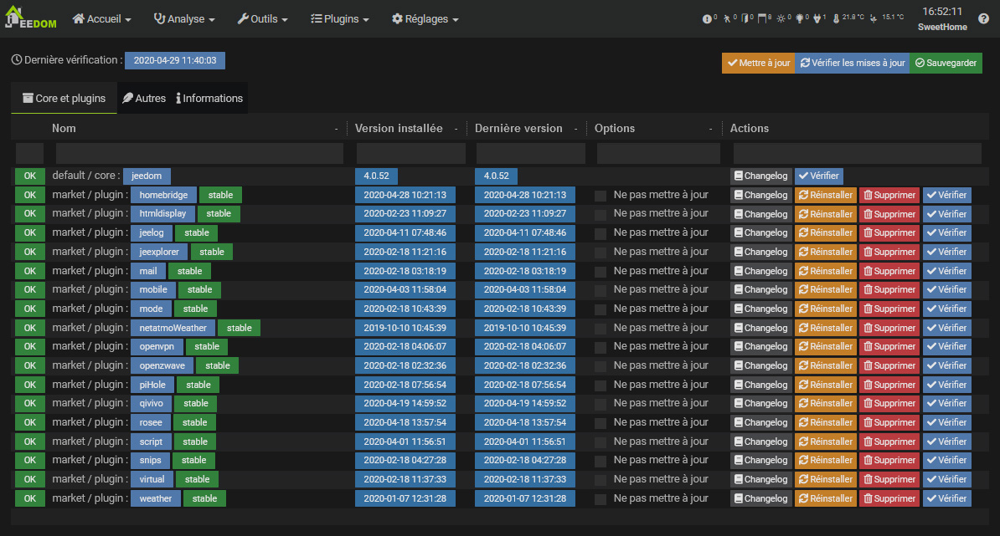

Presentación 
===

Jeedom es una solución de automatización del hogar de código abierto y * sin nubes * (sin servidor en la nube). Funciona sin suscripción, lo que garantiza el funcionamiento de su domótica sin internet, así como la seguridad de sus datos.. También es extremadamente abierto, multiprotocolo, personalizable y altamente escalable.

Jeedom ofrece un núcleo, el núcleo, que incorpora la estructura y las funciones centrales..

Différents (plugins)[https://market.jeedom.com] puede proponer nuevas funciones.

El núcleo incluye:

- Acceso al Tablero o la Síntesis.

*El equipo, incluidos los actuadores o sensores, está organizado por objetos.. Los objetos pueden, por ejemplo, representar partes físicas*.

- Un motor de escenario particularmente completo.

Los escenarios se construyen con diferentes bloques.. Bloques condicionales (si entonces, de lo contrario), acciones, programación (IN x minutos o A hhmm), bucle, comentario o código php. Todos los bloques se pueden encajar entre sí, ofreciendo infinitas posibilidades..

- La historización de la información..

Toda la información es historizable y accesible en Análisis → Historial o desde los mosaicos del Tablero.

- Un motor de interacción.

- Gestión de actualizaciones (Core y Plugins) y copias de seguridad..

Market
===

Alrededor de este núcleo hay complementos, que pueden ser de todo tipo :

-   Protocolo de automatización del hogar (Z-Wave, RFXcom, EnOcean ...),
-   Protocolo IP (KNX, xPL ...),
-   Objeto comunicante (Nest, Netatmo ...),
-   Nivel alto (alarma, termostato ...),
-   Interfaz (widget),
-   Organización (calendario, calendario de Google),
-   Desarrollo (guión).

Estos complementos se pueden instalar desde Mercado y le permiten ampliar las posibilidades de Jeedom.

Jeedom permite que cualquier complemento chatee con otro de forma estandarizada. Esto permite, por ejemplo, usar el termostato o los complementos de alarma con cualquier protocolo de automatización del hogar o incluso un complemento IP u objeto de comunicación ...

Liens
===

Se han realizado varios tutoriales en video para mostrar las características importantes de Jeedom, facilitar su uso y familiarizar al usuario con el software..

Sin embargo, desde la realización de estos tutoriales, la interfaz de Jeedom ha podido evolucionar y se agregaron funcionalidades.. Por lo tanto, la documentación sigue siendo la referencia para consultar en caso de necesidades, preguntas, etc..

Aquí está la lista de tutoriales disponibles. :

-   [Tutorial Jeedom 1 : Primer comienzo](https://www.youtube.com/watch?v=UTECRBGEUtI)
-   [Tutorial de Jeedom 2 : Introducción a Jeedom (Object, Mercado, Plugin, Module)](https://www.youtube.com/watch?v=2LU1neNvbus)
-   [Tutorial de Jeedom 3 : Jeedom, widgets, correos y escenarios](https://www.youtube.com/watch?v=OJn33XbpiH8)
-   [Tutorial de Jeedom 4 : Jeedom, Uso del complemento Agenda](https://www.youtube.com/watch?v=EBuvIabg3Cc)
-   [Tutorial de Jeedom 5 : Scripts en Jeedom usando el complemento Script](https://www.youtube.com/watch?v=FRbQILAogX0)
-   [Tutorial de Jeedom 6 : Escenarios en Jeedom con el plugin Weather](https://www.youtube.com/watch?v=w0ErP3wyEoA)
-   [Tutorial de Jeedom 7 : Presentación del complemento de energía](https://www.youtube.com/watch?v=DZfA_DxqbNs)
-   [Tutorial Jeedom 8 : Descubrimiento del modo plan](https://www.youtube.com/watch?v=2IkXF6CBCAE)
-   [Tutorial de Jeedom 9 : Complemento DataTransfert, copias de seguridad automáticas y Dropbox](https://www.youtube.com/watch?v=wLOfJygFc8k)
-   [Tutorial Jeedom 10 : Hacer hablar a Jeedom (Android)](https://www.youtube.com/watch?v=3Pc3VJFWHo4)
-   [Tutorial de Jeedom 11 : Ventana de descubrimiento de una instalación estándar](https://www.youtube.com/watch?v=hW1d1FvkmSs)
-   [Tutorial Jeedom 12 : Descubrimiento del complemento Termostato](https://www.youtube.com/watch?v=T21gqp1SQK0)
-   [Tutorial Jeedom 13 : Descubrimiento del complemento de alarma](https://www.youtube.com/watch?v=JjnWeU614gc)
-   [Jeedom tutorial 14 : Descubrimiento de interacciones](https://www.youtube.com/watch?v=Z8SHo_Xwk0Q)
