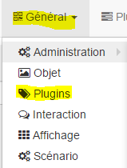

Recherche de l'ID de la télécommande 
====================================

Aller dans "Plugins", "Gestion des plugins", "RFX COM" 
------------------------------------------------------

Dans "Gestion des protocoles RFXcom", 
-------------------------------------

cocher le Protocole 8, BlindsT1, Enregistrer et sortir.

Activer, "Lancer en mode debug" 
-------------------------------

Attendre l'ouverture de la fenêtre, puis appuyer sur la touche Ouvrir de
votre télécommande Ematronic.

    MainThread - rfxcmd:2765 - DEBUG - Test message: 09 19 03 01 1F 84 B9 01 01 60
    MainThread - rfxcmd:2805 - DEBUG - Message OK
    MainThread - rfxcmd:328 - DEBUG - Verified OK
    MainThread - rfxcmd:334 - DEBUG - PacketType: 19
    MainThread - rfxcmd:338 - DEBUG - SubType: 03
    MainThread - rfxcmd:342 - DEBUG - SeqNbr: 01
    MainThread - rfxcmd:346 - DEBUG - Id1: 1F
    MainThread - rfxcmd:350 - DEBUG - Id2: 84
    MainThread - rfxcmd:359 - DEBUG - Verify correct packet length
    MainThread - rfxcmd:556 - DEBUG - Save packet to log_msgfile

Rechercher de l'ID de la télécommande 
-------------------------------------

Observación: les télécommandes Ematronic commencent toujours par : 09 19 03
donc la zone qui nous intéresse démarre de "Test message" : 09 19 03.

Repérer : Id1 et Id2 et ajouter l'hexadecimal suivant : dans mon exemple
Id1=1F et Id2=84. vous devez donc les repérer dans la ligne, "Test
message" et en extraire l'Id3 , ici Id3=B9, Notre télécommande a donc
comme ID ⇒ 1F84B9.

Arrêter le Mode Debug par le bouton "Arrêter/Redémarrer le démon" 
-----------------------------------------------------------------

Création de la télécommande sous JeeDom 
=======================================

Aller, dans Plugins, Protocole domtique, RFXcom.

Cliquer sur "Ajouter" et saisir un nom pour votre télécommande
virtuelle.

Choisir dans la liste des équipements le template : "Volet Ematronic -
Por defecto".

Remplacer l'ID automatique par celui que vous avez extrait précédemment
et Cocher "Activer" et "Visible" :

Cliquer sur "Sauvegarder" pour enregistrer votre configuration et
charger le template "Volet Ematronic - Por defecto".

Voilà votre télécommande est prête, elle doit ressembler à ça :

Associer votre télécommande virtuelle JeeDom à votre moteur Ematronic: 
======================================================================

Réinitialisation du moteur: 
---------------------------

-   Débrancher électriquement le moteur.

-   Sur la télécommande d'origine, laisser le bouton "Up" Appuyé 3 ou 4
    secondes, la led devient rouge fixe.

-   Brancher électriquement le moteur.

-   Relâcher le bouton de la télécommande.

-   Le moteur fera 5 bips.

-   Rapidement, appuyer avec un trombone sur le "micro bouton" a
    l'arrière de la télécommande.

-   Le moteur fera 3 bips.

Association de la télécommande virtuelle JeeDom au moteur Ematronic: 
====================================================================

-   Débrancher électriquement le moteur.

-   Sur le télécommande d'origine, laisser le bouton "Up" Appuyer 3 ou 4
    secondes, la led devient rouge fixe.

-   Brancher électriquement le moteur.

-   Relâcher le bouton de la télécommande.

-   Le moteur fera 5 bips.

-   Appuyer sur la Commande "Monter" de la télécommande virtuelle de
    JeeDom. image::images/volet.ematronic/image09.png\[\]

-   Le moteur fera 3 bips, pour annoncer que votre JeeDoom est associé
    !!

