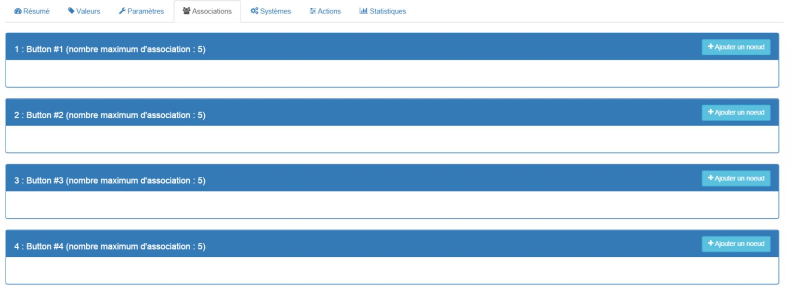

Aeotec Minimote 
===============

\

-   **El módulo**

\

\

-   **El visual de Jeedom**

\

\

Resumen 
------

\

Este mini controlador Aeon Labs es compatible con una amplia variedad de
Módulos Z-Wave como interruptores, atenuadores,
movimiento, interruptores para persianas ... Para que pueda ordenar en
distancia tus luces, dispositivos o persianas. Con esto
control remoto, también puede incluir / excluir
su red Z-Wave y asocie escenas con los botones del
control remoto Una solapa deslizante oculta los botones para
configurar la red Z-Wave.

\

Funciones 
---------

\

-   Configuración de red Z-Wave (inclusión / exclusión de módulos)

-   Le permite controlar hasta 4 escenas.

-   8 llaves : 4 para escenas, 4 para configuraciones de red

-   Inicio / parada y funciones de atenuación

-   Función ALL ON / ALL OFF

-   Batería interna recargable en USB

-   Actualización de firmware a través de USB

\

Características técnicas 
---------------------------

\

-   Tipo de módulo : Controlador Z-Wave

-   Color : Blanco, Blanca

-   Suministro : batería interna recargable a través de USB

-   Visualización: LED azul y rojo

-   Frecuencia : 868.42MHz

-   Alcance : hasta 30 m

-   Dimensiones : 0.8cm x 3.3cm x 9.3cm

-   Temperatura de funcionamiento : -35 a +85 ° C

\

Datos del módulo 
-----------------

\

-   Hacer : Aeotec

-   Nombre : Minimote

-   ID del fabricante : 134

-   Tipo de producto : 1

-   ID del producto : 3

\

Configuración 
-------------

\

Para configurar el complemento OpenZwave y saber cómo poner Jeedom en
inclusión refiérase a esto
[documentation](https://jeedom.fr/doc/documentation/plugins/openzwave/es_ES/openzwave.html).

\

> **Importante**
>
> Para poner este módulo en modo de inclusión, presione el botón
> APRENDER, de acuerdo con su documentación en papel.

\

\

Una vez incluido, deberías obtener esto :

\

\

### Comandos 

\

Una vez que el módulo ha sido reconocido, los comandos asociados con el módulo serán
disponible.

\

\

Aquí está la lista de comandos :

\

-   Botones : es el comando que empujará el botón hacia arriba

1 : Botón 1 pulsación corta

2 : Botón 1 pulsación larga

3 : Botón 2 presiones cortas

4 : Botón 2 prensas largas

5 : Botón 3 pulsaciones cortas

6 : Botón 3 pulsaciones largas

7 : Botón 4 pulsaciones cortas

8 : Botón 4 prensas largas

\

### Configuracion del modulo 

\

> **Importante**
>
> Durante una primera inclusión, siempre active el módulo justo después
> inclusión.

\

Entonces, si desea configurar el módulo de acuerdo con
de su instalación, debe pasar por el botón
"Configuración "del complemento OpenZwave de Jeedom.

\

\

Llegará a esta página (después de hacer clic en la pestaña
configuraciones)

\

\

Detalles del parámetro :

\

-   241: Botón 1 modo de funcionamiento (salir por defecto)

-   242: botón 2 modo de funcionamiento (dejar por defecto)

-   243: Botón 3 modo de funcionamiento (salir por defecto)

-   244: botón 4 modo de funcionamiento (dejar por defecto)

-   250: modo de funcionamiento del control remoto (dejar absolutamente
    Escena para control remoto)

\

### Grupos 

\

Este módulo tiene cuatro grupos de asociación, ninguno es necesario
para usarlo como control remoto en Jeedom.

\

\

Bueno saber 
------------

\

### Específicos 

Despertador 
------

\

Para activar este módulo, solo hay una forma :

-   mantenga presionado el botón APRENDIZAJE durante 3 segundos

\

Faq. 
------

\

Este módulo se activa presionando y manteniendo presionado el botón LEARN durante 3 segundos.

\

Este módulo es un módulo de batería, la nueva configuración no será
tenga en cuenta que si despierta el control remoto.

\

Nota importante 
---------------

\

> **Importante**
>
> Tienes que despertar el módulo : después de su inclusión, después de un cambio
> de la configuración, después de un cambio de activación, después de un
> cambio de grupos de asociación

\

**@sarakha63**
