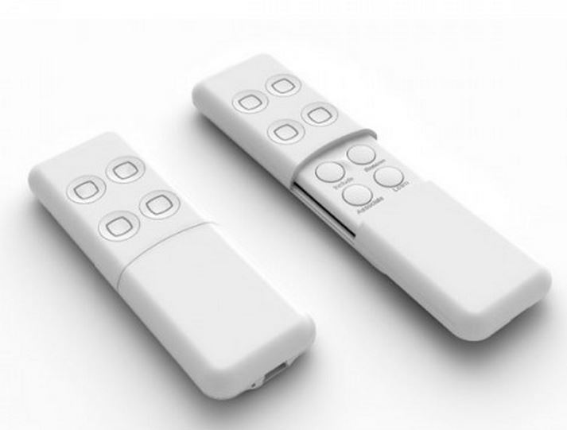
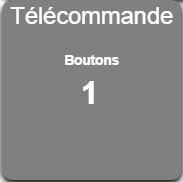

Aeotec Minimote 
===============

 \

-   **El módulo**

 \

 \

-   **Le visuel Jeedom**

 \

 \

Resumen 
------

 \

Ce mini contrôleur Aeon Labs est compatible avec une grande variété de
modules Z-Wave tels que des interrupteurs, variateurs, détecteurs de
mouvement, interrupteurs pour stores…​ Ainsi, vous pourrez commander à
distance vos éclairages, appareils ou volets roulants. Avec cette
télécommande, vous pourrez également inclure/exclure des modules de
votre réseau Z-Wave et associer des scènes aux boutons de la
télécommande. Un clapet coulissant dissimule les boutons permettant de
paramétrer le réseau Z-Wave.

 \

Funciones 
---------

 \

-   Paramétrage du réseau Z-Wave (inclusion/exclusion de modules)

-   Permet de piloter jusqu'à 4 scènes

-   8 touches : 4 pour les scènes, 4 pour le paramétrage du réseau

-   Funciones marche/arrêt et variation

-   Fonction ALL ON/ALL OFF

-   Batterie interne rehargeable sur USB

-   Mise à jour du firmware par USB

 \

Caractéristiques techniques 
---------------------------

 \

-   Type de module : Contrôleur Z-Wave

-   Color : Blanco, Blanca

-   Suministro : batterie interne rechargeable via USB

-   Visualización: LED bleue et rouge

-   Fréquence : 868,42MHz

-   Portée : jusqu'à 30 m

-   Dimensions : 0.8cm x 3.3cm x 9.3cm

-   Température de fonctionnement : -35 to +85 °C

 \

Données du module 
-----------------

 \

-   Marque : Aeotec

-   Nombre : Minimote

-   Fabricant ID : 134

-   Type Produit : 1

-   Produit ID : 3

 \

Configuración 
-------------

 \

Pour configurer le plugin OpenZwave et savoir comment mettre Jeedom en
inclusion référez-vous à cette
[documentation](https://jeedom.fr/doc/documentation/plugins/openzwave/fr_FR/openzwave.html).

 \

> **Importante**
>
> Pour mettre ce module en mode inclusion il faut appuyer sur le bouton
> LEARN, conformément à sa documentation papier.

 \

 \

Une fois inclus vous devriez obtenir ceci :

 \

 \

### Comandos 

 \

Une fois le module reconnu, les commandes associées au module seront
disponible.

 \

 \

Voici la liste des commandes :

 \

-   Botones : c'est la commande qui remontera le bouton appuyé

1 : Bouton 1 appui court

2 : Bouton 1 appui long

3 : Bouton 2 appuis courts

4 : Bouton 2 appuis longs

5 : Bouton 3 appuis courts

6 : Bouton 3 appuis longs

7 : Bouton 4 appuis courts

8 : Bouton 4 appuis longs

 \

### Configuracion del modulo 

 \

> **Importante**
>
> Lors d'une première inclusion réveillez toujours le module juste après
> l'inclusion.

 \

Ensuite si vous voulez effectuer la configuration du module en fonction
de votre installation, il faut pour cela passer par la bouton
"Configuración" du plugin OpenZwave de Jeedom.

 \

 \

Vous arriverez sur cette page (après avoir cliqué sur l'onglet
paramètres)

 \

 \

Détails des paramètres :

 \

-   241: mode de fonctionnement du bouton 1 (laisser par défaut)

-   242: mode de fonctionnement du bouton 2 (laisser par défaut)

-   243: mode de fonctionnement du bouton 3 (laisser par défaut)

-   244: mode de fonctionnement du bouton 4 (laisser par défaut)

-   250: mode de fonctionnement de la télécommande (absolument laisser
    Scene pour s'en servir en télécommande)

 \

### Grupos 

 \

Ce module possède quatre groupes d'association, aucun n'est nécessaire
pour s'en servir en télécommande dans Jeedom.

 \

 \

Bon à savoir 
------------

 \

### Spécificités 

Wakeup 
------

 \

Pour réveiller ce module il y a une seule et unique façon de procéder :

-   rester appuyé 3 secondes sur le bouton LEARN

 \

F.A.Q. 
------

 \

Ce module se réveille en restant appuyé 3 secondes sur le bouton LEARN.

 \

Ce module est un module sur batterie, la nouvelle configuration ne sera
prise en compte que si vous réveillez la télécommande.

 \

Note importante 
---------------

 \

> **Importante**
>
> Il faut réveiller le module : après son inclusion, après un changement
> de la configuration , après un changement de wakeup, après un
> changement des groupes d'association

 \

**@sarakha63**
