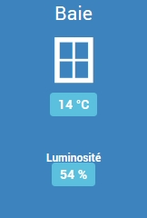

 DCH-Z110 - "Apertura 3 en 1" 
====================================

\

-   **El módulo**

\

\

-   **El visual de Jeedom**

\

\

Resumen 
------

\

El detector DCH-Z110 ofrece 3 funciones diferentes. : detección
apertura, sensor de temperatura y detector de luz. El se
consta de dos partes : un detector y un imán. Estan disenados
para ser colocado en una puerta o ventana con el imán fijado en el
parte de apertura y el detector en la parte fija.

Abrir la puerta o ventana mantendrá el imán alejado de
detector, que activará el detector que enviará una señal Z-Wave
alarma, si el sistema está armado (esta señal puede ser utilizada por un
sirena o por una caja de automatización del hogar, por ejemplo). El sensor también puede
ser utilizado para el control automático de iluminación, dependiendo del
nivel de brillo. Por ejemplo, el sensor enviará una señal a
Interruptor Z-Wave para encender la luz cuando se abre la puerta
y el cuarto esta oscuro.

El detector también aumentará el brillo y la temperatura, es decir.
en caso de un cambio significativo, y cada vez que la apertura / cierre
se detecta. 

.

\

Funciones 
---------

\

-   Detector 3 en 1: Apertura, temperatura, luz.

-   Rango de antena optimizado

-   Uso para aplicaciones de domótica o seguridad

-   Botón para incluir / excluir el detector

-   Autoprotección

-   Indicación de batería baja

-   Pequeño, discreto y estético.

-   Facilidad de uso e instalación.

\

Características técnicas 
---------------------------

\

 :
<http://www.dlink.com/-/media/Consumer_Products/DCH/DCH%20Z110/Datasheet/DCH_Z110_Datasheet_FR.pdf>

 :
<http://www.kafkas.gr/uploads/Pdf/182732/DCH-Z120_183010381_01_Z02.PDF>

![caracteristiques

\

Datos del módulo 
-----------------

\

-   Hacer : 

-   Modelo : 
    

-   Fabricante : Sistema FIBARO

-   ID del fabricante : ]

-   Tipo de producto : ]

-   ID del producto : ]

\

Configuración 
-------------

\

Para configurar el complemento OpenZwave y saber cómo poner Jeedom en
inclusión refiérase a esto
[documentation](https://jeedom.fr/doc/documentation/plugins/openzwave/es_ES/openzwave.html).

\

> **Importante**
>
> 
> 
> .
> 
> 
> . 
> 

\

\

Una vez incluido, deberías obtener esto :

\

\

### Comandos 

\

Una vez que el módulo ha sido reconocido, los comandos asociados con el módulo serán
disponible.

\

\

Aquí está la lista de comandos :

\

-   Apertura : es el comando que generará una detección
    abriendo

-   Temperatura : es el comando que permite subir el
    Temperatura

-   Brillo : es el comando que hace posible aumentar el brillo

-   Sabotaje : Este es el comando de sabotaje (se activa en
    arrancando)

-   Batería : es el comando de la batería

\

### Configuracion del modulo 

\

> **Importante**
>
> 
> .
> .

\

Entonces es necesario configurar el módulo en
dependiendo de su instalación. Esto requiere pasar por el botón
"Configuración "del complemento OpenZwave de Jeedom.

\

\

Llegará a esta página (después de hacer clic en la pestaña
Configuraciones)

\

\

Detalles del parámetro :

\

-   2: permite ajustar la señal enviada a los módulos en el grupo
    asociación 2

-   4: ajusta el nivel de brillo desde el cual
    la señal definida en el parámetro 2 se enviará a los módulos asociados con el
    grupo 2

-   5: modo de funcionamiento (ver el
    

-   6: modo de funcionamiento multisensor (ver el
    .  : 7

-   7: 
    en la documentación del fabricante).  : 
    

-   9: permite definir después de cuánto tiempo será la señal OFF
    enviado a módulos asociados con el grupo 2

-   10: le permite definir la duración entre dos informes de batería (uno
    unidad = parámetro 20)

-   11: le permite definir la duración entre dos informes de apertura automáticos
    (una unidad = parámetro 20)

-   12: le permite definir la duración entre dos auto
    .  : 6

-   13: le permite definir la duración entre dos auto
    .  : 2

-   20: 
    recomendado : 10

-   21: valor de variación de temperatura en ° F para activar un
    Reporte

-   22: 
    .  : 10

\

### Grupos 

\

Este módulo tiene dos grupos de asociación, solo el primero es
indispensable.

\

\

Bueno saber 
------------

: Sirena

\

Visual alternativo 
-----------------

\

\

Despertador 
------

\

Para activar este módulo, solo hay una forma :

-   

-   
    

\

Faq. 
------

\

.

\

Este módulo es un módulo de batería, la nueva configuración será
tomado en cuenta en el próximo despertar. 

\

Nota importante 
---------------

\

> **Importante**
>
> Tienes que despertar el módulo : después de su inclusión, después de un cambio
> de la configuración, después de un cambio de activación, después de un
> cambio de grupos de asociación

\

