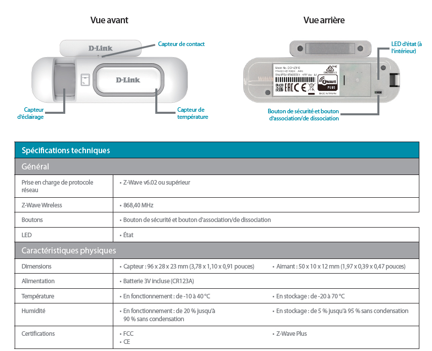

# D-Link DCH-Z110 - "3 en 1 Ouverture"

**El módulo**

**El visual de Jeedom**

## Resumen

El detector DCH-Z110 ofrece 3 funciones diferentes : detección de apertura, sensor de temperatura y detector de luz. Consta de dos partes : un detector y un imán. Están diseñados para colocarse en una puerta o ventana con el imán fijado en la parte de apertura y el detector en la parte fija.

Al abrir la puerta o ventana, el imán se alejará del detector, lo que activará el detector que enviará una señal de alarma de onda Z, si el sistema está armado (esta señal puede ser operada por una sirena o por un caja de domótica por ejemplo). El sensor también se puede utilizar para el control automático de la iluminación, según el nivel de brillo. Por ejemplo, el sensor enviará una señal al interruptor Z-Wave para encender la luz cuando la puerta se abra y la habitación esté oscura.

El detector también aumentará el brillo y la temperatura, es decir, en caso de un cambio significativo, y cada vez que se detecte la apertura / cierre. Es necesario un controlador Z-Wave (control remoto, dongle ...?) Para integrar este detector en su red si ya tiene una red existente.

## Funciones

-   Detector 3 en 1: Apertura, temperatura, luz
-   Rango de antena optimizado
-   Uso para aplicaciones de domótica o seguridad
-   Botón para incluir / excluir el detector
-   Autoprotection
-   Indicación de batería baja
-   Pequeño, discreto y estético
-   Facilidad de uso e instalación

## Características técnicas

Sitio [Oficial](http://www.dlink.com/-/media/Consumer_Products/DCH/DCH%20Z110/Datasheet/DCH_Z110_Datasheet_FR.pdf)

Otro enlace [tecnico](http://www.kafkas.gr/uploads/Pdf/182732/DCH-Z120_183010381_01_Z02.PDF)

## Datos del módulo

-   Hacer : D-Link
-   Modelo : DCH-Z110 mydlink ™ Sensor de apertura de puerta y ventana de inicio
-   Fabricante : Sistema FIBARO
-   ID del fabricante : 264 \ [0x0108 \]
-   Tipo de producto : 2 \ [0x0002 \]
-   ID del producto : 14 \ [0x000e \]

## Configuración

Para configurar el complemento OpenZwave y saber cómo incluir a Jeedom, consulte esto [Documentación](https://doc.jeedom.com/es_ES/plugins/automation%20protocol/openzwave/).

> **Importante**
>
> No instale el módulo en la ventana / puerta antes de haberlo configurado correctamente, y preste especial atención a la alineación del imán al probar en una superficie plana y al instalar. (Use cuñas si es necesario) Para poner este módulo en modo de inclusión, debe presionar el botón de asociación 3 veces 3.5 segundos, según su documentación. (parpadeo rojo constante en modo asociación)

Una vez incluido, deberías obtener esto :

### Comandos

Una vez que se reconoce el módulo, los comandos asociados con el módulo estarán disponibles.

Aquí está la lista de comandos :

-   Apertura : es el comando que generará una detección de apertura
-   Temperatura : es el comando que hace posible elevar la temperatura
-   Brillo : es el comando que hace posible aumentar el brillo
-   Sabotaje : Este es el comando de sabotaje (se activa en caso de desgarro)
-   Batería : es el comando de la batería

### Configuración du module

> **Importante**
>
> Durante una primera inclusión o modificación, guarde y active siempre el módulo presionando el botón de asociación. Debería parpadear en rojo y cambiar de estado.

Entonces es necesario configurar el módulo de acuerdo con su instalación. Para hacer esto, vaya al botón "Configuración" del complemento OpenZwave de Jeedom.

Llegará a esta página (después de hacer clic en la pestaña Configuración)

Detalles del parámetro :

-   2: establece la señal enviada a los módulos en el grupo de asociación 2
-   4: ajusta el nivel de brillo desde el cual la señal definida en el parámetro 2 se enviará a los módulos asociados con el grupo 2
-   5: modo de funcionamiento (consulte la documentación del fabricante)
-   6: modo de funcionamiento multisensor (consulte la documentación del fabricante). Valor recomendado : 7
-   7: modo de funcionamiento personalizado del multisensor (consulte la documentación del fabricante). Valor recomendado : 20 (tener la apertura funcional)
-   9: permite definir después de cuánto tiempo se enviará la señal OFF a los módulos asociados con el grupo 2
-   10: le permite definir la duración entre dos informes de batería (una unidad = parámetro 20)
-   11: Se utiliza para definir la duración entre dos informes de apertura automática (una unidad = parámetro 20)
-   12: le permite definir la duración entre dos informes de brillo automático (una unidad = parámetro 20). Valor recomendado : 6
-   13: le permite definir el tiempo entre dos informes de temperatura automáticos (una unidad = parámetro 20). Valor recomendado : 2
-   20: duración de un intervalo para los parámetros 10 a 13. Valor recomendado : 10
-   21: valor de variación de temperatura en ° F para activar un informe
-   22: valor en% de variación de brillo para activar un informe. Valor recomendado : 10

### Grupos

Este módulo tiene dos grupos de asociación, solo el primero es esencial.

## Bueno saber

Asociación / Notificación posible con otros módulos (ejemplo: Notificación de campanilla de sirena DCH-Z510 al abrir la puerta / ventana)

## Despertador

Para activar este módulo, solo hay una forma :

-   Suelte el botón de asociación y presiónelo nuevamente
-   Reduzca el intervalo de activación en la configuración / sistema del módulo (en segundos)

## Faq.

Este módulo se activa presionando su botón de asociación.

Este módulo es un módulo de batería, la nueva configuración se tendrá en cuenta en la próxima activación. (botón de asociación para forzarlo, de ahí la ventaja de no instalar el módulo antes de su configuración adecuada)

## Nota importante

> **Importante**
>
> Tienes que despertar el módulo : después de su inclusión, después de un cambio en la configuración, después de un cambio en la activación, después de un cambio en los grupos de asociación
