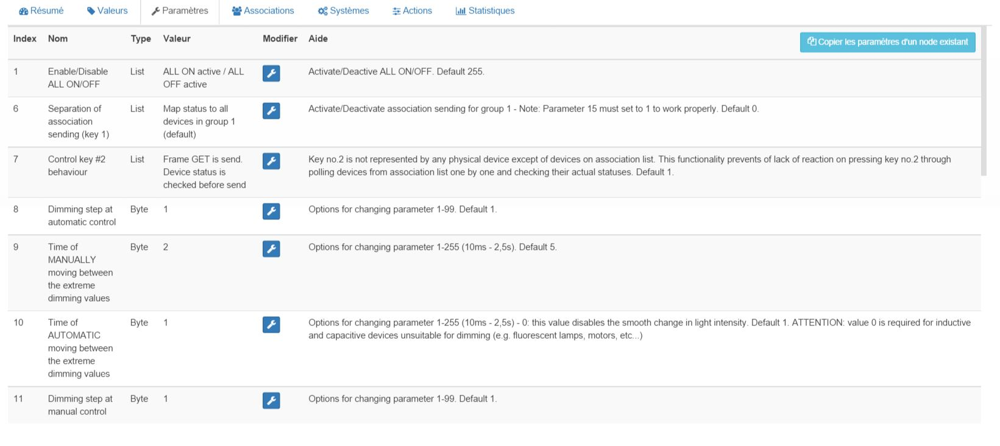

# Dimmer Fibaro - FGD-211

**El módulo**

**El visual de Jeedom**

## Resumen

El módulo de atenuación FGD-211 le permitirá controlar una lámpara o una lámpara de techo de forma remota utilizando el protocolo Z-Wave mientras mantiene su interruptor existente.

Por lo tanto, podrá activar la lámpara conectada y variar su intensidad utilizando el interruptor existente, un transmisor Z-Wave o directamente desde el botón en el micromódulo. Es compatible con cualquier tipo de variación de soporte de lámpara (incandescencia, fluo-compacto, LED,). El módulo dimmer Fibaro es un concentrado de tecnología, detecta automáticamente el tipo de carga conectada y está protegido contra sobretensiones.

Para las bombillas fluorescentes que no son compatibles con la atenuación, el módulo actúa automáticamente como un módulo de interruptor (solo ENCENDIDO / APAGADO)).

Se puede usar en modo de 2 hilos (sin neutro), reemplazando un interruptor existente o de tres hilos con un suministro convencional al módulo (Fase + Neutro)).

Para lámparas de muy bajo consumo (lámpara LED, por ejemplo), puede usar la carga (bypass) FGB-001 que permite el funcionamiento correcto del módulo. Es necesario un controlador Z-Wave (control remoto, dongle, etc.) para integrar este detector en su red si ya tiene una red existente. Cada módulo Z-Wave funciona como un repetidor inalámbrico con los otros módulos, para garantizar la cobertura total de su hogar.

## Funciones

-   Control remoto de iluminación
-   Se instala detrás de un interruptor existente
-   ON / OFF y función de variación
-   Uso en modo de 2 hilos (neutro no necesario)
-   Detección automática de carga
-   Protegido contra sobrecargas
-   Pequeño, discreto y estético
-   Facilidad de uso e instalación

## Características técnicas

-   Tipo de módulo : Receptor Z-Wave
-   Suministro : 230V, 50 Hz
-   Cableado : neutral no requerido
-   Carga máxima : 25-500W (carga resistiva) o 1.5A (carga inductiva)
-   Tipo de lámpara compatible (regulable) : Incandescente, fluorescente compacta, halógena (230VAC y 12VDC con transformador electrónico), LED
-   Tipo de lámpara compatible (no regulable)) : Fluorescente compacta, LED
-   Fusible : 2.5A
-   Frecuencia : 868.42 Mhz
-   Distancia de transmisión : 50m de campo libre, 30m en interiores
-   Dimensions: 15 x 42 x 36 mm
-   Temperatura de funcionamiento : 0-40 ° C
-   Temperatura límite : 105°C
-   Normas : EN 55015 y EN 60669-2-1

## Datos del módulo

-   Hacer : Grupo Fibar
-   Nombre : Fibaro FGMS-001 \ [Sensor de movimiento \]
-   ID del fabricante : 271
-   Tipo de producto : 256
-   ID del producto : 4106

## Configuración

Para configurar el complemento OpenZwave y saber cómo incluir a Jeedom, consulte esto [Documentación](https://doc.jeedom.com/es_ES/plugins/automation%20protocol/openzwave/).

> **Importante**
>
> Para poner este módulo en modo de inclusión, presione el botón de inclusión 3 veces, de acuerdo con su documentación en papel.

> **Punta**
>
> Si ya ha integrado su módulo en la pared, puede incluirlo haciendo muchos viajes de ida y vuelta en el interruptor o muchas pulsaciones si tiene un interruptor de botón.

Una vez incluido, deberías obtener esto :

### Comandos

Una vez que se reconoce el módulo, los comandos asociados con el módulo estarán disponibles.

Aquí está la lista de comandos :

-   Intensidad : Es el control que permite ajustar la intensidad de la luz
-   Uno : Es el control que enciende la luz
-   Apagado : Es el comando que apaga la luz
-   Estado : Es el comando que permite conocer el estado de la luz

Tenga en cuenta que en el tablero de instrumentos, toda la información se encuentra en el mismo icono

### Configuración du module

Puede configurar el módulo de acuerdo con su instalación. Para hacer esto, vaya al botón "Configuración" del complemento OpenZwave de Jeedom.

Llegará a esta página (después de hacer clic en la pestaña Configuración)

Detalles del parámetro :

-   1: TODAS las funciones ON / ALL OFF : se usa solo si ha asociado el FGD-211 con otro módulo
-   6: digamos cómo se envía la información al grupo de asociación 1
-   7: permite verificar o no el estado del módulo asociado antes de enviar un pedido
-   8: permite definir el porcentaje de variación (auto)
-   9: duración de la variación entre los dos extremos (manual)
-   10: duración de la variación entre los dos extremos (auto)
-   11: permite definir el porcentaje de variación (manual)
-   12: permite definir el nivel máximo autorizado
-   13: permite definir el nivel mínimo autorizado
-   14: AJUSTE IMPORTANTE : permite elegir entre interruptor BISTABLE o MONOSTABLE (botón pulsador)
-   15: activa la opción que permite establecer el brillo al máximo en doble pulsación (o volver a biestable)
-   16: opción para activar la memorización del último estado
-   17: permite elegir entre el modo de ida y vuelta y el modo de control remoto
-   18: permite la sincronización del nivel de variación con los otros variadores asociados
-   19: modo de funcionamiento del interruptor biestable (marcha atrás o no))
-   20: permite ajustar el nivel mínimo para bombillas LEDS regulables, por ejemplo
-   30: define el modo de funcionamiento del módulo en caso de recepción de una señal de alarma de difusión
-   39: duración de la alarma definida en el parámetro 30
-   41: permite activar o no la función de activación de escena

### Grupos

Este módulo tiene tres grupos de asociación, solo el tercero es esencial.

## Bueno saber

### Específicos

> **Depositar**
>
> El parámetro más importante de la configuración es 14. Le permite elegir el tipo de interruptor utilizado. Por defecto, el tipo se establece en monoestable.

Si desea excluir / incluir el módulo sin desmantelar su interruptor, puede presionarlo varias veces (o ir y venir en caso de un interruptor biestable))

### Visual alternativo

## Despertador

No hay noción de activación en este módulo.

## Faq.

No este módulo se puede incluir o excluir presionando el interruptor varias veces.
