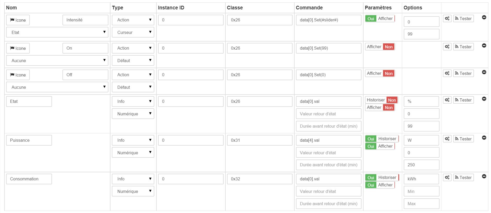

 
========================

\

-   **El módulo**

\

\

-   **El visual de Jeedom**

\

\

Resumen 
------

\

.

.

. ,
.

. 

.

\

Funciones 
---------

\

-   Control remoto de iluminación

-   Se instala detrás de un interruptor existente

-   ON / OFF y función de variación

-   Usar en modo de 2 hilos (no es necesario neutral)

-   Integra el chip de la serie Z-Wave 500

-   
    Estándar

-   Detección automática de carga

-   Protegido contra sobrecargas

-   

-   

-   ,
    .

-   

-   
    

-   

-   ,
    

-   

-   Pequeño, discreto y estético.

-   Facilidad de uso e instalación.

\

Características técnicas 
---------------------------

\

-   Puntao de módulo : Receptor Z-Wave

-   Suministro : 

-   El consumo : 

-   Cableado : neutral no requerido

-   Carga máxima : 
    

-   Puntao de lámpara compatible (regulable) : Incandescente, Fluocompacto,
    Halógeno (230VAC y 12VDC con transformador electrónico), LED

-   Puntao de lámpara compatible (no regulable) : Fluorescente compacta, LED

-   Frecuencia : 868.42 Mhz

-   Fuerza de la señal : 1mW

-   Distancia de transmisión : 50m de campo libre, 30m en interiores

-   Dimensiones : 42..

-   Temperatura de funcionamiento : 

-   Temperatura límite : 105 ° C

-   Normas : 
    

\

Datos del módulo 
-----------------

\

-   Hacer : Grupo Fibar

-   Nombre : 

-   ID del fabricante : 271

-   Puntao de producto : 258

-   ID del producto : 4096

\

Configuración 
-------------

\

Para configurar el complemento OpenZwave y saber cómo poner Jeedom en
inclusión refiérase a esto
[documentation](https://jeedom.fr/doc/documentation/plugins/openzwave/es_ES/openzwave.html).

\

> **Importante**
>
> Para poner este módulo en modo de inclusión, presione el botón 3 veces
> botón de inclusión, de acuerdo con su documentación en papel. 
> 
> .

\

\

> **Punta**
>
> Si ya ha integrado su módulo en la pared, puede incluirlo
> 
> .

\

Una vez incluido, deberías obtener esto :

\

\

### Comandos 

\

disponible.

\

\

Aquí está la lista de comandos :

\

-   Intensidad : Este es el comando que le permite ajustar la intensidad de la
    Iluminación

-   Uno : Es el control que enciende la luz.

-   Apagado : Es el comando que apaga la luz.

-   Estado : Es el comando que permite conocer el estado de la
    Iluminación

-   El consumo : 
    

-   Potencia : 
    

Tenga en cuenta que en el tablero de instrumentos toda la información se encuentra en el mismo
Icono

\

### Configuracion del modulo 

\

Puede configurar el módulo de acuerdo con su
instalación Esto requiere pasar por el botón "Configuración" del
Complemento Jeedom OpenZwave.

\

\

Llegará a esta página (después de hacer clic en la pestaña
configuraciones)

\

\

Detalles del parámetro :

\

\

### Grupos 

\

indispensable.

\

\

Bueno saber 
------------

\

### Específicos 

\

> **Depositar**
>
> 
> . 
> .

\

\

### Visual alternativo 

\

\

Despertador 
------

\

No hay noción de activación en este módulo.

\

Faq. 
------

\

No este módulo se puede incluir o excluir presionando varias veces
en el interruptor.

\
**@sarakha63**
