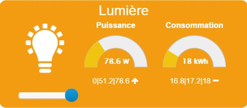

Fibaro Dimmer2 - FGD-212 
========================

\

-   **El módulo**

\

\

-   **El visual de Jeedom**

\

\

Resumen 
------

\

El módulo de atenuación FGD-212 le permitirá controlar un
lámpara o lámpara de techo de forma remota gracias al protocolo Z-Wave mientras
manteniendo su interruptor existente.

Por lo tanto, podrá activar la lámpara conectada y variar su
intensidad usando el interruptor existente, un transmisor Z-Wave o
directamente desde el botón en el micromódulo.

El nuevo disco Fibaro FGD-212 está equipado con un
detección inteligente de fuente de luz que facilita
configuración y garantiza una alta compatibilidad del dispositivo. Él
tiene autoprotección contra sobrecarga y la función de
inicio suave. En el caso de fuentes de luz no regulables.,
solo es posible la función ON / OFF (en conexión de 3 hilos).

Es compatible con todos los tipos de lámparas que admiten variaciones o
no Además de la función de variación, este micromódulo también puede
medir el consumo eléctrico de la carga conectada. Los valores
consumo instantáneo (en W) y consumo eléctrico total
(en kWh) se puede ver.

\

Funciones 
---------

\

-   Control remoto de iluminación

-   Se instala detrás de un interruptor existente

-   ON / OFF y función de variación

-   Usar en modo de 2 hilos (no es necesario neutral)

-   Integra el chip de la serie Z-Wave 500

-   Comunicación 250% más rápida en comparación con los dispositivos Z-Wave
    Estándar

-   Detección automática de carga

-   Protegido contra sobrecargas

-   Compatible con todos los controladores Z-Wave y Z-Wave +

-   Poder activo y función de medición de energía

-   Funciona con diferentes tipos de interruptores de botón,
    rockero, de tres vías, etc..

-   Función de arranque suave

-   LED para indicación del estado de inclusión, calibración y
    Niveles de MENÚ

-   Probador de rango Z-Wave integrado

-   Detecta automáticamente fallas de cableado, alta temperatura,
    bombilla fundida, sobretensiones y sobrecargas

-   Opciones de configuración avanzada

-   Pequeño, discreto y estético.

-   Facilidad de uso e instalación.

\

Características técnicas 
---------------------------

\

-   Puntao de módulo : Receptor Z-Wave

-   Suministro : 230V +/- 10%, 50Hz

-   El consumo : 1.3W

-   Cableado : neutral no requerido

-   Carga máxima : 50-250W (carga resistiva) o 0.25-1.1A
    (carga inductiva)

-   Puntao de lámpara compatible (regulable) : Incandescente, Fluocompacto,
    Halógeno (230VAC y 12VDC con transformador electrónico), LED

-   Puntao de lámpara compatible (no regulable) : Fluorescente compacta, LED

-   Frecuencia : 868.42 Mhz

-   Fuerza de la señal : 1mW

-   Distancia de transmisión : 50m de campo libre, 30m en interiores

-   Dimensiones : 42.5 x 38.25 x 20.3 mm

-   Temperatura de funcionamiento : 0-35 ° C

-   Temperatura límite : 105 ° C

-   Normas : RoHS 2011/65 / EU, LVD 2006/95 / EC, EMC 2004/108 / EC, R & TTE
    1999/5 / CE

\

Datos del módulo 
-----------------

\

-   Hacer : Grupo Fibar

-   Nombrebre : FGD212 Dimmer 2

-   ID del fabricante : 271

-   Puntao de producto : 258

-   ID del producto : 4096

\

Configuración 
-------------

\

Para configurar el complemento OpenZwave y saber cómo poner Jeedom en
inclusión refiérase a esto
[Documentación](https://jeedom.fr/doc/documentation/plugins/openzwave/es_ES/openzwave.html).

\

> **Important**
>
> Para poner este módulo en modo de inclusión, presione el botón 3 veces
> botón de inclusión, de acuerdo con su documentación en papel. Si el
> el módulo no está incluido, se incluirá
> automáticamente cuando se enciende.

\

\

> **Tip**
>
> Si ya ha integrado su módulo en la pared, puede incluirlo
> haciendo muchos viajes de ida y vuelta en el interruptor o
> muchas prensas si tiene un interruptor de botón.

\

Una vez incluido, deberías obtener esto :

\

\

### Comandos 

\

Una vez que el módulo ha sido reconocido, los comandos asociados con los módulos serán
disponibles.

\

\

Aquí está la lista de comandos :

\

-   Intensidad : Este es el comando que le permite ajustar la intensidad de la
    Iluminación

-   Uno : Es el control que enciende la luz.

-   Apagado : Es el comando que apaga la luz.

-   Estado : Es el comando que permite conocer el estado de la
    Iluminación

-   El consumo : Es el comando que permite subir el
    consumo de módulo

-   Potencia : Es el comando que permite elevar el poder.
    módulo instantáneo

Tenga en cuenta que en el tablero de instrumentos toda la información se encuentra en el mismo
icone

\

### Configuracion del modulo 

\

Puede configurar el módulo de acuerdo con su
instalación Esto requiere pasar por el botón "Configuración" del
Complemento Jeedom OpenZwave.

\

\

Llegará a esta página (después de hacer clic en la pestaña
configuraciones)

\

\

Detalles del parámetro :

\

Ser redactado

\

### Grupos 

\

Este módulo tiene cinco grupos de asociación, solo el primero es
indispensable.

\

\

Bueno saber 
------------

\

### Específicos 

\

> **Caution**
>
> El parámetro más importante de la configuración es 20. Se
> permite elegir el tipo de interruptor utilizado. Puntao predeterminado
> se establece en monoestable.

\

Si desea excluir / incluir el módulo sin desmontar su
interruptor puede presionar su interruptor varias veces
(o ir y venir en caso de un interruptor biestable)

\

### Visual alternativo 

\

\

Despertador 
------

\

No hay noción de activación en este módulo.

\

Faq. 
------

\

No este módulo se puede incluir o excluir presionando varias veces
en el interruptor.

\
**@sarakha63**
