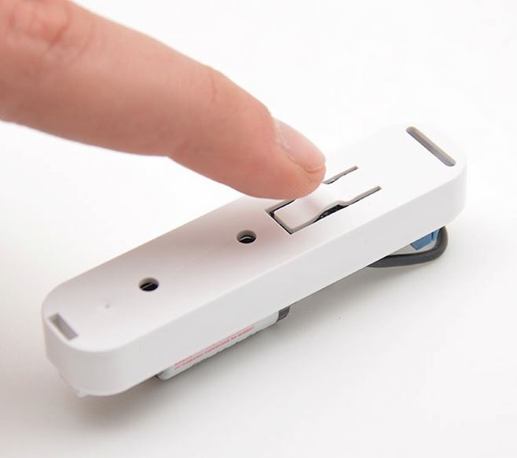
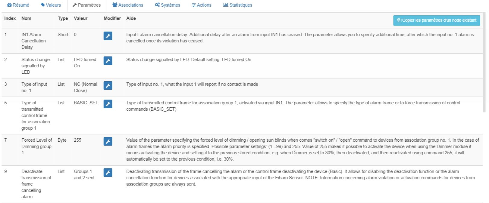

Detector de apertura Fibaro - FGK-101 
======================================

\

-   **El módulo**

\

\

-   **El visual de Jeedom**

\

\

Resumen 
------

\

Este detector compatible con baterías y compatible con Z-Wave tiene un sensor
Reed, un interruptor de proximidad con funcionamiento magnético, que
detecta la apertura de una puerta o ventana cuando el
dos elementos son distantes.

El dispositivo consta de una parte con un imán (la parte
móvil), conectado a la puerta o ventana, así como a la unidad
principal colocado en la parte fija de la ventana / puerta con
tornillo o adhesivo. Cuando las dos partes ya no son opuestas, un
La señal de radio Z-Wave se envía automáticamente.

Además, este detector tiene una entrada analógica que permite
conecte una sonda de temperatura DS18B20 de 1 cable. Este detector tiene
también desde una entrada cableada, por lo que se puede usar como
transmisor universal : dejar de lado su contacto magnético, y
conecte sus entradas de tornillo a cualquier detector (normalmente cerrado) de su
elección como detector de humo, gas o monóxido de carbono,
etc.

Se requiere un controlador Z-Wave (control remoto, dongle, Etcétera.) para
integre este detector en su red si ya tiene una red
existant.

\

Funciones 
---------

\

-   Detector de apertura

-   Botón para incluir / excluir el detector

-   Detección de batería baja

-   Protección contra manipulaciones

-   1 entrada cableada sin potencial

-   1 entrada analógica de 1 cable (para conectar un
    temperatura DS18B20)

-   Muy pequeño, dimensiones reducidas

-   Facilidad de uso e instalación.

\

Características técnicas 
---------------------------

\

-   Puntao de módulo : Transmisor de onda Z

-   Color : Blanco (FGK-101/102/103/104/105/106/107 según el color)

-   Suministro : Batería ER14250 (1 / 2AA) 3.6V

-   Frecuencia : 868.42 Mhz

-   Distancia de transmisión : 50m de campo libre, 30m en interiores

-   Dimensiones: 76 x 17 x 19 mm

-   Temperatura de funcionamiento : 0-40 ° C

\

Datos del módulo 
-----------------

\

-   Hacer : Grupo Fibar

-   Nombrebre : Fibaro FGK-101 con sonda de temperatura (DS18B20)

-   ID del fabricante : 271

-   Puntao de producto : 1792

-   ID del producto : 4096

\

Configuración 
-------------

\

Para configurar el complemento OpenZwave y saber cómo poner Jeedom en
inclusión refiérase a esto
[Documentación](https://jeedom.fr/doc/documentation/plugins/openzwave/es_ES/openzwave.html).

\

> **Important**
>
> Para poner este módulo en modo de inclusión, presione el botón 3 veces
> botón de inclusión, de acuerdo con su documentación en papel.

\

\

Una vez incluido, deberías obtener esto :

\

\

### Comandos 

\

Una vez que el módulo ha sido reconocido, los comandos asociados con el módulo serán
disponibles.

\

\

Aquí está la lista de comandos :

\

-   Estado : es el comando que elevará el estado abierto o cerrado del
    Modulo

-   Batería : es el comando que permite subir el estado del
    batería

\

Puede ocultar o mostrar estos comandos como desee.

\

### Configuracion del modulo 

\

> **Important**
>
> Durante una primera inclusión, siempre active el módulo justo después
> inclusión.

\

Entonces, si desea configurar el módulo de acuerdo con
de su instalación, debe pasar por el botón
"Configuración "del complemento OpenZwave de Jeedom.

\

\

Llegará a esta página (después de hacer clic en la pestaña
Configuraciones)

\

\

Detalles del parámetro :

\

-   Despertador : Este es el intervalo de activación del módulo (valor
    7200 recomendado)

-   1: establece el retraso para cancelar la alarma de entrada IN
    (contacto seco)

-   2: permite elegir si el led azul debería parpadear al abrir y
    cerrando tu puerta por ejemplo

-   3: se usa para definir el tipo de contacto conectado al bloque de terminales (IN)

-   5: no se recomienda cambiar esta configuración a menos que sepa por qué
    (define el tipo de señal enviada al grupo de asociación 1)

-   7: valor enviado al grupo de asociación 1

-   9: le permite configurar el envío de la señal de cancelación entre la entrada IN
    y el grupo de asociación 1

-   12: permite ajustar la sensibilidad al cambio de temperatura (si
    una sonda de 1 cable está conectada al módulo)

-   13: permite configurar el envío en modo broadcast de las señales de
    temperatura y sabotaje

-   14: activa la función de activación de escena

\

### Grupos 

\

Este módulo tiene tres grupos de asociación, solo el tercero es
indispensable.

\

\

Bueno saber 
------------

\

### Específicos 

\

> **Tip**
>
> Este módulo es muy meticuloso al despertar y requiere un muy
> fuerte proximidad al controlador cuando está incluido

\

### Visual alternativo 

\

\

Despertador 
------

\

Para activar este módulo, solo hay una forma :

-   presione el botón de inclusión 3/4 veces. Puede ser necesario
    hacerlo varias veces seguidas (2 o 3)

\

Faq. 
------

\

Este módulo se activa presionando 3 veces en uno de los botones de manipulación. Pero
el otro botón de sabotaje debe ser presionado.

\

Este módulo tiene un rango muy bajo. Es recomendable hacer
inclusión más cercana a su caja.

\

Este módulo es un módulo de batería, la nueva configuración será
tomado en cuenta en el próximo despertar.

\

Nota importante 
---------------

\

> **Important**
>
> Tienes que despertar el módulo : después de su inclusión, después de un cambio
> de la configuración, después de un cambio de activación, después de un
> cambio de grupos de asociación

\

**@sarakha63**
