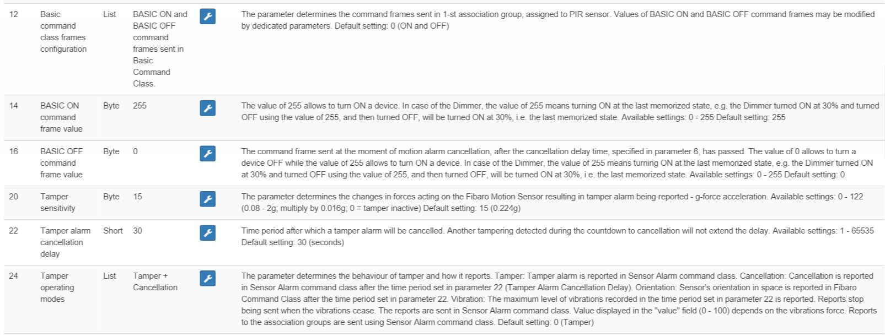
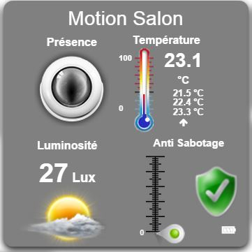

 
===============================

\

-   **El módulo**

\

\

-   **El visual de Jeedom**

\

\

Resumen 
------

\

.

. 

Dispositivo.

,

.

.

\

Funciones 
---------

\

-   

-   

-   

-   

-   

-   
    

-   

-   Botón para incluir / excluir el detector

-   Detección de batería baja

-   Muy pequeño, dimensiones reducidas

-   

\

Características técnicas 
---------------------------

\

-   Puntao de módulo : Transmisor de onda Z

-   Suministro : 

-    : 

-    : -

-    : 

-    : X

-   Frecuencia : 868.42 Mhz

-   Distancia de transmisión : 50m de campo libre, 30m en interiores

-   Dimensiones: 

-   Temperatura de funcionamiento : 0-40 ° C

-   Certificaciones : 
    

\

Datos del módulo 
-----------------

\

-   Hacer : Grupo Fibar

-   Nombre : Fibaro FGMS-001 \ [Sensor de movimiento \]

-   ID del fabricante : 271

-   Puntao de producto : 2048

-   ID del producto : 4097

\

Configuración 
-------------

\

Para configurar el complemento OpenZwave y saber cómo poner Jeedom en
inclusión refiérase a esto
[documentation](https://jeedom.fr/doc/documentation/plugins/openzwave/es_ES/openzwave.html).

\

> **Importante**
>
> Para poner este módulo en modo de inclusión, presione el botón 3 veces
> botón de inclusión, de acuerdo con su documentación en papel.

\

\

Una vez incluido, deberías obtener esto :

\

\

### Comandos 

\

Una vez que el módulo ha sido reconocido, los comandos asociados con el módulo serán
disponible.

\

\

Aquí está la lista de comandos :

\

-   Presencia : es el comando que detectará una detección de presencia

-   Temperatura : es el comando que permite subir el
    Temperatura

-   Brillo : es el comando que hace posible aumentar el brillo

-   Sabotaje : 
    

-   Batería : es el comando de la batería

\

### Configuracion del modulo 

\

> **Importante**
>
> Durante una primera inclusión, siempre active el módulo justo después
> inclusión.

\

Entonces, si desea configurar el módulo de acuerdo con
de su instalación, debe pasar por el botón
"Configuración "del complemento OpenZwave de Jeedom.

\

\

Llegará a esta página (después de hacer clic en la pestaña
Configuraciones)

\

\

Detalles del parámetro :

\

-   Despertador : Este es el intervalo de activación del módulo (valor
    7200 recomendado)

-   1: 

-   2: 

-   3: 

-   4: 

-   6: 
    

-   8: 
     : 

-   9: 
    

-   12: 
    

-   14: ídem

-   16: ídem

-   20: 

-   22: 
    

-   24:  :
     : 
    
    

-   26: 

-   40: 
    

-   42: 
    

-   60: 
    .

-   62: 
    

-   64: 
    

-   66: 

-   80: 
    

-   81: 

-   82: 
    

-   83: 
    100% led (vinculado al parámetro 81)

-   86: temperatura por debajo de la cual el LED se iluminará en azul
    (vinculado al parámetro 81)

-   87: temperatura por encima de la cual el LED se iluminará en rojo
    (vinculado al parámetro 81)

-   89: permite que el LED parpadee en azul / blanco / rojo en caso de
    sabotaje

\

### Grupos 

\

Este módulo tiene tres grupos de asociación, solo el tercero es
indispensable.

\

\

Bueno saber 
------------

\

### Específicos 

\

> **Punta**
>
> Este módulo es muy complicado al despertar y está muy mal configurado
> fabrica. Es esencial despertarlo bien después de la inclusión.
> (varias veces son mejores que uno), para configurarlo de acuerdo a su
> deseos, y despertarlo bien para que la configuración se tenga en cuenta
> Cuenta.

\

### Visual alternativo 

\

\

Despertador 
------

\

Para activar este módulo, solo hay una forma :

-   presione el botón de inclusión 3 veces (la luz se enciende
    en azul). Incluso si la luz se enciende, puede ser necesario
    hazlo varias veces seguidas (2 o 3)

\

Faq. 
------

\

Este módulo se activa presionando 3 veces en su botón de inclusión.

\

Este módulo es muy meticuloso.. Es recomendable incluir
más cerca de tu caja y recógela varias veces.

\

Este módulo es un módulo de batería, la nueva configuración será
tomado en cuenta en el próximo despertar.

\

Nota importante 
---------------

\

> **Importante**
>
> Tienes que despertar el módulo : después de su inclusión, después de un cambio
> de la configuración, después de un cambio de activación, después de un
> cambio de grupos de asociación

\

**@sarakha63**
